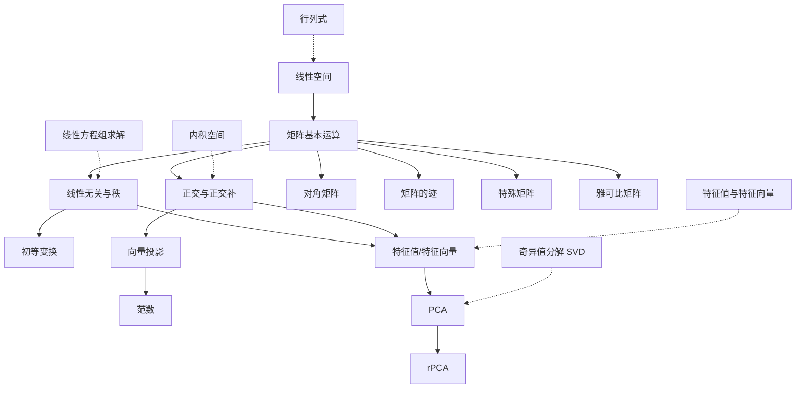

# 线性代数知识依赖关系图与导航文档设计

## 1. 现有知识点分析

### 1.1 现有文件列表
1. `linear_space.md` - 线性空间基础
2. `LinearAlgebra_Ax.md` - 从列的角度理解矩阵与向量
3. `LinearAlgebra_Independency_Rank.md` - 线性无关与秩
4. `LinearAlgebra_orthogonal.md` - 正交与正交补
5. `LinearAlgebra_Matrix.md` - 矩阵相关知识点
6. `DiagonalMatrix.md` - 对角矩阵
7. `Norm.md` - 范数
8. `projection.md` - 向量投影
9. `PCA.md` - 主成分分析
10. `rPCA.md` - 鲁棒主成分分析
11. `trace.md` - 矩阵的迹
12. `JacobianMatrix.md` - 雅可比矩阵
13. `LinearAlgebra_Basic_Change.md` - 矩阵的初等变换

## 2. 知识模块划分

### 2.1 基础知识模块（适合初学者）
**目标**：建立线性代数的核心概念框架

#### 模块A：向量与空间基础
1. 线性空间（linear_space.md）
   - 向量空间定义
   - 子空间
   - 线性映射

2. 矩阵基本运算（LinearAlgebra_Ax.md）
   - 矩阵向量乘法
   - 列空间与行空间
   - 矩阵乘法视角

#### 模块B：线性关系与秩
1. 线性无关与相关（LinearAlgebra_Independency_Rank.md）
   - 线性组合
   - 线性无关定义
   - 相关性判定

2. 矩阵的秩
   - 秩的定义
   - 秩的性质
   - 秩与线性无关关系

#### 模块C：矩阵变换
1. 初等变换（LinearAlgebra_Basic_Change.md）
   - 三种初等变换
   - 初等等价

### 2.2 进阶知识模块（适合有一定基础的学习者）
**目标**：深入理解线性代数的应用与高级主题

#### 模块D：内积空间与正交
1. 正交与正交补（LinearAlgebra_orthogonal.md）
   - 正交补定义
   - 直和分解

2. 向量投影（projection.md）
   - 投影几何直观
   - 投影计算

3. 范数（Norm.md）
   - 向量范数
   - 矩阵范数
   - Frobenius范数

#### 模块E：特殊矩阵与分解
1. 对角矩阵（DiagonalMatrix.md）
   - 对角矩阵性质
   - 对角化

2. 矩阵的迹（trace.md）
   - 迹的定义与性质
   - 迹与特征值关系
   - Frobenius内积

3. 特殊矩阵（LinearAlgebra_Matrix.md）
   - 反对称矩阵
   - 其他特殊矩阵

#### 模块F：应用专题
1. 主成分分析（PCA.md）
   - 方差与协方差
   - 特征值与特征向量
   - PCA算法

2. 鲁棒主成分分析（rPCA.md）
   - rPCA原理
   - 应用场景

3. 雅可比矩阵（JacobianMatrix.md）
   - 雅可比矩阵定义
   - 在微分几何中的应用

## 3. 知识依赖关系图



## 4. 详细依赖关系说明

### 4.1 核心依赖链
1. **线性空间 → 矩阵运算 → 线性无关/秩 → 特征值 → PCA**
   - 这是最重要的依赖链，构成了线性代数的核心理论框架

2. **矩阵运算 → 正交/投影 → 范数**
   - 构成了内积空间和数值线性代数的基础

3. **矩阵运算 → 特殊矩阵 → 应用专题**
   - 连接理论到具体应用

### 4.2 交叉依赖关系
- 特征值概念同时依赖于线性无关和正交概念
- PCA同时依赖于特征值和投影概念
- 范数依赖于内积概念，而内积又依赖于正交概念

## 5. 建议的学习路径

### 5.1 初学者路径（基础知识模块）
```
阶段1：建立空间概念
  1. 线性空间基础
  2. 向量与矩阵基本运算

阶段2：理解线性关系
  3. 线性无关与相关
  4. 矩阵的秩
  5. 初等变换

阶段3：空间结构
  6. 正交与正交补
  7. 向量投影
```

### 5.2 进阶者路径（进阶知识模块）
```
阶段4：深入矩阵理论
  8. 对角矩阵与矩阵分解
  9. 矩阵的迹与范数
  10. 特殊矩阵类型

阶段5：应用专题
  11. 特征值与特征向量（缺失）
  12. 主成分分析
  13. 鲁棒主成分分析
  14. 雅可比矩阵
```

## 6. 缺失概念的补充建议

### 6.1 必须补充的核心概念
1. **特征值与特征向量**
   - **位置**：放在"线性无关与秩"之后，"PCA"之前
   - **依赖关系**：需要线性无关和矩阵运算知识
   - **重要性**：PCA、矩阵分解、动力系统的基础

2. **奇异值分解(SVD)**
   - **位置**：放在"特征值"之后，"PCA"之前
   - **依赖关系**：需要特征值和正交知识
   - **重要性**：PCA的数学基础，矩阵分解的核心

3. **行列式**
   - **位置**：放在"矩阵基本运算"之后，"线性无关"之前
   - **依赖关系**：需要矩阵运算知识
   - **重要性**：判断矩阵可逆性，特征值计算

### 6.2 建议补充的重要概念
4. **线性方程组求解**
   - **位置**：放在"初等变换"之后
   - **依赖关系**：需要矩阵运算和初等变换知识
   - **重要性**：线性代数最经典的应用

5. **内积空间**
   - **位置**：放在"正交"之前
   - **依赖关系**：需要线性空间知识
   - **重要性**：正交、投影、范数的理论基础

6. **基变换与坐标变换**
   - **位置**：放在"线性空间"之后，"矩阵运算"之前
   - **依赖关系**：需要线性空间知识
   - **重要性**：理解不同坐标系下的表示

## 7. 导航文档结构建议

### 7.1 按模块组织的导航
```
线性代数导航
├── 基础知识模块
│   ├── 1. 线性空间基础
│   ├── 2. 矩阵与向量运算
│   ├── 3. 线性无关与秩
│   ├── 4. 初等变换
│   └── 5. 正交与投影
│
├── 进阶知识模块
│   ├── 6. 特征值与特征向量（待补充）
│   ├── 7. 矩阵分解
│   ├── 8. 范数与内积
│   ├── 9. 特殊矩阵
│   └── 10. 应用专题
│       ├── PCA
│       ├── rPCA
│       └── 雅可比矩阵
│
└── 扩展学习
    ├── 奇异值分解（待补充）
    ├── 线性方程组（待补充）
    └── 数值线性代数
```

### 7.2 按依赖关系的导航
- 每个知识点明确标注前置要求
- 提供"如果不懂这个概念，请先学习..."的指引
- 建立概念之间的超链接

## 8. 实施建议

### 8.1 短期行动项
1. 创建导航文档框架
2. 为现有文件添加依赖关系标注
3. 补充缺失的核心概念文件

### 8.2 中期优化
1. 建立概念之间的交叉引用
2. 添加学习路径建议
3. 创建练习题和示例

### 8.3 长期完善
1. 扩展更多应用专题
2. 添加可视化示例
3. 建立知识测试系统

## 9. 总结

这个知识依赖关系图清晰地展示了线性代数知识点之间的逻辑关系，为创建导航文档提供了坚实的基础。通过将知识分为基础模块和进阶模块，并明确依赖关系，学习者可以按照合理的顺序逐步深入，避免因知识断层导致的学习困难。

建议优先补充特征值与特征向量、奇异值分解等核心缺失概念，以完善知识体系的完整性。