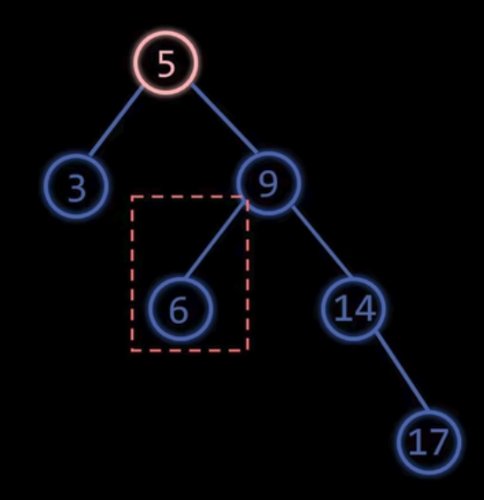
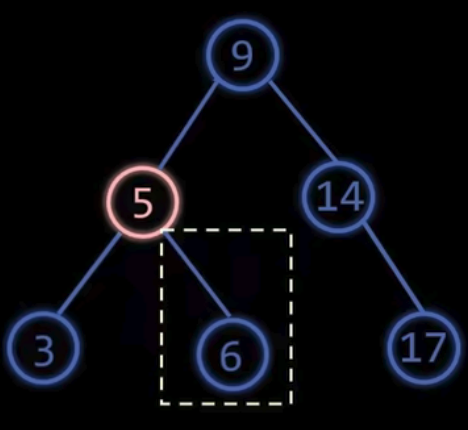
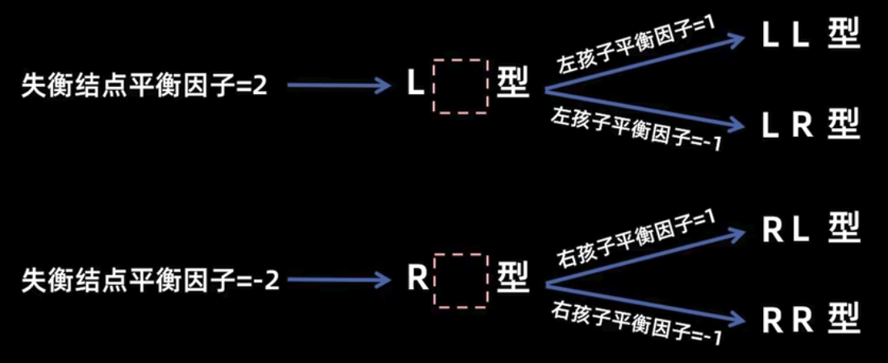

## 二叉搜索树（BST）

二叉搜索树（Binary Search Tree，BST）是一种特殊的二叉树，满足以下性质：

+ **左<根<右**：对于每个节点，其左子树中的所有节点的值都小于该节点的值，右子树中的所有节点的值都大于该节点的值。

    :::tip
    这意味着按照中序遍历的顺序访问二叉搜索树的节点时，得到的值是一个有序的序列。
    :::

+ **递归性质**：每个子树也是一个二叉搜索树。

### 二叉搜索树的查找

比大小，小于根节点往左走，大于根节点往右走，等于则找到。如果找到叶子还不等说明查找失败。

平均复杂度为 O(log n)，最坏情况为 O(n)（退化为链表）。

### 二叉搜索树的插入

插入操作只能在叶子节点进行。

比大小插入空子叶。小于根节点往左走，大于根节点往右走，直到找到空子叶位置插入。

平均复杂度为 O(log n)，最坏情况为 O(n)。

### 二叉搜索树的构建

对于一串数，对每个元素执行插入操作，构建二叉搜索树。

极端情况：数据有序，退化为链表。复杂度为 O(n)。

### 二叉搜索树的删除操作

分类：

1. 删除叶子节点：直接删除。

2. 只有左子树或右子树的节点：用其子节点替代该节点。（移动子树根节点的位置，子树的结构不改变）
3. 有左右子树的节点：找到该节点的**中序后继节点**（**右子树的最小节点**）或**中序前驱节点**（**左子树的最大节点**），用该节点的值替代要删除的节点，然后删除该后继或前驱节点（此时该后继或前驱节点要么是叶子节点，要么只有一个子树，属于前两种情况）。

情况三能这样做是因为中序节点给定根可以划分左右子树，把根和前驱or后继合并，并不影响左右子树的结构。

时间复杂度也是O(log n)

## 平衡二叉搜索树（AVL树）

避免二叉搜索树退化为链表的情况，可以使用平衡二叉搜索树（AVL树）。

引入平衡因子（Balance Factor，BF）的概念：

平衡因子=节点的左子树高度 - 右子树高度

+ 如果平衡因子为0，表示该节点的左、右子树高度相等。
+ 如果平衡因子为1，表示该节点的左子树高度比右子树高度大1。
+ 如果平衡因子为-1，表示该节点的右子树高度比左子树高度大1。

AVL树是一种自平衡的二叉搜索树，满足以下性质：

+ 对于每个节点，其平衡因子的绝对值不超过1，即 |BF| ≤ 1。

### AVL树的旋转操作

平衡二叉树也是二叉搜索树，继承了二叉树的增删改查，但它通过旋转操作来保持树的平衡。

当插入或删除节点后，AVL树可能会失去平衡。为了恢复平衡，需要进行旋转操作。主要有四种旋转操作：

先来两种基本的旋转操作：

1. 左旋（Left Rotation）：当一个节点的右子树比左子树高时，进行左旋操作。

    将该节点的**右子节点(rc)提升**为新的**根**节点，**该节点**变为新根节点(rc)的**左子节点**，原rc的左子树成为该节点的右子树。

    冲突的左孩变右孩。

    
    

2. 右旋（Right Rotation）：当一个节点的左子树比右子树高时，进行右旋操作。

    将该节点的**左子节点(lc)提升**为新的**根**节点，**该节点**变为新根节点(lc)的**右子节点**，原lc的右子树成为该节点的左子树。

    冲突的右孩变左孩。

:::tip
旋转之后，**中序遍历序列**相同，但是树高不一样。
:::

### 插入后的旋转判断

定义失衡节点：插入节点后，从根往下，第一个平衡因子绝对值大于1的节点。、

+ LL型：失衡节点的平衡因子=2，且其左子节点的平衡因子=1

操作：对失衡节点进行右旋。

+ RR型：失衡节点的平衡因子=-2，且其右子节点的平衡因子=-1

操作：对失衡节点进行左旋。

+ LR型：失衡节点的平衡因子=2，且其左子节点的平衡因子=-1

操作：先对失衡节点的**左子节点**进行左旋，再对**失衡节点**进行右旋。

:::tip
注意顺序：先旋转失衡节点的子节点，再旋转失衡节点。
:::

+ RL型：失衡节点的平衡因子=-2，且其右子节点的平衡因子=1

操作：先对失衡节点的**右子节点**进行右旋，再对**失衡节点**进行左旋。

### 多插入导致多祖先失衡

只需要调整**最低**（最靠近新插入节点的）失衡节点即可，调整后其祖先节点的平衡性会被修复。

:::tip
插入操作的失衡可以一次调整
:::

## 平衡二叉树的构建

对于一串数，对每个元素执行插入操作，构建平衡二叉搜索树。

先按照二叉树大往左小往右插入，然后检查失衡节点并进行旋转操作。

## 平衡二叉树的删除

:::note
删除操作带来的失衡可能不止一次调整。
:::

删除一个节点，需要找最近的失衡节点，一直往上检查。
