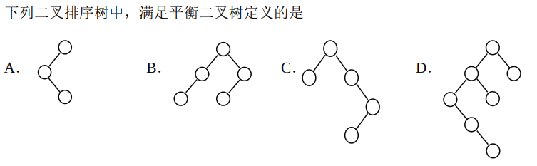

## 2009年统考题选解

:::note[T1]  
设栈 $S$ 和队列 $Q$ 的初始状态均为空，元素 $a$, $b$, $c$, $d$, $e$, $f$, $g$ 依次进入栈 S。若每个元素出栈后立即进入队列 $Q$，且 7 个元素出队的顺序是 $b, d, c, f, e, a, g$，则栈 $S$ 的容量至少是  
:::

队列的特性：先进先出，即进入队列和出队列的顺序是一样的。先进队列表示着先出栈，所以出队列的顺序就是出栈的顺序。

所以出栈顺序是 $b, d, c, f, e, a, g$。

元素|操作说明|栈 S 状态 (栈顶在右)|当前所需容量 C|
|:---:|:---:|:---|:---:|  
a|a 入 S|[a|1|
b|b 入 S|[a,b|2|
b|b 出 S (并入 Q)|[a|2|
c|c 入 S|[a,c|2|
d|d 入 S|[a,c,d|3|
d|d 出 S|[a,c|3|
c|c 出 S|[a|2|
e|e 入 S|[a,e|2|
f|f 入 S|[a,e,f|3|
f|f 出 S|[a,e|3|
e|e 出 S|[a|2|
g|g 入 S|[a,g|2|
g|g 出 S|[a|2|
a|a 出 S|[] (空)|2|

所以栈 S 的容量至少是 3。

:::note[T2]
给定二叉树如下图所示。设 $N$ 代表二叉树的根，$L$ 代表根结点的左子树，$R$ 代表根结点的右子树。若遍历后的结点序列为 $3, 1, 7, 5, 6, 2, 4$，则其遍历方式是 D:RNL。

[附图为一棵二叉树：根节点 1，左子 2，右子 3。节点 2 的左子 4，右子 5。节点 5 的左子 6，右子 7。]

```plaintext
     1
    / \
   2   3
  / \
 4   5
    / \
   6   7   
```

A. LRN  B. NRL   C. RLN   D. RNL  
:::

考点：遍历序列的特征：

前序根左右，后续左右根，中序左根右，层序第一个是根。

:::note[T3]

选B  
:::

考点：平衡二叉树的定义:其左子树和右子树的高度差的绝对值不超过 1。

：：：tip
不平衡度的定义是左子树高度-右子树高度，在二叉树平衡化的时候需要注意。
:::

:::note[T4]
已知一棵完全二叉树的第 6 层（设根为第 1 层）有 8 个叶结点，则该完全二叉树的结点个数最多是
:::

考点：完全二叉树定义: 深度为 $k$ 的完全二叉树，其前 $k-1$ 层是满的，而第 $k$ 层的结点从左到右依次排列，且只可能缺少右边的连续部分。

考点2：第 $n$ 层最多有 $2^{n-1}$ 个结点。

推论：完全二叉树的结点个数在 $2^{k-1}$ 到 $2^k-1$ 之间。

第6层至多有 $2^{5}=32$ 个结点，已知有8个叶结点，所以第6层还可以有24个结点。这24个节点可以在第七层作为叶节点的父节点，提供48个叶节点。

所以该完全二叉树的结点个数最多是：$31+32+48=111$。

:::note[T5]  
将森林转换为对应的二叉树，若在二叉树中，结点 u 是结点 v 的父结点的父结点，则在原来的森林中，u 和 v 可能具有的关系是  
I．父子关系；II．兄弟关系；III．u 的父结点与 v 的父结点是兄弟关系  
:::

考点：左孩子右兄弟表示法能把树映射成二叉树。此时二叉树的左孩子对应原始树中的左孩子，二叉树的右孩子对应原始树中的右兄弟。

有四种可能：

```plaintext
        u   u      u            u
       /     \      \          /
      x       x      x        x 
     /       /        \        \
    v       v          v        v
```

从左往右：

1. u是v的祖父
2. v的父节点x是u的右兄弟
3. v是u的右兄弟
4. v是u的孩子

所以 $I$ $II$ 正确。

:::note[T6]
下列关于无向连通图特性的叙述中，正确的是  
I．所有顶点的度之和为偶数； II．边数大于顶点个数减 1；
III．至少有一个顶点的度为 1
:::

考点：  
**握手定理**: 图中所有顶点的**度数之和**等于**边数两倍**。

连通图的**边数下界**: 一个 $n$ 个顶点的连通图至少需要 $n-1$ 条边。取等的时候退化成树。

度的概念: 一个顶点的度是与该顶点关联的边的数量。

所以 $I$ 正确。

:::warning
$II$ 错误，边数可以等于顶点个数减1。
:::

:::note[T7]  
下列叙述中，不符合 m 阶 B 树定义要求的是  
A．根结点最多有 m 棵子树 ；B．所有叶结点都在同一层上  
C．各结点内关键字均升序或降序排列 ；D．叶结点之间通过指针链接  
:::

D 是B+树的特点

:::note[T8]
已知关键字序列 $5, 8, 12, 19, 28, 20, 15, 22$ 是小根堆（最小堆），插入关键字 $3$，调整后得到的小根堆是
:::

考点：堆的定义：堆是一棵**完全二叉树**，且满足堆性质：对于小根堆，任一节点的值均不大于其子节点的值。

堆的存储：堆通常用数组表示，假设节点的下标从1开始，则对于下标为 $i$ 的节点：

- 左子节点下标为 $2i$；

- 右子节点下标为 $2i+1$；

- 父节点下标为 $\lfloor i/2 \rfloor$。

这是对于**下标从1开始**的**完全二叉树**的存储性质。

插入操作：将新元素添加到数组的末尾，然后通过上滤操作恢复堆性质。

初始堆：

H=[5, 8, 12, 19, 28, 20, 15, 22]

插入3：

H=[5, 8, 12, **19**, 28, 20, 15, 22, **3**]

上滤3：3的下标9,是父节点H[4]=19的左子节点，3<19，交换：

H=[5, **8**, 12, **3**, 28, 20, 15, 22, 19]

3的下标4,是父节点H[2]=8的右子节点，3<8，交换：

H=[**5**, **3**, 12, 8, 28, 20, 15, 22, 19]

3的下标2,是父节点H[1]=5的左子节点，3<5，交换：

H=[**3**, 5, 12, 8, 28, 20, 15, 22, 19]

得到最终堆

:::note[T9]  
若数据元素序列 $11, 12, 13, 7, 8, 9, 23, 4, 5$ 是采用下列排序方法之一得到的第二趟排序后的结果，则该排序算法只能是 B  
A．起泡排序 (Bubble Sort)  
B．插入排序 (Insertion Sort)  
C．选择排序 (Selection Sort)  
D．二路归并排序 (Merge Sort)  
:::

选择排序：k次选择后，**前k个元素**是**最小的**k个元素，且有序。这里不符合

插入排序：k次插入后，**前k个元素**是有序的。这里符合

冒泡排序：k次冒泡后，**后k个元素**是**最大的**k个元素，且有序。这里不符合

归并排序：完成划分后，k次归并得到长度为2k的有序子序列。这里是长度为2的有序子序列。13,7不符合。

:::note[T10]
快慢指针：查找链表中倒数第 $k$ 个结点
:::

最朴素的方法是先遍历一遍链表得到总长度 $L$，然后第二次遍历时找到第 $L-k+1$ 个结点。这种方法需要两次遍历

优化一下，只需要一次遍历：用快慢指针

1. 初始化两个指针 $fast$ 和 $slow$，都指向链表的头结点。

2. 让 $fast$ 指针先移动 $k$ 步。
3. 然后同时移动 $fast$ 和 $slow$ 指针，直到 $fast$ 指针到达链表的末尾。
4. 此时，$slow$ 指针所指向的结点就是链表的倒数第 $k$ 个结点。

```C
#include <stdio.h>
#include <stdlib.h>

// 链表结点结构定义
typedef struct Node {
    int data;
    struct Node* link;
} Node;

/**
 * @brief 查找单链表中倒数第 k 个位置上的结点
 * * @param list 头指针（指向头结点）
 * @param k 倒数第 k 个位置 (k > 0)
 * @return int 查找成功返回 1，失败返回 0
 */
int find_kth_from_end(Node* list, int k) {
    
    // P1. 校验 k 值
    if (k <= 0 || list == NULL) {
        // k 非正或链表为空（虽然有头结点，但防错）
        return 0;
    }

    // P2. 初始化快慢指针
    Node* P1 = list; // 快指针，从头结点开始
    Node* P2 = list; // 慢指针，从头结点开始
    
    // --- 1. 拉开 k 个间距（P1 比 P2 先走 k 步） ---
    // 由于链表带有头结点，P1 移动 k 次后，P2 距离倒数第 k 个结点还有 k 步
    
    int i;
    for (i = 0; i < k; i++) {
        // P1 向后移动
        P1 = P1->link; 
        
        // 关键判断：如果 P1 在 k 步内到达链表末尾，说明结点总数不足 k
        // 注意：P1->link == NULL 时 P1 停在倒数第二个结点
        if (P1 == NULL) {
            // 如果只剩头结点，或有效结点不足 k 个 (i < k)
            // 说明 k 大于有效数据结点数，查找失败
            return 0; 
        }
    }
    
    // --- 2. 同步移动，直到 P1 到达末尾 ---
    // P1 和 P2 保持 k 个结点间距，同时向后移动
    // P1 已经先走了 k 步，此时 P1 指向第 k+1 个结点
    
    while (P1 != NULL) {
        P1 = P1->link; // P1 向后移动
        P2 = P2->link; // P2 同步移动
    }

    // --- 3. 输出结果并返回 ---
    // 当 P1 达到 NULL 时，P2 正好指向倒数第 k 个结点。
    // P2->data 即为所求。
    printf("倒数第 %d 个结点的数据域值为：%d\n", k, P2->data);
    return 1; // 查找成功
}
```

## 2010年统考题选解

:::note[T1]  
若元素 $a, b, c, d, e, f$ 依次进栈，允许进栈、退栈操作交替进行，但不允许连续三次进行退栈操作，则不．可能得到的出栈序列是 D
A．$d, c, e, b, f, a$  
B．$c, b, d, a, e, f$  
C．$b, c, a, e, f, d$  
D．$a, f, e, d, c, b$  
:::

逆序三连不可能。D:fec

:::note[T2]  
某队列允许在其两端进行入队操作，但仅允许在一端进行出队操作。若元素 $a, b, c, d, e$ 依次入此队列后再进行出队操作，则不可能得到的出队序列是C  
A．$b, a, c, d, e$  
B．$d, b, a, c, e$  
C．$d, b, c, a, e$  
D．$e, c, b, a, d$  
:::

能出的那一头进去就是栈LIFO，不能出的那一头进去就是队列FIFO。

:::note[T3]  
在下图所示的平衡二叉树中，插入关键字 $48$ 后得到一棵新平衡二叉树。在新平衡二叉树中，关键字 $37$ 所在结点的左、右子结点中保存的关键字分别是C
[附图为 AVL 树：根 24，左 13；右 53；53 的左 37，右 90。]  
A．13、48 ；B．24、48； C．24、53； D．24、90  
:::

AVLtree:

```plaintext
        24
       /  \
     13    53
          /  \
        37    90
```

先插入，按照大往左，小往右：

```plaintext
        24
       /  \
     13    53
          /  \
        37    90
       /
     48
```

发现里插入节点最近的失衡节点是24，平衡因子-2，右子树的平衡因子是1，属于RL型，先右旋子节点再左旋自身：

```plaintext
        37
       /  \
     24    53
    / \     \
  13  48    90
```

:::note[T4]
在一棵度为 4 的树 $T$ 中，若有 20 个度为 4 的结点，10 个度为 3 的结点，1 个度为 2 的结点，10 个度为 1 的结点，则树 $T$ 的叶结点个数是
:::

考点：树中叶节点个数公式： 叶节点数 = 总节点数 - 非叶节点数 + 1（根节点）

节点度和节点数关系：$$

$$
N=20 +10+ 1 + 10 + n_0
$$
