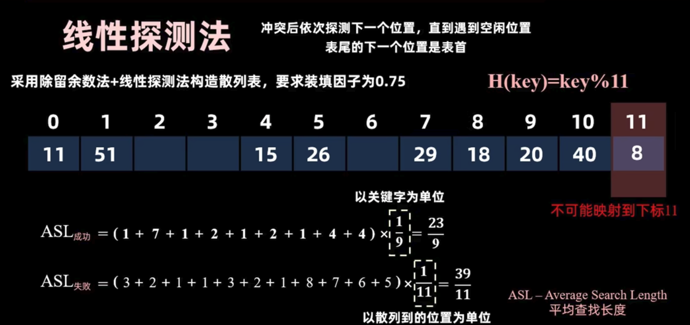
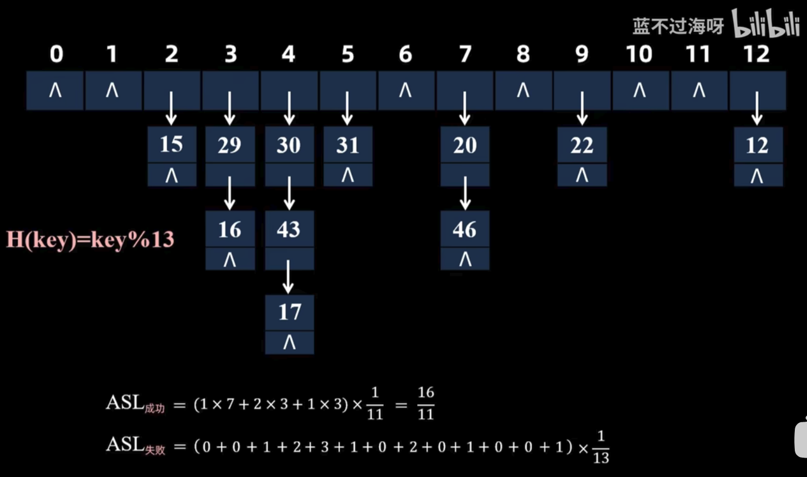

## 哈希表的定义

哈希表（Hash Table）是一种基于数组实现的数据结构，通过**散列函数**将关键字映射到数组的索引位置，从而实现快速的数据存取。哈希表的核心思想是利用**键值对**（key-value pairs）存储数据，通过键（key）快速定位到对应的值（value）。

## 散列函数

散列函数（Hash Function）是将输入的关键字映射到哈希表索引的函数。一个好的散列函数应满足以下条件：

- **均匀分布**：散列函数应尽可能将关键字均匀地分布在哈希表的各个位置，减少冲突的发生。

- **高效计算**：散列函数的计算应尽可能简单和快速，以提高哈希表的性能。
- **确定性**：相同的输入关键字应始终映射到相同的索引位置。

常见的散列函数包括**取模法、乘法散列法和平方取中法**等。

用**装填因子** $\mathbf{\alpha = \dfrac{n}{m}}$ 表示哈希表中元素的数量 $n$ 与长度 $m$ 之比。装填因子越大，冲突的概率越高。装填因子越小，空间利用率越低。

### 直接寻址法

直接寻址法适用于关键字的取值范围较小且连续的情况。通过将关键字直接作为数组的索引位置来存储数据。

$$
h(k) = k \pm c
$$

c表示偏移量，当k大的时候可以节省空间。

适合关键字连续且范围较小的情况。不会冲突

### 取模法

取模法是最常用的散列函数之一，计算公式为：

$$
h(k) = k \mod m
$$

其中，$k$ 是关键字，$m$ 是哈希表的大小，$h(k)$ 是映射到的索引位置。

已经证明，选择小于表长的最大素数作为哈希表的大小可以减少冲突的发生。

适合关键字分布较均匀的情况。会出现冲突

## 开放地址法解决冲突

### 线性探测法（Linear Probing）

线性探测法：当发生冲突时，依次检查哈希表中的下一个位置，直到找到一个空槽为止。

注意，如果填到表尾，则继续从表头开始查找。

$$
h(k, i) = (h(k) + i) \mod m
$$

其中，$i$ 是探测次数。

对于线性探测法的查找，过程和插入完全一样，因此，如果查找到空，就说明元素不存在。

ASL:

删除操作：删除标记

如果直接删除元素，会破坏探测序列，导致后续查找失败。

引入删除标记（tombstone），表示该位置曾经被占用，但现在已经删除。这样，在查找过程中，仍然可以继续探测下去，直到找到目标元素或遇到空槽。

在插入的时候，可以将删除标记的位置重新利用，插入新的元素。

### 二次探测法（Quadratic Probing）

二次（平方）探测法：当发生冲突时，按照二次函数的方式探测下一个位置。$\pm1^2, \pm2^2, \pm3^2, \ldots$

注意，如果填到表尾，则继续从表头开始查找。

已有数学证明，当表长为某个4k+3形式的素数时，二次探测法能够保证在装填因子 $\alpha < 0.5$ 时找到空槽。

$$
h(k, i) = (h(k) \pm c i^2) \mod m,\;\;i=0,1,2,...
$$

和线性探测法类似，查找过程和插入过程一样。删除也要加删除标记。

## 拉链法处理冲突

把所有的同义词（映射到同一位置的关键字）存储在一个链表中。

这时候表里的每个位置存储的不是单个元素，而是一个链表的头指针。

规律：后来居上，即新插入的元素放在链表的头部。（采用头插比较常见）

查找的过程和插入一模一样，先散列函数映射到，查找到位置后，再遍历链表，找到目标元素。

ASL:

