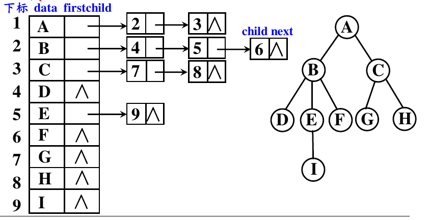
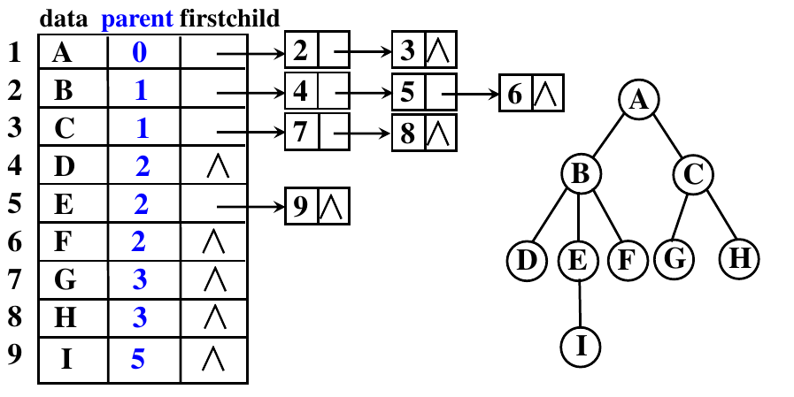

## 树的遍历

树的遍历是指按照某种顺序访问树中的所有节点。类似于二叉树的遍历，树的遍历也有前序遍历、中序遍历和后序遍历等方法。

由于树可能有多个子树，所以按照从左往右的顺序访问每个子树。

## 树的存储结构

### 父亲表示法

每个结点(根结点除外)都只有唯一的父亲结点

把结点的数据(**一般按层序**)存储在数组中,记录其唯一父亲结点在数组中的下标。

```cpp
struct PTNode {
    int data; // 结点数据
    int parent; // 结点的双亲在数组中的下标
};
```

**存储特点**：

+ 每个节点均保存其父节点的**下标**

+ 兄弟节点的在数组中下标连续（前提是按层序存）
+ 方便找父亲，随机访问；不方便找孩子，需要遍历。适合父亲多，孩子少。

### 孩子表示法

把每个结点的孩子结点组成一个单链表,则n个结点共有 n个孩子链表。

把每个单链表的**表首结点指针**组织成一个顺序表,便于
进行查找。

最后,将存放 n 个表首结点指针的数组和存放n个结点的
数组结合起来,构成孩子链表的表头数组。

**表头数组**（和父亲表示法类似）：数组下标对应树节点（按照层序），数组元素是该节点和该节点第一个孩子节点指针

**孩子链表**：链表里每一个节点存放孩子节点在表头数组里的下标，以及指向下一个兄弟节点的指针

```cpp
//表头数组的元素
struct CTNode{
    dataType data ;//树的节点数据
    struct ChildChainNode *firstchild; //指向孩子链表的指针
};
//孩子链表的节点
struct ChildChainNode{
    int childIndex; //孩子节点在表头数组中的下标
    struct ChildChainNode *next; //指向下一个兄弟节点
};
```



**存储特点**：

+ 第二个结点存的是链表

+ 方便找孩子，遍历表头数组+孩子链表即可；不方便找父亲，需要依次遍历表头数组的所有孩子链表直到找到。

### 父亲孩子表示法

结合父亲表示法和孩子表示法的优点，同时保存每个节点的父节点下标和孩子链表指针。

```cpp
struct PCTNode{
    dataType data; //树的节点数据
    int parent; //节点的父节点在数组中的下标
    struct ChildChainNode *firstchild; //指向孩子链表的指针
};
```



### 二叉链表表示法

一句话：**用二叉树存普通树**

每个节点的右兄弟是唯一的，采用**左孩子右兄弟**表示法，将树转换为二叉树进行存储。

```cpp
struct BTNode{
    dataType data; //树的节点数据
    struct BTNode *firstchild; //指向第一个孩子节点
    struct BTNode *rightsibling; //指向右兄弟节点
};
```

**存储特点**：

+ 找孩子方便，找结点A的孩子，先看A的左指针，然后一路向右遍历直到右指针结点为空。
+ 可以用三叉链表实现找父亲。

显然，这种方式将树映射成了一个**二叉树**，那么他们的遍历有没有联系呢？

对于先序遍历，树和其对应的二叉树经过先序遍历得到的先序序列是相同的。

但树的后序序列对应的是二叉树的中序序列。

## 森林与二叉树的转换

树是森林的基本结构，树与二叉树之间一一对应，所以森林与二叉树之间也存在一一对应关系。
