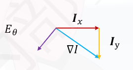
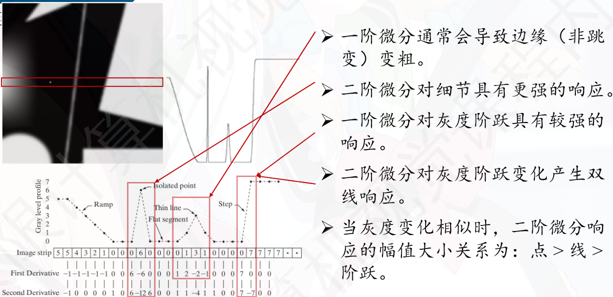

## 图像的一阶微分

图像是离散的，不能直接求导 → 用差分近似

图像在 $(x,y)$ 处的梯度定义为：

$$
I_x(x,y) = I(x+1,y) - I(x-1,y)\\
I_y(x,y) = I(x,y+1) - I(x,y-1)\\
$$

等价于卷积形式：

$$
K_x = \begin{bmatrix}0&0&0\\-1&0&1\\0&0&0\end{bmatrix} \quad\quad K_y = \begin{bmatrix}0&-1&0\\0&0&0\\0&1&0\end{bmatrix}\\
I_x = I * K_x =\frac{1}{2}\sum_{i=-1}^{1}\sum_{j=-1}^{1} K_x(i,j) \cdot I(x-i,y-j) \\
 I_y = I * K_y =\frac{1}{2}\sum_{i=-1}^{1}\sum_{j=-1}^{1} K_y(i,j) \cdot I(x-i,y-j)
$$

梯度的幅值 $\iff$ 边缘强度，梯度的方向 $\iff$ 边缘方向

$$
\nabla I(i,j) = (I_x, I_y) \quad\quad E_s(i,j|I)=||\nabla I|| = \sqrt{I_x^2 + I_y^2}\\[1em]
\theta = \arctan{\frac{I_y}{I_x}}  \quad\quad E_\theta(i,j|I) = \theta+\frac{\pi}{2}
$$

## 二阶微分

图像的二阶微分可以通过对一阶微分再次求导来近似：

$$
\nabla^2 I = \frac{\partial^2 I}{\partial x^2} + \frac{\partial^2 I}{\partial y^2} \approx I(x+1,y) + I(x-1,y) + I(x,y+1) + I(x,y-1) - 4I(x,y)
$$

还可以进行拓展，加入对角线方向的二阶微分

