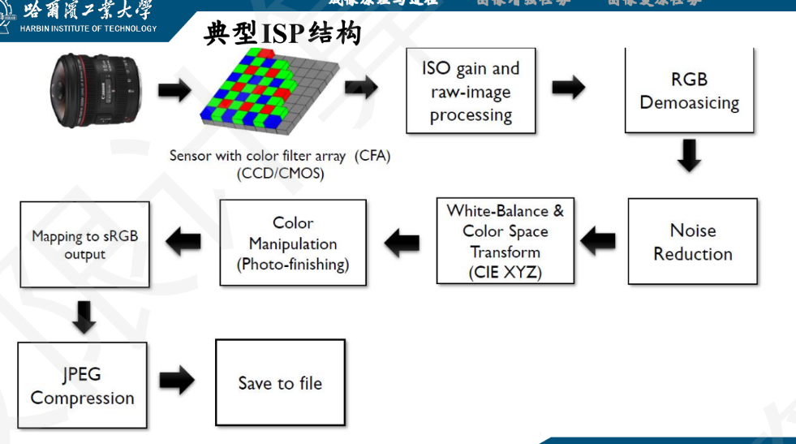
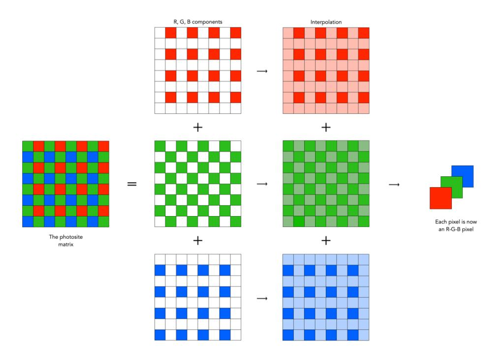
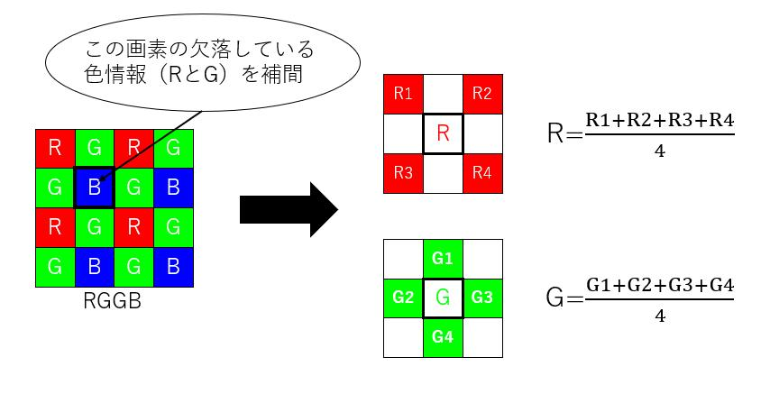

ISP 是一套硬件或算法流程，负责将图像传感器（CMOS/CCD）输出的原始RAW数据转换成人眼可看的、颜色正确、噪声较低、亮度合适的图像（通常是YUV、RGB等格式）。它通常集成在摄像头模组、手机SoC或独立芯片中。

## 整体流程



## CFA

常见的CCD/CMOS图像传感器本身只能感知光的强度（即光子数量），无法区分光的波长（颜色）。要得到彩色图像，必须在每个像素位置获取红、绿、蓝（RGB）三种颜色的强度。

可以每个像素放三个独立的传感器（三芯片相机，如部分高端摄像机），但成本高、体积大，不适合手机、普通相机。

Color Filter Array，彩色滤波片阵列，按照某种固定的颜色排列模式覆盖在图像传感器表面。每个滤波片只能透射红、绿或蓝光。输出的是**马赛克状的单通道图像**（RAW图），每个像素只有一种颜色分量，例如一个像素有红色值，相邻像素有绿色值，再下一个有蓝色值。常见的CFA模式是Bayer阵列：

```plaintext
G R G R ...
B G B G ...
G R G R ...
B G B G ...
...
```

## Demosaicing去马赛克

输入：CFA图像（RAW图）

输出：完整的RGB图像

### 双边线性插值

"Simple interpolation"简单插值



遍历RAW图的每个像素点，缺哪个颜色（例如RAW图里的红色分量，缺蓝色和绿色分量），就用周围邻居的平均值补。



缺点

- 边缘会糊（边缘被“平均”掉了）

- 产生伪彩色（例如在黑白边缘附近出现红蓝条纹，称为“拉链效应”）

### Hamilton-Adams算法

"Simple “edge aware” interpolation"

- 假设图像中的 **边缘** 往往是连续的，因此，插值应该沿着 **边缘方向** 进行，而不是跨越边缘。

- 在每个像素位置计算水平和垂直方向的 **绿色梯度（一阶微/差分）** + **同色二阶微/差分**
- 同色二阶微分类似于拉普拉斯算子，可以衡量边缘，只不过这里只有水平方向或垂直方向。

首先重建绿色通道（在Bayer阵列中G分量最多），再在绿通道的引导下恢复红蓝通道。

以红色像素 $R(i,j)$ 为例，需要插值它所缺少的绿色分量 $G(i,j)$ 。上下左右四个**绿色邻居**是绿色像素 $G(i-1,j), G(i+1,j), G(i,j-1), G(i,j+1)$， **同色邻居** 是红色像素 $R(i-2,j), R(i+2,j), R(i,j-2), R(i,j+2)$。

则水平"梯度" $D_h$ 和垂直"梯度" $D_v$ 定义为：

:::tip

这里的梯度是一个**混合指标**，既包含了绿色通道的梯度，又包含了同色通道的二阶微分。它不是传统意义上的图像梯度，而是一个综合考虑边缘和纹理的指标，用于指导插值方向。

:::

$$
D_h = |G(i,j-1) - G(i,j+1)| + |R(i,j-2) - 2R(i,j) + R(i,j+2)|\\
D_v = |G(i-1,j) - G(i+1,j)| + |R(i-2,j) - 2R(i,j) + R(i+2,j)|
$$

- 如果 $D_h < D_v$，说明边缘沿水平方向，应该沿水平方向插值：

    $$
    G_H(i,j) = \frac{G(i,j-1) + G(i,j+1)}{2} + \frac{R(i,j-2) - 2R(i,j) + R(i,j+2)}{4}
    $$
  - 第一项是周围绿色像素的线性平均（基本估计）。
  - 第二项是修正项：红色通道的二阶中心差分除以 4。

- 如果 $D_v < D_h$，说明边缘沿垂直方向，应该沿垂直方向插值：

    $$
    G_V(i,j) = \frac{G(i-1,j) + G(i+1,j)}{2} + \frac{R(i-2,j) - 2R(i,j) + R(i+2,j)}{4}
    $$

- 如果 $D_h = D_v$，说明边缘不明显，可以使用两者的平均：

    $$
    G(i,j) = \frac{G_H(i,j) + G_V(i,j)}{2}
    $$

完成绿色通道的重建后，再利用绿色通道的值来指导红色和蓝色通道的插值。这时候所有的像素都有了绿色分量，有的有红色分量，有的有蓝色分量

对于红色像素 $R(i,j)$，插值蓝色分量 $B(i,j)$：

- 红色像素包含的绿色分量 $G(i,j)$ 已经重建好了，作为插值的基础。
- 四个对角线上的蓝色邻居 $B(i-1,j-1), B(i-1,j+1), B(i+1,j-1), B(i+1,j+1)$ 以及他们对应包含的绿色分量 $G(i-1,j-1), G(i-1,j+1), G(i+1,j-1), G(i+1,j+1)$ 对他们的差取平均，得到蓝色分量的修正项：

$$
B(i,j) = G(i,j) + \frac{1}{4} \sum_{k=-1,1} \sum_{l=-1,1} [B(i+k,j+l) - G(i+k,j+l)]
$$

对于蓝色像素 $B(i,j)$，插值红色分量 $R(i,j)$ 的方法类似。

### 其他的去马赛克方法

| 方法           | 原理                                                                | 优缺点                                                         |
| -------------- | ------------------------------------------------------------------- | -------------------------------------------------------------- |
| Pixel Shift    | 通过移动传感器多次拍摄，获取每个像素位置的全色信息。                | 图像质量高，但需要多次曝光，不适合动态场景。                   |
| 三片式结构     | 用分光棱镜将光线分成三路，分别用三个传感器接收RGB。                 | 颜色真实，无马赛克伪影，但体积大、成本高（广播级摄像机使用）。 |
| Foveon波长分离 | 在垂直方向不同深度感光，分别吸收蓝、绿、红光（如Foveon X3传感器）。 | 每个像素都有全色，但灵敏度较低，高ISO噪声大。                  |

## Noise Reduction降噪

通过高通量滤波（高斯模糊，均值滤波之类的）来降噪：

输入图像 $I$，模糊图像 $S=blur(I)$，高频成分 $H=I-S$。

输出图像 $O$ 的每个像素：

$$
O(x,y) = \begin{cases} S(x,y), & \text{if } |H(x,y)| < T \\ I(x,y) + \alpha H(x,y), & \text{if } |H(x,y)| \geq T \end{cases}
$$

- 模糊可以降噪，但会模糊边缘。

- 从原图减去模糊图，得到的是高频成分（包含边缘、纹理，也包含噪声）。

- 判断高频成分的强度：强度高的地方很可能是真实图像内容（边缘），强度低的地方很可能只是噪声。用阈值 $T$ 判断。

- 对高响应区域，把高频成分加回图像，甚至增强（对应$\alpha > 0$）；对低响应区域，只保留模糊后的降噪结果。

优点：

- 平坦区域噪声被有效消除（因为只保留模糊结果）。

- 边缘处保留甚至增强了锐度（因为加回了高频成分）。

缺点：

- 阈值 $T$ 难以自动确定，可能将弱边缘误判为噪声。

- 在纹理密集区域，可能导致“过平滑”或“伪影”

## White Balance白平衡

核心假设：图像中所有像素的RGB平均值应该趋于灰色（$R_{avg} \approx G_{avg} \approx B_{avg}$）。如果某个颜色分量的平均值偏高，说明该颜色过强，需要进行缩放。

对于原图的三个通道分别乘以不同的增益，通常取 $G$ 通道作为参考（增益系数=1），然后再重新组合成RGB图像：

$$
R' = R \cdot k_R, \quad G' = k_G \cdot G, \quad B' = B \cdot k_B\\[1em]
O = \begin{bmatrix} R' \\ G' \\ B' \end{bmatrix} = \begin{bmatrix} k_R & 0 & 0 \\ 0 & k_G & 0 \\ 0 & 0 & k_B \end{bmatrix} \cdot \begin{bmatrix} R \\ G \\ B \end{bmatrix}
$$

无论哪种方法，都需要归一化到绿色通道。

### 全局灰度世界法（Gray World Assumption）

根据全局平均值计算增益：

$$
Global_{avg}=\frac{R_{avg} + G_{avg} + B_{avg}}{3}\\
k_R = \frac{Global_{avg}}{R_{avg}}, \quad k_G = 1= \frac{Global_{avg}}{G_{avg}}, \quad k_B = \frac{Global_{avg}}{B_{avg}}\\
$$

消去 $Global_{avg}$ 后：

$$
k_R = \frac{G_{avg}}{R_{avg}}, \quad k_G = 1, \quad k_B = \frac{G_{avg}}{B_{avg}}
$$

### 完美反射法（Perfect Reflector / White Patch）

根据图像中最亮的像素计算增益：

$$
R_{max} = \max_{x,y} R(x,y), \quad G_{max} = \max_{x,y} G(x,y), \quad B_{max} = \max_{x,y} B(x,y)\\
k_R = \frac{G_{max}}{R_{max}}, \quad k_G = 1, \quad k_B = \frac{G_{max}}{B_{max}}
$$

## Color Correction颜色校正&Color Space Conversion颜色空间转换

### 1. 颜色校正（Color Correction）

目的：修正相机传感器的光谱响应曲线与人眼视觉特性之间的差异。不同型号的传感器对红、绿、蓝光的敏感度不同，导致拍出的颜色与真实颜色有色偏（即使已经做了白平衡）。

本质：从“相机 RGB 空间”映射到“标准色彩空间（如 sRGB、Adobe RGB）”的颜色数学变换，同时完成色域匹配和色彩还原。

典型形式：一个 3×3 矩阵（Color Correction Matrix, CCM）。

$$
\begin{bmatrix} R' \\ G' \\ B' \end{bmatrix} = \begin{bmatrix} c_{11} & c_{12} & c_{13} \\ c_{21} & c_{22} & c_{23} \\ c_{31} & c_{32} & c_{33} \end{bmatrix} \cdot \begin{bmatrix} R \\ G \\ B \end{bmatrix}
$$

用gamma = 2.2的sRGB色彩空间为例，CCM矩阵可以通过标定板拍摄和优化算法求得，或者直接使用厂商提供的预设值。

### 2. 颜色空间转换（Color Space Conversion）

颜色空间转换只是换个表示法，颜色本身不再校正。
