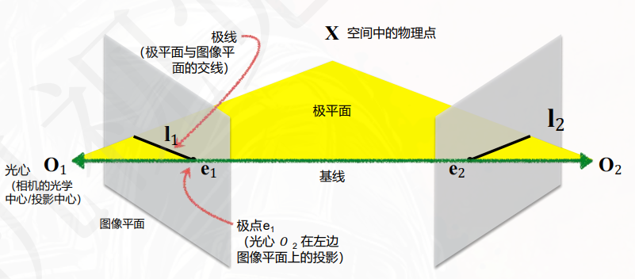
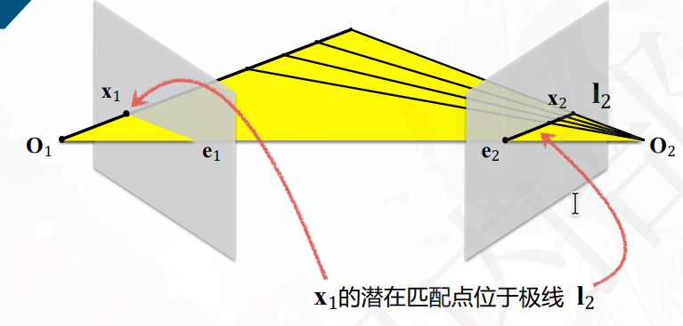

单目相机模型 $\mathbf{x} = K [R|t] X$ 只能描述“一个相机看到什么”，无法恢复深度信息——因为无数个不同深度的三维点都可能投影到同一个像素点上。

引入第二个相机后，已知两个相机的内外参，两个相机看到的**同一个**三维点 $X$，在两个图像平面上分别投影为 $\mathbf{x}_1$ 和 $\mathbf{x}_2$（一对匹配点）。这时，**深度信息就可以恢复了**。

## 双目的数学基础：对极几何（Epipolar Geometry）

- $X$：空间点
- $O_1,O_2$：两个相机的光心
- $\mathbf{x}_1,\mathbf{x}_2$：两个相机看到的同一个空间点 $X$ 的投影点（匹配点）
- 基线： 两个相机的光心连线。
- 对极平面：空间点 $X$、两个相机的光心 $O_1, O_2$ 构成的平面。

- 极线：对极平面与图像平面的交线。（图中的 $I_1$, $I_2$）

- 极点：基线与图像平面的交点。（图中的 $e_1$, $e_2$）

- 极线约束：已知一个图像点 $\mathbf{x}_1$，其对应的匹配点 $\mathbf{x}_2$ 必须在 对应 的极线上。

线代知识补充：叉乘转换为矩阵形式，$\mathbf{a} \times \mathbf{b} = [\mathbf{a}]_\times \mathbf{b}$，其中

$$
[\mathbf{a}]_\times = \begin{bmatrix} 0 & -a_z & a_y \\ a_z & 0 & -a_x \\ -a_y & a_x & 0 \end{bmatrix}
$$

## 对极几何约束的数学推导

极线约束可以表示为：

1. 标定左右相机，得到
   - 左右相机内参 $K, K'$，
   - 从左相机到右相机的旋转矩阵 $R$ 和平移向量 $t$。
2. 对左右像素坐标归一化到相机坐标系下：
   $$
   \mathbf{x}^c = K^{-1} \mathbf{x}, \quad \mathbf{x}'^c = K'^{-1} \mathbf{x}'
   $$
   这里，$\mathbf{x}^c$ 和 $\mathbf{x}'^c$ 是在各自相机坐标系下的归一化坐标。即从各自相机光心出发、指向三维点 $X$ 的单位方向向量
3. 建立对极几何约束：将所有向量都转换到 右相机的坐标系
   - 向量1：从左光心指向右光心的向量 $t$
   - 向量2：从右光心指向三维点 $X$ 的向量 $\mathbf{x}'^c$
   - 向量3：从左光心指向三维点 $X$ 的向量 $R \mathbf{x}^c$（将左相机坐标系下的向量旋转到右相机坐标系下）
   - 这三个向量必须共面，叉积为零：
    $$
    \mathbf{x}'^c  \cdot (t \times R \mathbf{x}^c) = 0\\
    \mathbf{x}'^c  \cdot ([t]_\times R) \mathbf{x}^c = 0'
    $$

### 本质矩阵

中间这一坨就是**对极几何约束**，也称为**本质矩阵约束**，其中 **本质矩阵**

$$
E = [t]_\times R
$$

是一个 $3\times 3$ 的矩阵，描述了两个相机之间的相对姿态（旋转和平移）。该矩阵由相机的内参及其相对位置推导得出

本质矩阵的局限：它只适用于**归一化坐标系下**的点，即在相机坐标系下的点。

### 基础矩阵

在不知道内参 $K, K'$ 的情况下，无法将像素坐标 $\mathbf{x}, \mathbf{x}'$ 转换为相机坐标系下的归一化坐标 $\mathbf{x}^c, \mathbf{x}'^c$。因此，需要引入**基础矩阵** $F$ 来描述像素坐标之间的对极几何约束。

$$
\begin{cases}
    \mathbf{x}^c= K^{-1} \mathbf{x}, \\
     \mathbf{x}'^c= K'^{-1} \mathbf{x}'\\
     \mathbf{x}^{cT} E \mathbf{x}'^c = 0
\end{cases}\\[1em]
\iff \mathbf{x}^T F \mathbf{x}' = 0, \quad F = K^{-T} E K'^{-1}
$$

#### 基础矩阵的自由度分析

- 秩：2

$E=[t]_\times R$，是一个 $3\times 3$ 的矩阵，$t$的反对称矩阵 $[t]_\times$ 是一个秩为 2 的矩阵，$R$ 是一个旋转矩阵（正交矩阵），内参矩阵也是满秩的，因此 $E$ 的秩为 2，基础矩阵 $F$ 也是一个秩为 2 的矩阵。$\iff$ $\det(F) = 0$。

- 自由度：7

$F$ 是一个 $3\times 3$ 的矩阵，有 9 个元素，但由于其秩为 2，且可以任意缩放，因此自由度为 $9 - 1 - 1 = 7$。

$\therefore$ **至少**需 **要 7 组独立** 的匹配点对才能唯一确定两视图间的极线几何关系

## 基础矩阵的估计

估计基础矩阵被称为“弱标定”，因为它不需要知道相机的内参，只需要知道匹配点对。

记一对匹配点为 $(\mathbf{x}_i=\begin{bmatrix} u_i \\ v_i\\1 \end{bmatrix}, \mathbf{x}'_i=\begin{bmatrix} u'_i \\ v'_i \\ 1 \end{bmatrix})$，基础矩阵 $F=[f_{ij}]$，展开 $\mathbf{x}^T F \mathbf{x}' = 0$，得到线性方程：

$$
\begin{bmatrix} u_i & v_i & 1 \end{bmatrix} \begin{bmatrix} f_{11} & f_{12} & f_{13} \\ f_{21} & f_{22} & f_{23} \\ f_{31} & f_{32} & f_{33} \end{bmatrix} \begin{bmatrix} u'_i \\ v'_i \\ 1 \end{bmatrix} = 0\\[2em]
\iff f_{11} u_i u'_i + f_{12} u_i v'_i + f_{13} u_i + f_{21} v_i u'_i + f_{22} v_i v'_i + f_{23} v_i + f_{31} u'_i + f_{32} v'_i + f_{33} = 0
$$

对于$N\ge 7$对匹配点 $(\mathbf{x}_i, \mathbf{x}'_i)$，可以得到一个 $N\times 9$ 的矩阵 $A$，每一行对应一个匹配点对的线性方程：

$$
A = \begin{bmatrix}
u_1 u'_1 & u_1 v'_1 & u_1 & v_1 u'_1 & v_1 v'_1 & v_1 & u'_1 & v'_1 & 1 \\
u_2 u'_2 & u_2 v'_2 & u_2 & v_2 u'_2 & v_2 v'_2 & v_2 & u'_2 & v'_2 & 1 \\
\vdots & \vdots & \vdots & \vdots & \vdots & \vdots & \vdots & \vdots & \vdots \\
u_N u'_N & u_N v'_N & u_N & v_N u'_N & v_N v'_N & v_N & u'_N & v'_N & 1
\end{bmatrix}\\[2em]
Af = 0, \quad f = [f_{11}, f_{12}, f_{13}, f_{21}, f_{22}, f_{23}, f_{31}, f_{32}, f_{33}]^T
$$

### 8点法（8-point algorithm）

虽然说是8点，但实际计算中可以用更多点。

两步：

1. 使用最小二乘法求解线性方程 $Af = 0$，得到基础矩阵 $F$ 的元素。
2. 对得到的基础矩阵 $F$ 进行奇异值分解（SVD），然后将最小的奇异值设为0，再重构基础矩阵 $F$。

- **第一步**：使用最小二乘法求解线性方程 $Af = 0$，得到基础矩阵 $F$ 的元素。

$$
\min ||Af||^2, \quad \text{s.t. } ||f||=1
$$

:::tip

推导

用拉格朗乘子法，构建拉格朗日函数：
$$
L(f, \lambda) = ||Af||^2 - \lambda (||f||^2 - 1)\\
L(f, \lambda) = f^T A^T A f - \lambda (f^T f - 1)\\
\frac{\partial L}{\partial f} = 2 A^T A f - 2 \lambda f = 0\\
A^T A f = \lambda f
$$

最优解 $f$ 是 $A^T A$ 的特征向量。由于目标是最小化 $||Af||^2$，因此选择对应 **最小特征值** 的特征向量作为解。

:::

实际操作就是对 $A$ 进行奇异值分解（SVD）（等价于对 $A^T A$ 进行特征值分解）：$A = U \Sigma V^T$，则 $f$ 是 $V$ 的 **最后一列**（对应最小奇异值）。

这时得到的基础矩阵 $F_{alg}$ 的秩为3，需要投影到秩为2的空间中，才能满足对极几何约束 $\det(F)=0$。

- **第二步**：强制 $F$ 秩为2（投影到合法空间）

对得到的基础矩阵 $F_{alg}$ 进行奇异值分解（SVD）$F = U \Sigma V^T$，然后将最小的奇异值设为0 $\sigma_3=0,\Sigma'=\text{diag}(\sigma_1, \sigma_2, 0)$，再重构基础矩阵 $F=U\Sigma'V^T$。

### 7点法（7-point algorithm）

真实自由度是 7（9个元素 - 尺度1 - 秩约束1），8点法用了8个或更多点实际上多了冗余。7点法利用最少配置求解：

$A$ 是一个 $7\times 9$ 的矩阵，秩为 7，解空间是一个二维空间（两个线性无关的解）。

通过和上面一样的SVD方法，得到两个基向量 $f_1, f_2$，对应的基础矩阵 $F_1$ 和 $F_2$，则 **可能解** 表示为任意线性组合 $f = \alpha f_1 + (1-\alpha) f_2$

带入行列式约束 $\det(F)=0$，得到一个 **三次方程**，最多有三个实根 $\alpha_1, \alpha_2, \alpha_3$，对应三个基础矩阵 $F_1, F_2, F_3$。最后通过验证所有点是否在极线上，选出一个最优解.

### RANSAC技巧抗外点

现实中，通过特征匹配（如 SIFT、ORB）得到的对应点中，误匹配（外点，Outlier） 的比例可能非常高。如果直接用上述算法，外点会严重扭曲结果。因此，必须嵌套 RANSAC（随机抽样一致性） 框架：

RANSAC 迭代流程：

1. 随机采样：在所有匹配点中，随机抽取一个最小样本集（8点法抽 $\geq 8$ 对，7点法抽7对）。

2. 假设生成：用上一节的方法（8点或7点法）基于这个子集计算出一个**候选**的基础矩阵 $F_{hypo}$
​

3. 内点检验：用 $F_{hypo}$ 检验 **剩余的** 所有匹配点。将每一对点代入误差函数，比如 Sampson 距离（或直接计算对称极线距离 $d=\|\mathbf{x}'^T F \mathbf{x}\|$）。如果距离小于设定的阈值（如 1~2 个像素），则判定该点为“内点（Inlier）”，否则为“外点”。

4. 迭代与更新：记录本次假设的内点数量。重复上述步骤（通常几百次甚至上千次），直到找到内点数量最多的那一个模型。

5. 最终精化：用筛选出的 **所有内点**（而不是最初的8个），重新执行一次 8点法（或进行非线性优化），得到最终的、鲁棒的基础矩阵 $F$。

### 进一步优化:非线性优化（光束法平差，Bundle Adjustment）

经过 SVD 强制秩约束和 RANSAC 后，我们得到的是代数最小二乘解（最小化$||Af||^2$）。代数误差并不直接等于图像平面上的像素误差。

为了达到最高精度，我们需要进行非线性优化（光束法平差，Bundle Adjustment）：

优化目标：最小化所有内点的几何重投影误差（即真实匹配点到各自极线的距离平方和）。

$$
\min_F \sum_{i=1}^{N} d(\mathbf{x}'_i, F \mathbf{x}_i)^2 + d(\mathbf{x}_i, F^T \mathbf{x}'_i)^2
$$

将 8点法+RANSAC得到的结果作为迭代初始值，使用 Levenberg-Marquardt（LM）算法进行迭代优化。

### 预处理：hartley归一化（数据归一化）

如果直接用原始的像素坐标（比如 $u\approx 1000$，矩阵 A 中的数值会极大（ 10^6 量级），导致 SVD 求解时矩阵条件数极差，精度灾难性下降。

标准流程：

1. 对两幅图，分别构建仿射变换矩阵 $T, T'$，将所有点归一化到均值为0，平均距离为 $\sqrt{2}$ 的坐标系下。
2. 用归一化后的点计算基础矩阵 $F_{norm}$。
3. 将归一化后的基础矩阵 $F_{norm}$ 反归一化回原始坐标系下的基础矩阵 $F = T'^T F_{norm} T$。

## F or E?

基础矩阵 $F$ 和本质矩阵 $E$ 都描述了两个相机之间的几何关系，但它们的定义域和应用场景不同：

基础矩阵(F)

- 优点：不需要知道相机内参，直接用图像上的点计算，简单省事。
- 缺点：拿来做3D 重建的话精度不够；而且它反映不出相机真实的运动轨迹。

本质矩阵(E)

- 优点：更精准！能直接反映出相机的旋转和平移，是做3D重建的绝佳选择。-
- 缺点：必须得提前知道相机的内参；而且计算起来更复杂。

使用场景

- 图像匹配 & 立体视觉：图省事、求快，选F。
- 3D 重建 & 运动估计：追求高精度，优先选E。

结论

如果你不知道相机内参，或者只是想简单处理一下，那就用F；但如果你要做高精度的任务，且清楚相机的内参，那就果断上E
