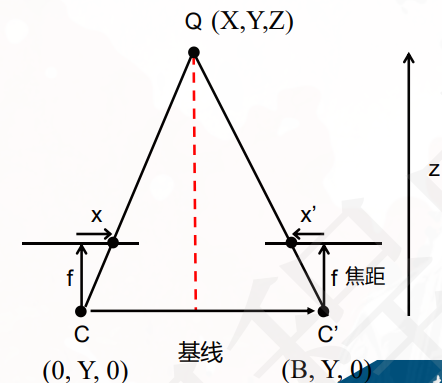

这里主要是Epipolar Geometry的应用：**深度恢复**。

## 极线约束:减少搜索空间

假设我们没有 $F$ 矩阵，要在右图里找左图某个点的对应点（2D搜索），计算量是 $O(宽 \times 高)$。

**“左图上的点，在右图上一定落在一条直线上”** ——这就是极线约束，它把我们无尽的二维搜索降维成了轻松的一维搜索。有了 $F$ 矩阵，我们把匹配点的搜索范围压缩到了 **一条极线（Epipolar Line）** 上（1D搜索）。

**具体操作**：

1. 对于左图上的点 $\mathbf{x}$，利用 $F$ 算出右图上的极线方程 $l' = F \mathbf{x}$。
2. 现在，我不需要在整张右图里乱翻，只需要**沿着这条斜线**找就行了。
3. 在应用中，通常会把两张图做**极线校正（Rectification）**，让极线变成水平线，这样就可以直接在同一行上滑动搜索。

虽然搜索维度降下来了，但计算机依然不知道这条线上哪个点才是真正的匹配点。

## 滑动窗口匹配（Sliding Window）

1. **取块**：在左图中，以目标点为中心，取一个 $n \times n$ 的小方块（比如 $7 \times 7$ 或 $11 \times 11$）。
2. **滑动**：在右图的 **极线** $l'$上，从左到右滑动一个同样大小的窗口。
3. **算账（匹配代价）**：每一次滑动，都要计算一下左右两个方块的“相似度”。PPT里提到了两种经典算法：
   - **SSD（平方差之和）**：把两个窗口里对应像素的灰度值相减，平方，再加起来。**值越小越像**。优点是快，缺点是对光照变化敏感。
   - **归一化互相关（NCC）**：计算两个窗口的相关系数。**值越接近 1 越像**。优点是抗光照能力强，缺点是计算量大一点。
4. **挑个最好的**：哪一次滑动时的代价最小（或相关性最大），我们就判定右图上的那个位置就是左图目标的“另一半”。

## 从视差（Disparity）到深度（Depth）

图中的 $x$ 和下文的 $u$ 都是像素坐标，$X,Y$ 和 $Z$ 是三维空间坐标。立体坐标系应该是左手系，这里面 $d=u-u'$ 是视差，$B$ 是两台相机的物理间距，也叫基线。

一旦找到了右图上的匹配点 $\mathbf{x'}$，就可以计算**视差 $d$**，它是左右图像中对应点的 **横坐标** 差值：

$$
\mathbf{x}=\begin{bmatrix} u \\ v\\1 \end{bmatrix}, \quad
\mathbf{x'}=\begin{bmatrix} u' \\ v'\\1 \end{bmatrix}, \quad
d = u - u'
$$

深度 $Z$ 和视差 $d$ 有着严格的**反比关系**：

$$
X/Z=u/f,  \quad u = f\cdot X/Z,\\
X/Z=u'/f, \quad u' = f\cdot (B-X)/Z,\\
d = u - u' \\
\therefore Z = \frac{f \times B}{d}
$$
（其中 $f$ 是焦距，$B$ 是两台相机的物理间距，也叫基线。）

> **物理直觉**：
>
> - 分别闭上左眼和右眼观察：
> - 看近处的手指，手指在左右眼中的位置差别很大（视差大），深度小。
> - 山在左右眼中的位置几乎重合（视差小），深度无穷大。

把 **每一个像素** 的视差算出来，我们就得到了一张**视差图**；再代入公式，就得到了**深度图**。

## 实际特殊情况

这是“基于相似性约束的对应点搜索”，但在真实机器人或手机上运行这套算法，会遇到许多令人头秃的难题：

| 痛点                  | 具体表现                                                                                                       | 工程解法法                                                                                                            |
| :-------------------- | :------------------------------------------------------------------------------------------------------------- | :-------------------------------------------------------------------------------------------------------------------- |
| **弱纹理与重复纹理**  | 面对一面白墙（全黑没纹理）或一堵砖墙（全是重复图案），滑动窗口算出来的代价全都差不多，匹配算法直接摆烂乱匹配。 | 引入全局优化算法（如**SGM半全局匹配**），不仅看局部相似度，还加上平滑约束（相邻像素视差不能突变）。                   |
| **遮挡（Occlusion）** | 左图能看到一个杯子，右图被另一个物体挡住了，根本看不到这个杯子。这时候去强行匹配，只会得到一堆噪点。           | 必须做**左右一致性检查（LRC Check）**。从左往右算一遍，再从右往左算一遍，两次算出来的深度一致才算数，不一致直接丢掉。 |

## E/F ：极线校正（Rectification）

> **如果没有 $F$**，我们就要在斜线上逐像素插值搜索，效率极低且难以并行。
> **有了 $F$ 校正**，稠密匹配变成了“行对行”的整齐搜索，这是现代立体匹配算法（如SGM、ELAS）能够实时运行的前提。

校正后的理想状态是：

- 两个相机的**图像平面**平行，
- 且图像平面的 $x$ 轴 （$u$ 坐标）**平行**于基线（两光心连线）。
- 左图第 $k$ 行的任何点，对应点一定在右图的第 $k$ 行——于是匹配变成了一维问题。这时候计算视差才有意义。

矫正的具体过程：

1. 先把光心连线（基线）方向定义为新的单位向量，记作 $\mathbf{e}_1=\frac{t}{\|t\|}$，

2. 定义另外两个单位向量 $\mathbf{e}_2$ 和 $\mathbf{e}_3$，
    - $\mathbf{e}_2=\dfrac{[-t_y,t_x,0]^T}{\|[-t_y,t_x,0]^T\|}$ 替代原来的 $z$ 轴方向，保证 $\mathbf{e}_2$ 与 $\mathbf{e}_1$ 垂直。
    - $\mathbf{e}_3 = \mathbf{e}_1 \times \mathbf{e}_2$，保证 $\{\mathbf{e}_1, \mathbf{e}_2, \mathbf{e}_3\}$ 构成一个右手坐标系。

3. 对于左右相机：
    - 左相机旋转矩阵 $R = [\mathbf{e}_1, \mathbf{e}_2, \mathbf{e}_3]^T$，右相机旋转矩阵 $R' = [\mathbf{e}_1, \mathbf{e}_2, \mathbf{e}_3]^TR$。$R$ 是两相机之间的相对旋转。

4. 构造单应矩阵
   $$
   H = K R K^{-1}, \quad H' = K' R' K'^{-1}
   $$

5. 应用单应矩阵 $H$ 和 $H'$ 对左右图像进行透视变换，得到校正后的图像。
   $$
   \hat{\mathbf{x}} = H \mathbf{x}, \quad \hat{\mathbf{x}}' = H' \mathbf{x}'
   $$

$$
\boxed{\text{稀疏匹配 (SIFT点)}}
\xrightarrow{\text{算出}}
\boxed{\text{基础矩阵 } F}
\xrightarrow{\text{结合内参}}
\boxed{\text{极线校正}}\\

\downarrow\\

\boxed{\text{沿水平线稠密滑动窗口 (SSD/NCC)}}
\xrightarrow{\text{取最小代价}}
\boxed{\text{视差图 (Disparity)}}
\xrightarrow{Z = fB/d}
\boxed{\text{深度图 (Depth Map)}}
$$
