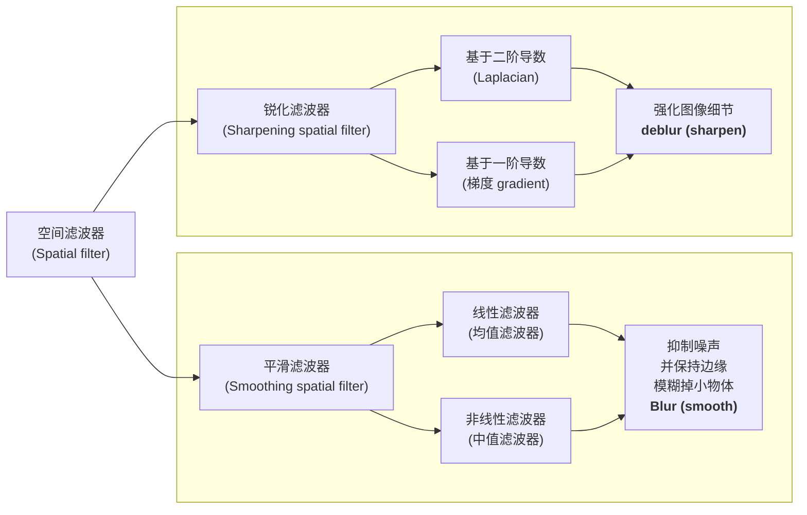
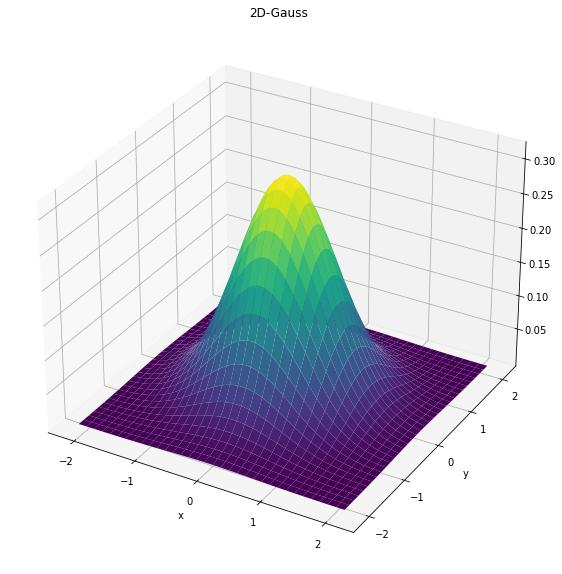

分为线性滤波器（均值/加权滤波器）和非线性滤波器（中值/最大值/最小值/双边滤波器）

- 线性的权重是固定的，非线性的权重是动态的（根据像素值差异调整权重）

## 线性滤波器

- **均值滤波器（Mean filter）**：用邻域内像素的平均值替代中心像素，会出现方块状伪阴影。
- **加权滤波器（Weighted filter）**：给邻域内不同位置的像素分配不同的权重，然后计算加权平均值，可以实现更精细的滤波效果。

### 高斯滤波器

一个常见的加权滤波器是高斯滤波器（Gaussian filter），其权重由高斯函数定义：

$$
w(i,j) = \dfrac{1}{2\pi\sigma^2} \exp{(-\dfrac{i^2 + j^2}{2\sigma^2})}
$$

性质：

- 核心参数 $\sigma$ 控制滤波器的平滑程度，$\sigma$ 越大，滤波效果越强。

- 属于低通滤波器，能有效滤除“高频”分量。

- 高斯核是可分离核：先进行一维横向高斯模糊，再进行一维纵向高斯模糊，计算复杂度从 $O(n^2)$ 降为 $O(n)$。
- 两次使用标准差为 $\sigma$ 的高斯核进行卷积，等价于使用一次标准差为 $\sqrt{2}\sigma$ 的高斯核进行卷积。
-滤波器尺寸和 $\sigma$ 的关系：$kernel\ size \approx 6\sigma + 1$ 因为高斯分布在 $\pm 3\sigma$ 范围内包含了 99.7% 的能量。

## 非线性滤波器

- **中值滤波器（Median filter）**：用邻域内像素的中位数替代中心像素，能有效去除椒盐噪声，同时保持边缘。

$$
g(x,y) = \text{median}\{f(i,j) | (i,j) \in \text{邻域}\}
$$

- **最大值滤波器（Max filter）**：用邻域内像素的最大值替代中心像素，常用于突出亮区域。

$$
g(x,y) = \max\{f(i,j) | (i,j) \in \text{邻域}\}
$$

- **最小值滤波器（Min filter）**：用邻域内像素的最小值替代中心像素，常用于突出暗区域。

$$
g(x,y) = \min\{f(i,j) | (i,j) \in \text{邻域}\}
$$

### 双边滤波器（Bilateral filter）

高斯滤波只考虑“空间距离”，不考虑“像素值差异”，会模糊边缘

双边滤波只和“距离近 + 像素值相似”的点做加权平均

通过两个高斯函数分别对空间距离和像素值差异进行加权：

Domain Kernel:
$$
d(i,j,k,l) = \exp{(-\dfrac{(i-k)^2 + (j-l)^2}{2\sigma_d^2})}
$$

Range Kernel:
$$
r(i,j,k,l) = \exp{(-\dfrac{(f(i,j)-f(k,l))^2}{2\sigma_r^2})}
$$

$$
g(i,j) = \dfrac{1}{W_p} \sum_{k,l} f(k,l) \cdot \underbrace{\exp{(-\dfrac{(i-k)^2 + (j-l)^2}{2\sigma_d^2})}}_{\text{空间距离权重}w_d(x,y,k,l)} \cdot \underbrace{\exp{(-\dfrac{(f(i,j)-f(k,l))^2}{2\sigma_r^2})}}_{\text{像素值差异权重}w_r(f(x,y), f(k,l))}
$$

其中 $W_p$ 是归一化因子，$\sigma_d$ 控制空间距离的权重，$\sigma_r$ 控制像素值差异的权重。

- $\sigma_d$ 控制模糊的范围，越大，越多邻域像素参与计算，平滑的范围越广；
- $\sigma_r$ 控制对灰度差异的敏感度，越大，越多像素值差异较大的像素参与计算。

每个像素都要重新计算权重，不能用卷积优化
