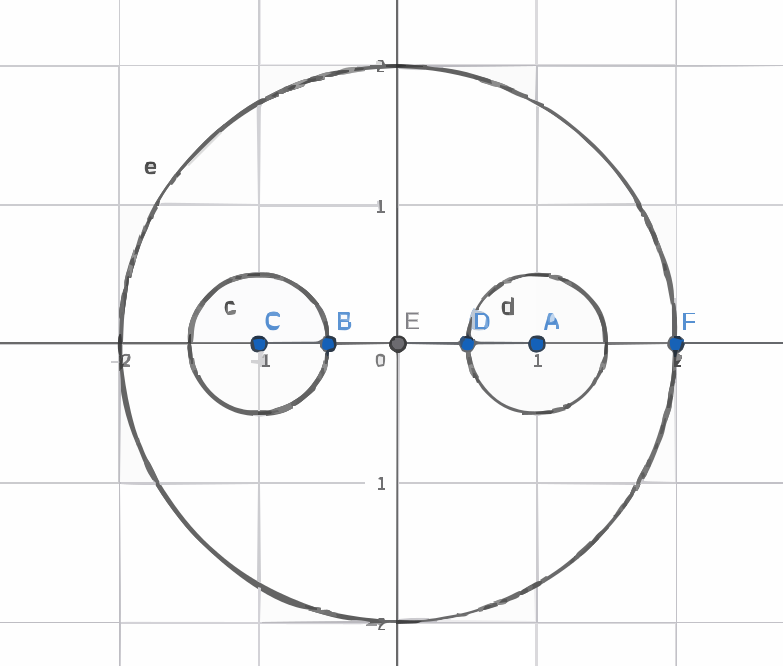

## 硬算这一块

通过定义，参数化的方法计算积分

eg1: 计算 $\int_C f(z)dz$,，其中C是复平面内从原点到 $(3,4)$ 的直线段

:::tip[solution]
参数化：$z=(3+4i)t\,,t:0\to1$
$$
\int_Cf(z)dz=\int_0^1(3+4i)(3+4i)dt
$$
:::

eg2: 计算 $\oint_{|z-z_0|\leq r} \frac{1}{(z-z_0)^n},n\in\mathbb{Z}$

:::tip[solution]
参数化
$$
\begin{align*}
&z-z_0=re^{i\theta},\theta\in(0,2\pi]\\
&\int_0^{2\pi}\frac{1}{(re^{i\theta})^n}re^{i\theta}id\theta\\[5bp]
&=ir^{1-n}\int_0^{2\pi}(e^{i\theta})^{1-n}d\theta\\
&=\begin{cases}
    0, &n\neq1\\
    2\pi i, &n=1
\end{cases}
\end{align*}
$$

:::

eg3: 计算 $\oint\frac{1}{2z-3}dz,|z|=1$

:::tip[solution]
奇点是 $(\frac{3}{2},0)$ 不在解析区域内，由柯西古撒定理，原积分是0
:::

eg4: 计算 $\int_{z+i}^{2+4i}z^2dz$

:::tip[solution]
幂函数是整个复平面上的解析函数，因此积分与路径无关
:::

eg5: 计算 $\int_{1-\pi i}^{1+\pi i}e^{\frac{z}{2}}dz$

:::tip[solution]
指数函数也是全纯函数，积分与路径无关
:::

## 利用柯西积分公式

$$
\oint_C \frac{f(z)}{z-z_0}dz=f(z_0)2\pi i
$$

eg1: 计算 $\oint_C\frac{1}{z^2-z}dz$ ，这里C是包含 $|z|=1$ 在内的正向封闭曲线

:::tip[solution]
被积函数有两个奇点 $z=0,1$，均在C内，取 $C_1=|z-0|=\delta_1,C_2=|z-1|=\delta_2$,由复合闭路定理和柯西积分公式：
$$
\oint_C\frac{1}{z^2-z}dz=\oint_C(\frac{1}{z-1}-\frac{1}{z})dz\\
\text{分别考察$C_1,C_2$}\\
=0-2\pi i+2\pi i-0=0
$$
:::

eg2 :$\oint_C\frac{sin(z\frac{\pi}{4})}{z^2-1}dz$ 其中C是包含 $|z+1|=\frac{1}{2},|z-1|=\frac{1}{2},|z|=2$

:::tip[solution]
被积函数有两个奇点 $z=\pm1$，均在C内，因此需要取两个积分路径 $C_1,C_2$ 分别包围奇点 $z=1,-1$，分别用柯西积分公式计算最后相加。
$$
\oint_C\frac{sin(z\frac{\pi}{4})}{z^2-1}dz=\oint_{C_1}\frac{sin(z\frac{\pi}{4})}{z-1}dz-\oint_{C_2}\frac{sin(z\frac{\pi}{4})}{z+1}dz
$$
其中 $C_1:|z-1|=\frac{1}{2},C_2:|z+1|=\frac{1}{2}$
$$
=2\pi i(sin(\frac{\pi}{4})-sin(-\frac{\pi}{4}))=2\pi i\sqrt{2}
$$
:::

## 利用高阶导数公式（柯西积分的高阶形式）

$$
\frac{2\pi i}{n!} \cdot f^{(n)}(a) = \oint_{\Gamma} \frac{f(z)}{(z-a)^{n+1}} \, dz, \quad n = 0,1,2,\dots
$$

eg1: $\oint_C\frac{cos(\pi z)}{(z-1)^5}dz$ 其中C $|z|>1$

:::tip[solution]
利用高阶导数公式
$$
\oint_C\frac{cos(\pi z)}{(z-1)^5}dz=2\pi i\frac{1}{4!}(-\pi)^4=\frac{\pi^4}{48}
$$
:::

eg2： $\oint_C\frac{e^z}{(z^2+1)^2}dz$ 其中C $|z|>1$

:::tip[solution]
把分母拆成 $(z-i)^2(z+i)^2$,根据不同的奇点选择不同的 $f(z)$ 和积分路径，然后用高阶导数公式，再把结果加起来。
$$
\oint_C\frac{e^z}{(z^2+1)^2}dz=\oint_C\frac{e^z}{(z-i)^2(z+i)^2}dz\\[5pt]
\text{取 $f_1(z)=\frac{e^z}{(z+i)^2}$，奇点 $z=i$}\\
f_1^\prime(z)=\frac{e^z}{(z+i)^2}-\frac{2e^z}{(z+i)^3}\\
\oint_C\frac{f_1(z)}{(z-i)^2}dz=2\pi i\frac{1}{1!}f_1^\prime(z=i)=2\pi i\frac{-e^i(1+i)}{4}=\frac{\pi e^i(1-i)}{2}\\[5pt]
\text{取 $f_2(z)=\frac{e^z}{(z-i)^2}$，奇点 $z=-i$}\\
f_2^\prime(z)=\frac{e^z}{(z-i)^2}-\frac{2e^z}{(z-i)^3}\\
\oint_C\frac{f_2(z)}{(z+i)^2}dz=2\pi i\frac{1}{1!}f_2^\prime(z=-i)=\frac{\pi e^{-i}(1+i)}{2}\\[5pt]
\oint_C\frac{e^z}{(z^2+1)^2}dz=\frac{\pi}{2}(e^i+e^{-i})+\frac{\pi i}{2}(e^{-i}-e^i)=\pi \cos 1-i\pi \sin 1
$$
:::

eg3: $\oint_C\frac{z^3+1}{(z+1)^4}$

:::tip[solution]
被积函数在 $z=-1$ 处有三阶极点，取 $f(z)=z^3+1$，则
$$
f^{(3)}(z)=6\\
\oint_C\frac{z^3+1}{(z+1)^4}dz=2\pi i\frac{1}{3!}f^{(3)}(-1)=2\pi i \;\text{奇点在积分路径内}  
$$
:::

eg4 :$\oint_C\frac{dz}{(z^2+1)(z^2+4)}$ C: $|z|=\frac{3}{2}$

:::tip[solution]

在积分路径内的奇点是 $z=i,-i$，取两个积分路径 $C_1,C_2$ 分别包围奇点 $z=i,-i$
$$
\oint_C\frac{dz}{(z^2+1)(z^2+4)}=\oint_{C_1}\frac{dz}{(z-i)(z+i)(z^2+4)}+\oint_{C_2}\frac{dz}{(z+i)(z-i)(z^2+4)}\\[5pt]
=2\pi i(\frac{1}{6i}+\frac{1}{-6i})=0
$$

:::

eg5：$\oint_C\frac{3z^2+7z+1}{(z+1)^3}dz$ 其中C $|z+i|=1$

:::tip[solution]
奇点在 $z=-1$，在积分路径外，因此积分为0
:::

eg6：$\oint_C\frac{3z+2}{z^4-1}dz$ 其中C $|z-(1+i)|=\sqrt{2}$

:::tip[solution]

奇点在 $z=\pm1,\pm i$，在积分路径内的奇点是 $z=1,i$，取两个积分路径 $C_1,C_2$ 分别包围奇点 $z=1,i$，取积分路径 $C_1,C_2$ 分别包围奇点 $z=1,i$

$$
\oint_C\frac{3z+2}{z^4-1}dz=\oint_{C_1}\frac{3z+2}{(z-1)(z+1)(z^2+1)}dz+\oint_{C_2}\frac{3z+2}{(z^2-1)(z+i)(z-i)}dz\\[5pt]
=2\pi i(\frac{5}{4}+\frac{2i-3}{4})=\pi(i-1)
$$

:::note[解题思路]
$$
\text{找奇点}\begin{cases}
    \text{在积分路径外的奇点}\rightarrow \text{积分为0}\\
    \text{在积分路径内的奇点}\begin{cases}
        \text{单个奇点，直接算}\\
        \text{多个奇点，取多个积分路径包围奇点，分别选择合适的 $f(z)$，计算后相加}\\
    \end{cases}
\end{cases}
$$
注意变形的时候要确保分母是 $(z-a)^{n+1}$ 的形式，n=0时就是柯西积分公式。一个分母对应一个奇点。
:::

## 证明题这一块

如果多项式 $Q(x)$ 的次数比 $P(x)$ 的次数高出至少2，证明：
$\lim_{R\to\infty}\oint_{|z|=R}\frac{P(z)}{Q(z)}dz=0$，(因此
 $\int_{-\infty}^{+\infty}\frac{P(x)}{Q(x)}dx$ 收敛)

:::tip[solution]

$$
\text{设}\frac{P(z)}{Q(z)}=\frac{a_nx^n+\cdots+a_0}{b_mx^m+\cdots+b_0}\\
=\frac{1}{x^{m-n}}\frac{a_n+a_{n-1}\frac{1}{x}+\cdots+a_0\frac{1}{x^n}}{b_m+b_{m-1}\frac{1}{x}+\cdots+b_0\frac{1}{x^m}}\\
\text{两边取模，利用积分估值定理，}\\
|\frac{P(z)}{Q(z)}|\leq\frac{1}{R^{m-n}}\frac{|a_n|+|a_{n-1}\frac{1}{R}+\cdots+a_0\frac{1}{R^n}|}{|b_m|-|b_{m-1}\frac{1}{R}+\cdots+b_0\frac{1}{R^m}|}\\
\text{注意到 $z\to\infty$ 时，分子趋于 $|a_n|$，分母趋于 $|b_m|$}\\
\text{当 $R$ 充分大时，分母大于 $\frac{|b_m|}{2}$，分子小于 $2|a_n|$}\\
\text{由积分的估值定理}\\
|\oint_{|z|=R}\frac{P(z)}{Q(z)}dz|\leq\frac{M}{R^{m-n}}2\pi R=\frac{2\pi M}{R^{m-n-1}}\\
\text{由于 $m-n-1\geq1$，所以当 $R\to\infty$ 时，右边趋于0，因此原式也趋于0}
$$

:::