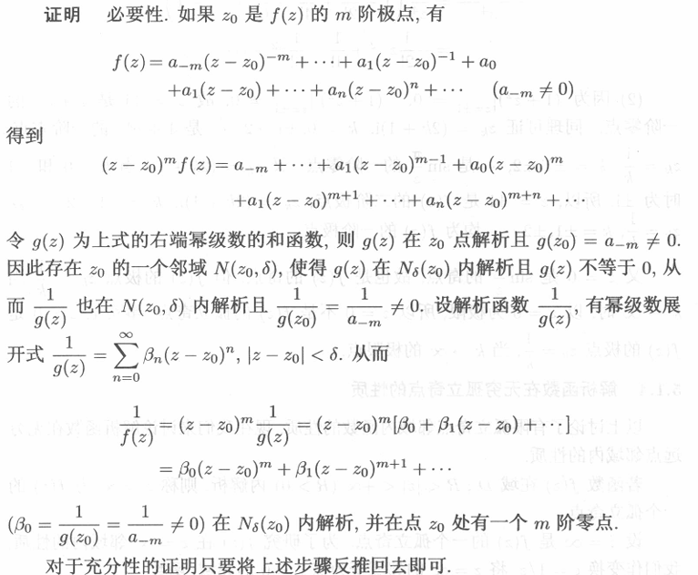
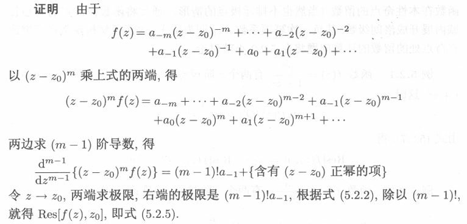

## 洛朗级数负幂部分与奇点分类，极点阶数判断

### 孤立奇点及附近的洛朗展开

**奇点**：设函数 $f(z)$ 在点 $z_0$ 的任意邻域内都有若干解析点，但在 $z_0$ 处不解析，则称 $z_0$ 为 $f(z)$ 的一个**奇点**。

**孤立奇点**：设函数 $f(z)$ 在奇点 $z_0$ 的某个去心邻域 $0<|z-z_0|<\delta$ 内解析，但在 $z_0$ 处不解析，则称 $z_0$ 为 $f(z)$ 的一个**孤立奇点**。

:::tip
并非所有奇点都是孤立奇点，例如 $f(z)=\dfrac{1}{\sin \dfrac{1}{z}}$ 的奇点 $\dfrac{1}{z}=k\pi ,\;z=\dfrac{1}{k\pi},\; k\in \mathbb{Z},\;k\to\infty\Rightarrow z\to 0$。
:::

在**孤立奇点**附近，解析函数总能展开成**洛朗级数**：

$$
f(z) = \sum_{n=-\infty}^{\infty} c_n (z-z_0)^n, \quad 0<|z-z_0|<R
$$

根据 **负幂部分** 的情况，可以把**孤立奇点**分为三类：（正幂部分解析和奇点没关系因此不讨论）

### 可去奇点

   **定义**：如果负幂部分全为零，即 $c_{-n}=0$，$n\geq 1$。

+ **充要条件** ：$\lim_{z\to z_0} f(z)=c_0 \text{存在} \iff z_0 \text{是可去奇点}$

+ 本质上函数在 $z_0$ 处是“无害”的，对积分没有贡献。

### 极点

**定义**：如果负幂部分只有有限项，即存在 $m$ 使得 $f(z)$ 展开式为  
$$
\begin{align*}
f(z) &= \frac{c_{-m}}{(z-z_0)^m} + \cdots + \frac{c_{-1}}{z-z_0} + \text{(正幂部分)}\\
&= \frac{g(z)}{(z-z_0)^m}
\end{align*}
$$
其中 $g(z)$ 在 $z_0$ 解析且 $g(z_0)\neq 0$，
那么 $z_0$ 是一个 **$m$ 阶极点**。

+ **充要条件**：$\lim_{z\to z_0} f(z)=\infty \iff z_0\text{是极点}$ 。  

+ **极点阶数定理**：设 $f(z)$ 在 $U(z_0,\delta)$ 内解析，则 $z_0$ 是 $f(z)$ 的m阶极点 $\iff$ 存在 $g(z)$，在 $U(z_0,\delta)$ 内解析且 $g(z_0)\neq 0$，并且 

   $$
   \boxed{f(z)=\dfrac{1}{(z-z_0)^m}g(z)}
   $$
+ 进一步，如果 $\lim_{z\to z_0} (z-z_0)^m f(z)=c_{-m}\neq 0$ 存在，则 $z_0$ 是 $m$ 阶极点。

### 本性奇点

**定义**：如果负幂部分有无限项，即 $f(z)$ 展开式为

$$
f(z) =\sum_{-\infty}^{+\infty}c_n(z-z_0)^n=\sum_{n=-\infty}^{-1} \frac{c_n}{(z-z_0)^n} + \text{(正幂部分)}
$$

+ **充要条件**：$\lim_{z\to z_0} f(z)\text{不存在且不为} \infty \iff z_0 \text{是本性奇点}$ 。
+ 例如：$f(z)=e^{1/z}$ 在 $z=0$ 就是本性奇点。  

eg:判断 $\frac{z+1}{z(z^2+4)^2(z+2i)^2}$ 在复平面上有何种奇点

解：分母的零点 $z=0,2i,-2i$ 都是孤立奇点，且都是极点。先把分母表示成奇点的形式：
$$
\frac{z+1}{z(z^2+4)^2(z+2i)^2}=\frac{z+1}{z(z-2i)^2(z+2i)^4}
$$
显然，$z=0$ 是1阶极点，$z=2i$ 是2阶极点，$z=-2i$ 是4阶极点。

:::warning
判断极点阶数一定要把分母因式分解成多个 $(z-z_0)^m$ 的形式，每个因式对应一个孤立奇点，指数就是极点阶数。
:::

:::warning
对于 $\infty$ 为奇点的情况，若 $\infty$ 是可去极点，未必 $\operatorname{Res}\left[f(z),\infty\right]=0$。
:::

## 无穷远点的孤立奇点

设函数 $f(z)$ 在 $|z|>R$ 内解析，则称 $f(z)$ 在无穷远点 $\infty$ 处有一个**孤立奇点**。

:::warning
并非所有的无穷远点都是孤立奇点，例如 $f(z)=e^z$ 在 $\infty$ 处不是孤立奇点。
:::

### 无穷远点的奇点分类

做变换 $w=\dfrac{1}{z}$，则 $z\to\infty \iff w\to 0 \;\;\; g(w)=f\left(\dfrac{1}{w}\right)=f(z)$ 利用 $g(w)$ 在 $w=0$ 处的奇点性质来判断 $f(z)$ 在 $z=\infty$ 处的奇点性质：

| $g(w)$ | $f(z)$ |
|:--:|:--:|
| $w\to 0$ | $z\to \infty$ |
| 可去奇点 | 可去奇点 |
| 极点 | 极点 |
| 本性奇点 | 本性奇点 |

:::warning
求所有孤立奇点时，别忘了无穷远点也是孤立奇点。
:::

## 零点与极点

### 零点的定义

设 $f(z)$ 在 $U(z_0,\delta)$ 解析，且 $f(z_0)=0$，如果存在 $m$ 使得
$$
\begin{align*}
f(z) &= \sum_{n=0}^{\infty} a_n (z-z_0)^n\\
&= a_0 + a_1 (z-z_0) + a_2 (z-z_0)^2 + \cdots
\end{align*}
$$
其中 $a_0=a_1=\cdots=a_{m-1}=0$，$a_m\neq 0$，则称 $z_0$ 是 $f(z)$ 的一个**m阶零点**。

### 零点阶数的判定

设 $f(z)$ 在点 $z_0$ 的某个邻域内解析，则 $z_0$ 是 $f(z)$ 的一个 **m阶零点** 的充要条件是：

$$
\begin{align*}
f(z) &= (z-z_0)^m g(z)\\
\text{其中 } g(z) &\text{ 在 } z_0 \text{ 解析且 } g(z_0) \neq 0
\end{align*}
$$

:::tip
简单来讲，函数在零点处得零，由泰勒展开可以看出来有些项系数（导数）是零，与 $(z-z_0)^m$ 项无关；而有些项的导数不是零，是 $(z-z_0)^m$ 项把这一项变成零。m阶零点就是函数在该点处有$m-1$个连续的导数为0，直到第 $m$ 阶导数不为0，由 $(z-z_0)^m$ 项决定。
:::

### 零点与极点的关系

1. $f(z)$ 在 $z_0$ 处有一个 **$m$ 阶极点**的充要条件是 $\dfrac{1}{f(z)}$ 在 $z_0$ 处有一个 **$m$ 阶零点**。(根据之前讲的极点的判定方法，极点处函数值为无穷大，倒数函数值为0)

   

1. 若 $z=z_0$ 是 $f(z)$ 的m阶零点，是 $g(z)$ 的n阶零点，则 $\dfrac{f(z)}{g(z)}$ 在 $z_0$ 处有一个 **$(n-m)$ 阶极点**（当 $n>m$ 时），或 **可去奇点**（当 $n\leq m$ 时）。

   :::note[简要证明]
   $$
   \begin{alignedat}{2}
      f(z)&=(z-z_0)^m h(z),\quad h(z_0)\neq 0\\
   g(z)&=(z-z_0)^n k(z),\quad k(z_0)\neq 0\\
   \therefore p(z)&=\frac{f(z)}{g(z)}=\frac{(z-z_0)^m h(z)}{(z-z_0)^n k(z)}\\
   &=(z-z_0)^{m-n}\frac{h(z)}{k(z)}\\
   &=\frac{1}{(z-z_0)^{n-m}}\frac{h(z)}{k(z)}
   \end{alignedat}
   $$
   :::

## 留数

### 留数的定义

设 $z_0$ 是 $f(z)$ 的一个**孤立奇点**，在 $\overset{\circ}{U}(z_0,\delta)$ 有洛朗展开：
$$
f(z) = \sum_{n=-\infty}^{\infty} c_n (z-z_0)^n, \quad 0<|z-z_0|<R
$$
则 $f(z)$ 在 $z_0$ 的 **留数（Residue）** 定义为：
$$
Res(f,z_0)=c_{-1}=\dfrac{1}{2\pi i} \int_\gamma \frac{f(\zeta)}{(\zeta-z_0)^{-1+1}}\, d\zeta=\dfrac{1}{2\pi i}\int_\gamma f(z)\, dz
$$
也就是说，留数就是 洛朗级数中 $(z-z_0)^{-1}$ 项的系数。

### 留数的计算方法

:::tip
当下面的技巧都行不通时，不妨用洛朗展开然后找出 $(z-z_0)^{-1}$ 项的系数来计算留数。
:::

根据奇点的不同种类以及极点的阶数，留数有不同的计算技巧：  

:::tip
极点的阶数判定方法：

1. 根据定义，看洛朗展开负幂部分有多少项

2. 根据极点阶数定理，构造 $f(z)=\dfrac{g(z)}{(z-z_0)^m}$ 注意 $g(z)$ 解析且不为零
3. 利用零点与极点的关系
4. 分式函数比较上下零点阶数来判断极点阶数

:::

1. **可去奇点**的留数

   $$
   \boxed{\operatorname{Res}(f, z_0) = 0}
   $$

2. **一阶极点**的留数

    $$
    \boxed{\operatorname{Res}(f, z_0) = \lim_{z \to z_0} (z-z_0) f(z)}
    $$

    :::tip
   有时候把 $z-z_0$ 挪到分母，构造导数的极限形式更好算
    :::

3. **高阶极点**的留数

    若 $z_0$ 是 $m$ 阶极点，则  

    $$
    \boxed{\operatorname{Res}(f, z_0) = \frac{1}{(m-1)!} \lim_{z\to z_0} \frac{d^{\,m-1}}{dz^{\,m-1}} \left[ (z-z_0)^m f(z) \right]}
    $$
    

4. **商的形式**的留数（实用公式）

    若 $f(z) = \dfrac{P(z)}{Q(z)}$，其中 $P(z)$、$Q(z)$ 在 $z_0$ 解析，且 $P(z_0)\neq 0\; Q(z_0)=0\; Q'(z_0)\neq 0$

    $$
    \boxed{\operatorname{Res}(f, z_0) = \dfrac{P(z_0)}{Q'(z_0)}}
    $$

   :::tip[例子]

   $f(z)=\dfrac{1}{z-1}$ 在 $z=1$ 的留数 ,则
   $\operatorname{Res}\Big(\frac{1}{z-1}, 1\Big) = \lim_{z\to 1} (z-1)\frac{1}{z-1} = 1$

   $f(z)=\dfrac{1}{(z-1)(z+2)}$ 在 $z=1$ 的留数  
   这里 $P(z)=1$ ,$Q(z)=(z-1)(z+2)$ ,所以 $P(1)=1$ ,$Q'(z)=(z+2)+(z-1)=2z+1$ ,$Q'(1)=3$ ,那么
   $\operatorname{Res}\Big(f, 1\Big) = \dfrac{1}{Q'(1)} = \frac{1}{3}$

   :::

5. 本性奇点的留数

   若 $z_0$ 是本性奇点，则留数计算可以用定义：

   $$
   \operatorname{Res}(f, z_0) = \frac{1}{2\pi i} \int_\gamma f(z)\, dz
   $$

   $\gamma$ 绕过奇点 $z_0$ 正向（逆时针）。

   更常用的方法是展开成洛朗级数后取 $(z-z_0)^{-1}$ 项的系数。

6. 无穷远点的留数

   当 $f(z)$ 的展开式满足：

   $$
   f(z) = \sum_{n=-\infty}^{\infty} c_n z^n, \quad |z|>R
   $$

   即当解析圆环的外圆半径 $R\to\infty$ 时，无穷远点就是一个孤立奇点。

   首先要考虑复平面上环绕无穷远点的闭合曲线（洛朗级数展开中的 $\gamma$ 方向）

   $\gamma$ 定义时必须是**正方向(逆时针)**，对于非无穷远的奇点是显然的，但对于无穷远点（扩充复平面上，引入复球面），从球内往球外看时画逆时针轨迹，投影到复平面上就变成了**顺时针**

   :::warning
   $$
   \texttt{\textcolor{yellow}{环绕无穷远点的正向路径是顺时针的！}}
   $$
   :::

   $$
   \boxed{\operatorname{Res}[f(z),\infty]=-\operatorname{Res}\left[\frac{1}{z^2}f\left(\frac{1}{z}\right),0\right]}
   $$

## 留数定理

### 一般留数定理

设函数 $f(z)$ 在某个单连通区域 $D$ 内解析，除了有限个**孤立奇点** $z_1, z_2, \dots, z_n$。设 $\gamma$ 是一条 **正向（逆时针）** 绕这些奇点的闭合曲线，且 $\gamma$ 不经过任何奇点，则：

$$
\boxed{\oint_\gamma f(z)\, dz = 2 \pi i \sum_{k=1}^n \operatorname{Res}(f, z_k)}
$$
其中 $\gamma$ 是 $z_0$ 的一个正向小闭合圈。  

也就是说：**闭合曲线积分等于曲线内部所有奇点（极点）留数之和乘以 $2\pi i$**。**留数就是函数在 $\textcolor{yellow}{孤立奇点}$ 周围对积分的“贡献值”**

留数定理的本质是**复合闭路定理**的推广  

$$
\operatorname{Res}(f, z_0) =\frac{1}{2\pi i} \int_\gamma \frac{f(\zeta)}{(\zeta-z_0)^{n+1}}\, d\zeta\overset{n=-1}{=}\frac{1}{2\pi i} \oint_\gamma f(z)\, dz
$$

:::warning
用留数定理一定要强调**孤立奇点**，复合闭路定理里面可以有大洞，就是非孤立奇点，但是留数定理不能有大洞。
:::

### 扩展留数定理

画一个**足够大的圆包围所有孤立奇点**，此时无穷远点也是孤立奇点，则所有奇点（包括无穷远点）的留数和为零：
$$
 \sum_{k=1}^n \operatorname{Res}(f, z_k) + \operatorname{Res}(f, \infty) =0
$$

带入无穷远点的留数公式：
$$
\operatorname{Res}(f, \infty)=-\operatorname{Res}\left(\frac{1}{z^2}f\left(\frac{1}{z}\right),0\right)
$$

$$
\boxed{\sum_{k=1}^n \operatorname{Res}(f, z_k) = \operatorname{Res}\left(\frac{1}{z^2}f\left(\frac{1}{z}\right),0\right)}
$$

+ 这个方法在孤立奇点非常多，或者留数不好算的时候很有用。

:::warning
扩展留数定理要求积分路径包围所有孤立奇点
:::

## 留数定理的常见应用

### 1 计算闭合曲线积分

例如，计算围绕单位圆 $|z|=1$ 的积分：
$\oint_{|z|=1} \dfrac{dz}{z^2+1}$

步骤：  

1. 分解因子：$z^2+1 = (z-i)(z+i)$  

2. 奇点在 $z=i, z=-i$，单位圆内仅 $z=i$  
3. 单极点留数：$\operatorname{Res}\Big(\dfrac{1}{z^2+1}, i\Big) = \lim_{z\to i} (z-i)\dfrac{1}{(z-i)(z+i)} = \dfrac{1}{2i}$  
4. 积分：$\oint_{|z|=1} \dfrac{dz}{z^2+1} = 2\pi i \cdot \dfrac{1}{2i} = \pi$

### 2 计算实积分

许多实积分可以通过构造复函数，并使用留数定理计算，例如：

$\int_{-\infty}^{\infty} \dfrac{dx}{x^2+1} = \pi$

1. 形如 $\int_0^{2\pi}R(\sin\theta,\cos\theta)d\theta$，其中R表示有理式

   $$
   \text{令}z=e^{i\theta},\;\frac{1}{z}=e^{-i\theta}\\
   \iff \begin{cases}
      \cos\theta=\frac{z+\frac{1}{z}}{2}\\
      \sin\theta=\frac{z-\frac{1}{z}}{2i}\\
      dz=izd\theta
   \end{cases}\\[10pt]
   \iff \boxed{\oint_{|z|=1} R(\frac{z+\frac{1}{z}}{2},\frac{z-\frac{1}{z}}{2i})\frac{1}{iz}dz}
   $$

   :::note  
   $\int_0^{\pi}$ 的情况先用奇偶性转到 $\frac{1}{2}\int_{-\pi}^{\pi}$ 再处理  
   :::

2. 形如 $\int_{-\infty}^{+\infty}\dfrac{P(x)}{Q(x)}dx$，上下都是多项式，$Q(x)$ 的次数比 $P(x)$ 至少高两次且 $Q(x)=0$ 无实根，则

   $$
   \boxed{\int_{-\infty}^{+\infty}\frac{P(x)}{Q(x)}dx=2\pi i\sum_{k=1}^{n}\operatorname{Res}[\frac{P(z)}{Q(z)},z_k]}\\[10pt]
   \text{这里 $z_k$ 是 $\dfrac{P(z)}{Q(z)}$ 在}\textcolor{yellow}{上半平面内}\text{的奇点}
   $$

3. 形如 $\int_{-\infty}^{+\infty}\dfrac{P(x)}{Q(x)}e^{iax}dx,a>0$ 上下都是多项式，$Q(x)$ 的次数比 $P(x)$ 至少高两次

   + **case 1** ：$Q(x)=0$ 无实根

      $$
         \int_{-\infty}^{+\infty}\dfrac{P(x)}{Q(x)}e^{iax}dx,a>0=2\pi i\sum_{k=1}^{n}\operatorname{Res}\left(\frac{P(z)}{Q(z)}e^{iaz},z_k\right)
      $$

   其中 $z_k$ 是 $\dfrac{P(z)}{Q(z)}e^{iaz}$ 在上半平面内的奇点。

   + **case 2** ：$Q(x)=0$ 有实根 $x_r$

      $$
         \int_{-\infty}^{+\infty}\dfrac{P(x)}{Q(x)}e^{iax}dx,a>0=2\pi i\sum_{k=1}^{n}\operatorname{Res}\left(\frac{P(z)}{Q(z)}e^{iaz},z_k\right)+\pi i\sum_{r=1}^p\operatorname{Res}\left(\frac{P(z)}{Q(z)}e^{iaz},x_r\right)
      $$

   + **case 3** ：只有 $\cos x$ 或 $\sin x$ ，则利用欧拉公式 $e^{iax}=\cos ax + i\sin ax$ 分别计算实部和虚部

      $$
         \int_{-\infty}^{+\infty}\dfrac{P(x)}{Q(x)}\cos ax\, dx=\int_{-\infty}^{+\infty}\dfrac{P(x)}{Q(x)}\operatorname{Re}\left[e^{iax}\right]dx= \operatorname{Re}\int_{-\infty}^{+\infty}\dfrac{P(x)}{Q(x)}e^{iax}dx\\[10pt]
         \int_{-\infty}^{+\infty}\dfrac{P(x)}{Q(x)}\sin ax\, dx=\int_{-\infty}^{+\infty}\dfrac{P(x)}{Q(x)}\operatorname{Im}\left[e^{iax}\right]dx= \operatorname{Im}\int_{-\infty}^{+\infty}\dfrac{P(x)}{Q(x)}e^{iax}dx
      $$

### 公公又式式

+ 核心步骤：**找奇点 → 判定类型 → 计算留数 → 求和 × 2πi**
