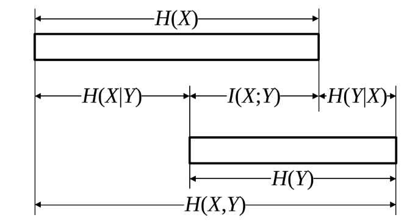

## 香农信息

信息是用来消除不确定性的东西。

对于一个随机事件 $x$ ，用 $x$ 发生的概率 $P(x)$ 来衡量这个事件所包含的信息量

- 事件发生的概率越小，包含的信息量就越大。
- 事件发生的概率越大，包含的信息量就越小。

## 自信息量的定义

定义随机事件的自信息量（self-information）为：

$$
I(x) = f(P(x))
$$

其中 $f$ 应当满足

1. $f$ 是一个单调递减函数：当 $P(x)$ 增大时，$I(x)$ 减小。
2. $P(x) = 1$ 时，$I(x) = 0$：当事件确定发生时，不包含任何信息。
3. $P(x) = 0$ 时，$I(x) = +\infty$：当事件不可能发生时，包含无限信息。
4. 满足可加性：对于两个**独立事件** $x$ 和 $y$，它们的联合事件 $x, y$ 的信息量应该等于它们各自信息量的和，即 $I(x, y) = I(x) + I(y)$。

满足上述条件的函数是 $I(x) = -\log P(x)$，因此我们定义随机事件 $x$ 的信息量为：

$$
I(x) = -\log_{?} P(x)
$$

其中底数 $?$ 可以是 2（比特bit）、自然对数 $e$（纳特nat）或 10（哈特莱hartley），根据具体应用场景选择。

其推广到联合事件 $x, y$ ：

**联合自信息量**定义为：

$$
I(xy) = -\log P(x, y)
$$

**条件自信息量**定义为：

$$
I(x|y) = -\log P(x|y)
$$

其中，条件自信息，联合自信息与自信息量之间满足以下关系：

$$
I(xy) = I(x) + I(y|x) = I(y) + I(x|y)
$$

用概率的乘法定律 $P(x, y) = P(x) P(y|x) = P(y) P(x|y)$ 可以验证上述关系。

## 信息熵

信息熵（entropy）是一个随机变量的不确定性的度量。对于一个离散随机变量 $X$，其信息熵定义为：

$$
H(X) =\mathbb{E}[I(X)] = -\sum_{x} P(x) \log P(x)
$$

说明：信息熵是随机变量**所有**可能结果的**自信息量**的**期望值**。

类比自信息量，这个也有联合熵和条件熵：

**联合熵**定义为：

$$
H(X, Y) =\mathbb{E}[I(x, y)] = -\sum_{x, y} P(x, y) \log P(x, y)
$$

**条件熵**定义为：(一般情况下 $H(X|Y) \neq H(Y|X)$)

$$
H(X|Y) =\mathbb{E}[I(x|y)] =-\sum_{x\in X, y\in Y} P(x, y) \log P(x|y)
$$

满足以下关系：（熵的链式法则）

对于一般有关系的随机变量 $X$ 和 $Y$，它们的联合熵满足以下关系：

$$
H(X, Y) = H(X) + H(Y|X) = H(Y) + H(X|Y)
$$

当且仅当 $X$ 和 $Y$ 独立时，条件熵等于各自的熵，即 $H(Y|X) = H(Y)$ 和 $H(X|Y) = H(X)$，此时联合熵满足：

$$
H(X, Y) = H(X) + H(Y)
$$

关于这几个量的关系：

## 离散信源的最大熵定理

定理：对于一个离散随机变量 $X$，当且仅当 $X$ 服从均匀分布时，其信息熵达到最大值。

也就是各随机事件发生的概率相等时，随机变量的不确定性最大，信息熵也最大。对于一个具有 $n$ 个可能取值的离散随机变量 $X$，当 $P(x_i) = \frac{1}{n}$ 对所有 $i$ 成立时，信息熵达到最大值。

证明：利用拉格朗日乘数法求解以下优化问题：

数学建模如下：

$$
\max H(X) = -\sum_{i=1}^{n} P(x_i) \log P(x_i)  \quad \text{s.t.} \quad \sum_{i=1}^{n} P(x_i) = 1\\
\mathcal{L}(P(x_1), \ldots, P(x_n), \lambda) = -\sum_{i=1}^{n} P(x_i) \log P(x_i) + \lambda \left( \sum_{i=1}^{n} P(x_i) - 1 \right)\\
\text{对参数求偏导}\\
\frac{\partial \mathcal{L}}{\partial P(x_i)} = -\log P(x_i) - 1 + \lambda = 0 \quad \Rightarrow \quad P(x_i) = e^{\lambda - 1} \quad \text{对所有 } i \\
\text{利用约束条件求解 } \lambda \\
\sum_{i=1}^{n} P(x_i) = n e^{\lambda - 1} = 1 \quad \Rightarrow \quad e^{\lambda - 1} = \frac{1}{n} \quad \Rightarrow \quad P(x_i) = \frac{1}{n} \quad \text{对所有 } i
$$
