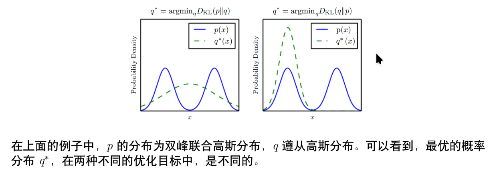

## KL散度

KL散度（Kullback-Leibler Divergence）又称相对熵，是衡量两个概率分布之间差异的一种方法。对于两个概率分布 $P$ 和 $Q$，KL散度定义为：

$$
D_{KL}(P \| Q) = \sum_{x} P(x) \log \frac{p(x)}{q(x)}
$$

其中 $p(x)$ 和 $q(x)$ 分别表示概率分布 $P$ 和 $Q$ 的概率密度函数

### KL散度的性质

- KL散度是非负的：$D_{KL}(P \| Q) \geq 0$，当且仅当 $P = Q$ 时，KL散度为零。
- KL散度不是对称的：$D_{KL}(P \| Q) \neq D_{KL}(Q \| P)$。

## 交叉熵

对KL散度进一步变形，发现他是由P的熵和P与Q的交叉熵两部分组成的：

$$
D_{KL}(P \| Q) = \int_{-\infty}^{+\infty} p(x) \log \frac{p(x)}{q(x)} dx \\
= -\int_{-\infty}^{+\infty} p(x) \log q(x) dx + \int_{-\infty}^{+\infty} p(x) \log p(x) dx\\
= -H(P) + CE(P, Q)
$$

其中 $H(P)$ 是P的熵，$CE(P, Q)$ 是P与Q的交叉熵。

### 交叉熵在分类问题中的应用

一般情况下，$P$ 是真实标签的分布(通常是one-hot向量)，$Q$ 是模型预测的分布。在这种情况下，交叉熵可以用来衡量模型预测与真实标签之间的差异。可以作为**损失函数**来优化模型参数，使得模型预测的分布尽可能接近真实标签的分布。

训练的过程就是Q从**无偏**（离散信源信息熵最大）到**有偏**的过程，最终使得Q与P尽可能接近，KL散度尽可能小，交叉熵尽可能小。

:::tip

one-hot向量：在分类问题中，真实标签通常表示为一个**长度为类别数**的向量，其中只有一个元素为1（表示正确类别），其余元素为0。

:::
