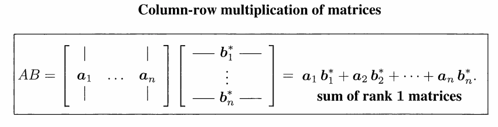

## 如何理解Ax

老爷子说“Multiplication $A\mathbf{x}$ Using **Columns** of $A$”，引出了两种不同但等价的计算思路，也就引出了值域空间和列空间这两个等价概念

### 第一种方法：**inner products** of the **rows** with $\mathbf{x}$

（线性变换角度）

将矩阵$A$的**行向量**与向量$\mathbf{x}$进行点积运算，得到结果向量的每个元素。这种方法强调了矩阵的行空间。得到的叫做**值域空间**（range space），也就是线性映射的输出空间。

### 第二种方法 : combination of the **columns** of $A$ with the **components** of $\mathbf{x}$

（线性组合角度）

这种视角下，$A\mathbf{x}$ 就是矩阵 $A$ 所有**列向量**的线性组合。而对于$\mathbf{x}$，他的每一个分量—— $A$ 中列向量的权重——可以取到任意实数，因此：

矩阵的所有**列向量**的**所有线性组合**所构成的向量空间称为矩阵的**列空间**（column space），记作 $C(A)$。也就是“The combinations of the columns fill out the column space of А.”

:::note  
注意这里定义列空间的时候并没有强调矩阵 $A$ 列向量的相关性，因为无论列向量是否相关，列空间都是由这些列向量的线性组合构成的。
:::

## 如何理解AB

通常我们学矩阵乘法有三种视角：

- **行内积视角**：是 行 $\times$ 列 “左边一行点乘右边一列”得到一个数

- **线性变换视角**：是 $A \times$ $B$ 的列 “左边矩阵作用于右边矩阵的列向量”得到一个新的矩阵  
- **外积视角**： “一列乘一行” $A$ 的列 $\times$ $B$ 的行 得到一个矩阵。

下面这句话是从**外积（Outer Product）** 的角度来理解矩阵乘法。它不仅是线性代数的高阶视角，更是图像处理、PCA（主成分分析）和 SVD（奇异值分解）的理论基石。

    AB = Sum of Rank One Matrices

### 什么是秩为1的矩阵？

一个列向量 $\mathbf{u}$ 乘以一个行向量 $\mathbf{v}^T$，结果是一个矩阵。例如：

$$
\mathbf{u}\mathbf{v}^T = \begin{bmatrix} u_1 \\ u_2 \end{bmatrix} \begin{bmatrix} v_1 & v_2 \end{bmatrix} = \begin{bmatrix} u_1v_1 & u_1v_2 \\ u_2v_1 & u_2v_2 \end{bmatrix}
$$

这个矩阵的每一行都是 $\mathbf{v}^T$ 的倍数，每一列都是 $\mathbf{u}$ 的倍数。它的秩必然是 1（因为它只有一维独立信息）。

### AB = Sum of Rank One Matrices

假设 $A$ 的列向量为 $\mathbf{a}_1, \mathbf{a}_2, \dots, \mathbf{a}_n$，而 $B$ 的行向量为 $\mathbf{b}_1^T, \mathbf{b}_2^T, \dots, \mathbf{b}_n^T$
即两个矩阵$A(m\times n)$和$B(n\times p)$，AB乘积是多个秩为1的矩阵的和。下图的 $*$ 表示转置：

这个视角的好处在于能看见整个矩阵是由哪些 **基础分量（层）** 堆叠出来的

例如在数据压缩中，我们可以通过保留前几个秩为1的矩阵来近似原始矩阵，这就是SVD（奇异值分解）的核心思想。

在奇异值分解（SVD）中，一个复杂的矩阵 $A$ 被分解为：

$$
A = \sigma_1 \mathbf{u}_1\mathbf{v}_1^T + \sigma_2 \mathbf{u}_2\mathbf{v}_2^T + \dots + \sigma_n \mathbf{u}_n\mathbf{v}_n^T
$$

每一项 $\mathbf{u}_i\mathbf{v}_i^T$ 都是一个秩一矩阵，代表了一层“特征”。$\sigma_i$ 是权重（奇异值）。如果想压缩一张图片，你只需要保留权重最大的前几个秩一矩阵，剩下的扔掉。图片依然清晰，但占用的空间小。
