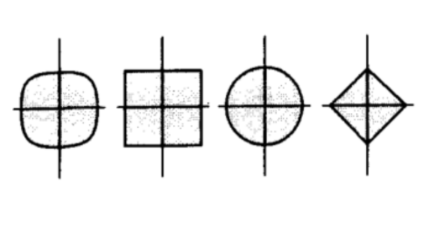

:::tip
Question:为什么机器学习里总在说 L1 / L2 / 正则化？
:::

# 范数的定义

从数学的角度上讲，范数是一个函数，它接受一个**向量**作为输入，并输出一个**非负实数**，表示这个向量的“大小”或“长度”。范数必须满足以下三个条件：

1. **非负性**：对于任何向量 $\mathbf{x}$，范数 $\|\mathbf{x}\|$ 都必须是非负的，即 $\|\mathbf{x}\| \geq 0$，并且只有当 $\mathbf{x} = \mathbf{0}$ 时，$\|\mathbf{x}\| = 0$。

2. **绝对齐次性**：对于任何标量 $\alpha$ 和任何向量 $\mathbf{x}$，范数必须满足 $\|\alpha \mathbf{x}\| = |\alpha| \|\mathbf{x}\|$。这意味着如果你将一个向量缩放一个标量，那么它的范数也会相应地缩放。
3. **三角不等式**：对于任何两个向量 $\mathbf{x}$ 和 $\mathbf{y}$，范数必须满足 $\|\mathbf{x} + \mathbf{y}\| \leq \|\mathbf{x}\| + \|\mathbf{y}\|$。这意味着两个向量的和的范数不会超过它们各自范数的和。

- 范数 ≠ 客观长度

- 范数 = 人为定义的“评价标准”

# 向量范数

## 1-范数（曼哈顿距离，L1）

L1范数是向量元素绝对值的和。对于一个向量 $\mathbf{x} = (x_1, x_2, \ldots, x_n)$，L1范数定义为：
$$
\|\mathbf{x}\|_1 = |x_1| + |x_2| + \ldots + |x_n|
$$

## 2-范数（欧几里得距离，L2）

L2范数是向量元素的平方和的平方根。对于一个向量 $\mathbf{x} = (x_1, x_2, \ldots, x_n)$，L2范数定义为：

$$
\|\mathbf{x}\|_2 = \sqrt{x_1^2 + x_2^2 + \ldots + x_n^2}
$$

## p-范数(Hölder范数,或Lp范数)

Lp范数是向量元素的p次幂和的1/p次幂。 对于一个向量 $\mathbf{x} = (x_1, x_2, \ldots, x_n)$，Lp范数定义为：
$$
\|\mathbf{x}\|_p = \left( |x_1|^p + |x_2|^p + \ldots + |x_n|^p \right)^{\frac{1}{p}}
$$

## 单位球

所有满足：

$$
\|\mathbf{x}\|_p = 1
$$

的点组成的集合。对于不同的范数，单位球的形状也不同：

| 范数 | 形状   |
| ---- | ------ |
| L2   | 圆     |
| L1   | 菱形   |
| L∞   | 正方形 |

## 加权p-范数

普通的范数视所有维度（所有特征）同等重要。但实际处理数据时，有些维度更重要，有些则包含更多噪声。通过**对角矩阵** (一个方阵中，除了**主对角线**（从左上角到右下角的那条线）上有数字外，其余地方全是 0) $W$，我们给不同的坐标轴加上了权重。

:::tip
当 $W$ 是非奇异矩阵（不一定是角阵）时，这本质上是在做一个线性变换后再量长度。在机器学习中，这常用于处理数据不均匀缩放的情况（马氏距离的基础）
:::

$$
\|x\|_{p,W} = \|Wx\|_p=\left( \sum_{i=1}^n |w_i x_i|^p \right)^{\frac{1}{p}}
$$

# 矩阵范数

## 诱导范数

:::tip
这里的 $Ax$ 是用外积的角度理解的，A的列和x中的元素一一对应，即AB=秩1矩阵之和
:::

矩阵范数有很多种，但诱导范数是最有用的

定义：$\|A\| = \sup_{x \neq 0} \frac{\|Ax\|}{\|x\|}$

如果把矩阵 $A$ 看作一个加工机器，输入向量 $x$。$\|x\|$ 是输入的"大小"。$\|Ax\|$ 是输出的"大小"。诱导范数 $\|A\|$ 就是这个机器能实现的最大“放大倍数”。

关于这个理解的数学细节：

:::note

- $\sup$ 是上确界的意思，表示在所有非零向量 $x$ 中，$\frac{\|Ax\|}{\|x\|}$ 的最大值。
- 这里面的下标 $(m,n)，(m),(n)$ 仅表示向量的维度，而非 Lm 或 Ln 范数。符号 $\|\cdot\|_{(m)}$ 和 $\|\cdot\|_{(n)}$ 可以表示任何同类型的向量范数。

:::

一个$m \times n$的矩阵$A$，输入一个$n$维向量$x$，输出一个$m$维向量$Ax$。所以在定义域(输入空间)中定义范数$\|\cdot\|_{(n)}$，在值域(输出空间)中定义m-范数$\|\cdot\|_{(m)}$。诱导矩阵范数$\|A\|_{(m,n)}$是使不等式

$$
\|Ax\|_{(m)} \leq C \|x\|_{(n)}
$$

对于所有$x$成立的最小常数$C$。换句话说，$\|A\|_{(m,n)}$是矩阵$A$在输入空间和输出空间的范数定义下的最大放大倍数($\frac{\|Ax\|}{\|x\|}$ 的上确界)。

称范数 $\|\cdot\|_{(m,n)}$ 为由向量范数 $\|\cdot\|_{(m)}$ 和 $\|\cdot\|_{(n)}$ 诱导的矩阵范数。

因为放大倍数是一个比值，我们干脆把输入的长度固定为 1（单位圆/单位球），看看经过矩阵 $A$ 变换后，这个球被拉伸得最厉害的地方有多长。

### 常见的诱导范数

具体的[L1LL∞推导过程](https://v1otusc.github.io/2020/06/01/Induced-Matrix-Norms-%E8%AF%B1%E5%AF%BC%E7%9F%A9%E9%98%B5%E8%8C%83%E6%95%B0%E8%AF%81%E6%98%8E/)和
[L2推导过程](https://epsavlc.github.io/2019/09/09/matrix_norm.html)

| 输入范数 $\|\|\cdot\|\|_n$ | 输出范数 $\|\|\cdot\|\|_m$ | 诱导矩阵范数 $\|\|A\|\|_{m,n}$ | 数学表示                                                                 |
| -------------------------- | -------------------------- | ------------------------------ | ------------------------------------------------------------------------ |
| L1                         | L1                         | 列和范数（最大列和）           | $\|\|A\|\|_1 = \max_{1 \leq j \leq n} \sum_{i=1}^m\| a_{ij}\|$           |
| L2                         | L2                         | 谱范数（A的最大**奇异值**）           | $\|\|A\|\|_2 = \sigma_{\max}(A) = \sqrt{\lambda_1}$ ,其中 $\lambda_1$ 是$A^TA$的最大**特征值**                                       |
| L∞                         | L∞                         | 行和范数（最大行和）           | $\|\|A\|\|_\infty = \max_{1 \leq i \leq m} \sum_{j=1}^n    \| a_{ij} \|$ |

## Frobenius范数

Frobenius范数是矩阵元素的平方和的平方根。对于一个矩阵 $A = [a_{ij}]$，Frobenius范数定义为：

$$
\|A\|_F = \sqrt{\sum_{i=1}^m \sum_{j=1}^n |a_{ij}|^2}
$$

Frobenius范数可以看作是把矩阵**拉直**成一个 $m\times n$ 维的**长向量**，然后计算这个向量的 2-范数（欧几里得长度）

### 与向量范数的联系

- 向量的2-范数可以看作是一个特殊的矩阵范数：当矩阵 $A$ 是一个列向量时，记作$x, n\times 1$ ，Frobenius范数就退化成了这个向量的2-范数：
    $$
    \|x\|_F = \sqrt{\sum_{i=1}^n |x_i|^2} = \|x\|_2
    $$

- 从矩阵的列向量角度理解，每一列 $a_{:j}$ 都是一个 $n\times 1$ 向量，Frobenius范数就是所有**列向量**的2-范数的平方和的平方根：

     $$
    \|A\|_F = \sqrt{\sum_{j=1}^n \|a_{:j}\|_2^2}
    $$

- 同理，从矩阵的行向量角度理解，每一行 $a_{i:}$ 都是一个 $1\times m$ 向量，Frobenius范数也是所有**行向量**的2-范数的平方和的平方根：

     $$
    \|A\|_F = \sqrt{\sum_{i=1}^m \|a_{i:}\|_2^2}
    $$

### 基本性质

有了和向量范数（2-范数）的联系，我们可以验证Frobenius范数满足范数的三个基本性质：

- 非负性 ：$\|A\|_F \geq 0$，并且只有当 $A$ 是零矩阵时，$\|A\|_F = 0$。
- 绝对齐次性 ：对于任何标量 $\alpha$ 和任何矩阵 $A$，$\|\alpha A\|_F = |\alpha| \|A\|_F$。
- 三角不等式 ：对于任何两个矩阵 $A$ 和 $B$，$\|A + B\|_F \leq \|A\|_F + \|B\|_F$。

### 重要性质

这玩意可以和矩阵的秩联系起来，若 $a_j$ 表示矩阵的地j列向量，那么 $\|A\|_F = \sqrt{\sum_{j=1}^n \|a_j\|_2^2}=\sqrt{\text{tr}(A^T A)}=\sqrt{\text{tr}AA^T}$

