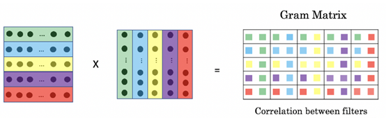

## 符号定义

内积是一种映射 $\langle \cdot, \cdot \rangle: V \times V \to \mathbb{R}$，满足以下性质：

1. **正定性**：对于所有 $\mathbf{v} \in V$，$\langle \mathbf{v}, \mathbf{v} \rangle \geq 0$，且当且仅当 $\mathbf{v} = \mathbf{0}$ 时等号成立。
2. **对称性（自反性）**：对于所有 $\mathbf{u}, \mathbf{v} \in V$，$\langle \mathbf{u}, \mathbf{v} \rangle = \langle \mathbf{v}, \mathbf{u} \rangle$。
3. **线性性**：对于所有 $\mathbf{u}, \mathbf{v}, \mathbf{w} \in V$ 和标量 $c \in \mathbb{R}$，满足以下线性关系：
   - $\langle c\mathbf{u}, \mathbf{v} \rangle = c\langle \mathbf{u}, \mathbf{v} \rangle$
   - $\langle \mathbf{u} + \mathbf{w}, \mathbf{v} \rangle = \langle \mathbf{u}, \mathbf{v} \rangle + \langle \mathbf{w}, \mathbf{v} \rangle$

定义标准内积为 $\langle \mathbf{u}, \mathbf{v} \rangle = \sum_{i=1}^n u_i v_i=\mathbf{u}^T \mathbf{v}$，其中 $\mathbf{u} = (u_1, u_2, \ldots, u_n)$ 和 $\mathbf{v} = (v_1, v_2, \ldots, v_n)$ 是 $n$ 维实向量。

## 从向量到矩阵的内积

### 补充：Gram矩阵

对于一组向量 $\{\mathbf{v}_1, \mathbf{v}_2, \ldots, \mathbf{v}_m\}$，我们可以构造一个 $m \times m$ 的矩阵 $G$，称为**Gram矩阵**，其元素定义为向量之间的内积：

$$
G_{ij} = \langle \mathbf{v}_i, \mathbf{v}_j \rangle
$$

或者如图：

Gram矩阵有几个重要性质：

1. **对称性**：由于内积的对称性，Gram矩阵是一个对称矩阵，即 $G_{ij} = G_{ji}$。
2. **半正定性**：Gram矩阵是半正定的。这意味着对于任何非零向量 $\mathbf{c} \in \mathbb{R}^m$，都有 $\mathbf{c}^T G \mathbf{c} \geq 0$。这是因为 $\mathbf{c}^T G \mathbf{c} = \sum_{i=1}^m \sum_{j=1}^m c_i c_j \langle \mathbf{v}_i, \mathbf{v}_j \rangle = \langle \sum_{i=1}^m c_i \mathbf{v}_i, \sum_{j=1}^m c_j \mathbf{v}_j \rangle \geq 0$。
3. **秩**：Gram矩阵的秩等于向量集合 $\{\mathbf{v}_1, \mathbf{v}_2, \ldots, \mathbf{v}_m\}$ 的线性独立向量的数量。换句话说，如果这些向量中有 $r$ 个是线性独立的，那么 Gram矩阵的秩就是 $r$。
4. **特征值**：由于 Gram矩阵是半正定的，它的所有特征值都是非负的。这些特征值反映了向量集合的几何性质，例如它们在空间中的分布和相互关系。

### $A^TA$

内积的概念可以推广到矩阵空间。对于两个同型矩阵 $A, B \in \mathbb{R}^{m \times n}$，我们可以定义它们的**Frobenius内积**为：

$$
\langle A, B \rangle_F = \text{tr}(A^T B) = \sum_{i=1}^m \sum_{j=1}^n A_{ij} B_{ij}
$$

可以参考矩阵的迹与Frobenius范数的关系。

对于一个矩阵 $A$ 自己和自己内积$A^TA$ ：

假设矩阵 $\mathbf{A}$ 的列向量分别为 $\mathbf{a}_1, \mathbf{a}_2, \dots, \mathbf{a}_n$：

$$
\mathbf{A} = \begin{pmatrix} | & | & & | \\ \mathbf{a}_1 & \mathbf{a}_2 & \dots & \mathbf{a}_n \\ | & | & & | \end{pmatrix}
$$

当我们计算 $\mathbf{A}^T\mathbf{A}$ 时：

$$
\mathbf{A}^T\mathbf{A} = \begin{pmatrix} \text{—} \mathbf{a}_1^T \text{—} \\ \vdots \\ \text{—} \mathbf{a}_n^T \text{—} \end{pmatrix} \begin{pmatrix} | & & | \\ \mathbf{a}_1 & \dots & \mathbf{a}_n \\ | & & | \end{pmatrix} = \begin{pmatrix} \mathbf{a}_1^T \mathbf{a}_1 & \mathbf{a}_1^T \mathbf{a}_2 & \dots \\ \mathbf{a}_2^T \mathbf{a}_1 & \mathbf{a}_2^T \mathbf{a}_2 & \dots \\ \vdots & \vdots & \ddots \end{pmatrix}
$$

可以看到，$\mathbf{A}^T\mathbf{A}$ 的每一个元素正好是 $\mathbf{A}$ 的列向量之间的内积。

结论：

- $\mathbf{A}^T\mathbf{A}$ 是矩阵 $\mathbf{A}$ 的列向量的 Gram 矩阵。
- 同理： $\mathbf{A}\mathbf{A}^T$ 是矩阵 $\mathbf{A}$ 的行向量的 Gram 矩阵。

所以 $A^TA$ 也满足 Gram矩阵的性质：

1. 对称性：$A^TA$ 是一个对称矩阵。
2. 半正定性：$A^TA$ 是半正定的。
3. 秩：$A^TA$ 的秩等于 $A$ 的列空间的维数。（或者$AA^T$ 等于 $A$ 的行空间的维数）
4. 特征值：$A^TA$ 的所有特征值都是非负的。

### $A^TA$ 的应用

A. 描述“相关性”

在数据处理中，如果 $\mathbf{A}$ 的每一列代表一个特征，那么 Gram 矩阵 $\mathbf{A}^T\mathbf{A}$ 实际上捕捉了所有特征两两之间的相关性。对角线元素 $\mathbf{a}_i^T \mathbf{a}_i$ 是向量的长度平方（能量）。非对角线元素反映了向量间的夹角（余弦相似度）。

B. 风格迁移（Style Transfer）

在深度学习的风格迁移（如 Gatys 的算法）中，我们提取卷积层的特征图（Feature Map），计算其 Gram 矩阵。这正是利用了 Gram 矩阵能丢弃空间信息、提取纹理统计特性的能力。

C. 与 SVD（奇异值分解）的联系

$\mathbf{A}^T\mathbf{A}$ 的特征值的平方根就是 $\mathbf{A}$ 的奇异值（Singular Values）。利用迹的性质：$Tr(\mathbf{A}^T\mathbf{A}) = \sum \lambda_i = \sum \sigma_i^2 = \|\mathbf{A}\|_F^2$。这意味着矩阵所有元素的平方和（Frobenius范数的平方），等于其 Gram 矩阵的迹，也等于所有奇异值的平方和。

### $A^TA$ 和 $AA^T$ 体现的对称性

$A$ 是一个 $m \times n$ 的矩阵。$A^T A$ 是一个 $n \times n$ 的对称阵。$A A^T$ 是一个 $m \times m$ 的对称阵

他们共享以下性质：

- **特征值**：$A^T A$ 和 $A A^T$ 的非零特征值是相同的。如果 $\lambda \neq 0$ 是 $A^T A$ 的一个特征值，那么它也一定是 $AA^T$ 的特征值。

   证明：

   设 $\mathbf{v}$ 是 $A^T A$ 的特征向量，对应特征值 $\lambda$：

   $$
   (A^T A) \mathbf{v} = \lambda \mathbf{v}
   $$

   两边同时左乘 $A$：

   $$
   A (A^T A) \mathbf{v} = A (\lambda \mathbf{v})
   $$

   利用矩阵结合律重组左边：

   $$
   (A A^T) (A \mathbf{v}) = \lambda (A \mathbf{v})
   $$

   结果显而易见：$A \mathbf{v}$ 变成了 $AA^T$ 的特征向量，且对应的特征值依然是 $\lambda$

- **迹（Trace）** 相等：由循环不变性 $\text{tr}(AB) = \text{tr}(BA)$。所以 $\text{tr}(A^T A) = \text{tr}(A A^T) = \sum a_{ij}^2$（这就是矩阵的 Frobenius 范数的平方）。
- **秩（Rank）** 相等：$\text{rank}(A) = \text{rank}(A^T A) = \text{rank}(A A^T)$。这意味着它们包含的“线性无关信息量”是一模一样的。
- **奇异值相同**：因为奇异值 $\sigma = \sqrt{\lambda}$，所以两者的奇异值（除去多出来的 0）完全一致。

唯一不同：零特征值的个数。如果 $m > n$，那么大的矩阵 $AA^T$ 会比 $A^T A$ 多出 $m-n$ 个等于 $0$ 的特征值。换句话说，大矩阵包含了小矩阵的所有信息，只是额外多了一堆“废话”（零空间）。
