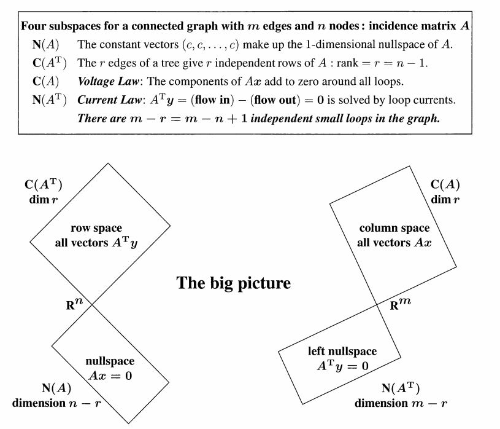

简单来说，线性空间不仅仅是一堆箭头的集合，它是一套游戏规则。只要满足这套规则的数学对象（无论是坐标、函数、矩阵还是多项式），我们都可以用统一的线性代数语言去处理它们。

## 线性空间的定义

线性空间是一个由 **“加法”** 和 **“数乘”** 定义的封闭世界：

设 $V$ 是一个非空集合，$F$ 是一个数域：

1. **存在加法运算**：对 $V$ 中任意两个元素 $\alpha$ 与 $\beta$，在 $V$ 中都有唯一的元素 $v$ 与之相对应，
称之为 $\alpha$ 与 $\beta$ 的和，记为 $v = \alpha + \beta$，且满足下面四条法则：
   - a) 交换律：$\alpha + \beta = \beta + \alpha$
   - b) 结合律：$\alpha + (\beta + \gamma) = (\alpha + \beta) + \gamma$，其中 $\gamma \in V$
   - c) 零元素：在 $V$ 中有一元素 $0$，对于 $\forall \alpha \in V$，$\alpha + 0 = \alpha$
   - d) 负元素：对于 $\forall \alpha \in V$，都存在 $\beta \in V$，使得 $\alpha + \beta = 0$
   - 注意这里的 0 是指零元素（0 ∈ V）

2. **存在数乘运算**：对 $V$ 中任意元素 $\alpha$ 与 F 中任意元素 $k$，在 $V$ 中都有唯一的元素 $\eta$ 与
它们相对应，称之为 $\alpha$ 与 $k$ 的数乘，记为 $\eta = k \cdot \alpha = k\alpha$，且满足下面四条法则：
   - a) 数 1 的乘法：$1 \cdot \alpha = \alpha$
   - b) 数域 F 中的乘法关系：$k(l\alpha) = (kl)\alpha$
   - c) 对 F 中数的加法分配律：$(k + l)\alpha = k\alpha + l\alpha$
   - d) 对 V 中元素的加法分配律：对于 $k(\alpha + \beta) = k\alpha + k\beta$
   - 其中，$k, l$ 为数域 $F$ 中的任意数，$\alpha$, $\beta$ 为集合 $V$ 中的任意元素。

### 线性空间的子空间

假设 $V$ 为 $F$ 上的线性空间，若存在 $W \subseteq V$ 使得：
1 加法封闭性：对任意的 $\alpha, \beta \in W$，均有 $\alpha + \beta \in W$；
2 数乘封闭性：对任意的 $\alpha \in W$，$k \in F$，均有 $k \cdot \alpha \in W$。
则称 $W$ 为 $V$ 的子空间。

例如：

- 二维空间中过原点的共线向量的集合。

- 三维空间中过原点的共面向量的集合。

## 线性映射

假设 $V$ 和 $W$ 为 $F$ 上的线性空间。若存在函数 $T : V \rightarrow W$，满足下列的齐次和可加性：

1. 对任意的 $\alpha, \beta \in V$，均有 $T(\alpha + \beta) = T(\alpha) + T(\beta)$。
2. 对任意的 $\alpha \in V$，$k \in F$，均有 $T(k\alpha) = kT(\alpha)$。

称 $T$ 为 $V$ 到 $W$ 的**线性映射**

### 线性映射与他的矩阵表示

旋转、缩放、投影等几何变换都是线性映射的例子。对于这些线性映射，我们可以用矩阵来表示它们的作用。例如，在二维空间中，旋转一个向量 $\mathbf{v}$ 可以通过一个旋转矩阵 $R$ 来实现：

$$
R = \begin{bmatrix}
\cos \theta & -\sin \theta \\
\sin \theta & \cos \theta
\end{bmatrix}
$$

当我们将向量 $\mathbf{v}$ 乘以这个矩阵 $R$ 时，我们就得到了旋转后的向量 $R\mathbf{v}$。

矩阵的行列操作（就是**初等变换**，不改变矩阵的秩）也是一种线性映射，也可以由矩阵表示，可以归结为三种基本的行列操作：

1. 交换：第 $i$ 行和第 $j$ 行的交换，第 $i$ 列和第 $j$ 列的交换
2. 相加：第 $j$ 行的 $c$ 倍加到第 $i$ 行，第 $j$ 列的 $c$ 倍加到第 $i$ 列
3. 伸缩：第 $i$ 行乘上标量 $c$ 倍，第 $i$ 列乘上标量 $c$ 倍

这些矩阵被称为基本矩阵。

## 矩阵的子空间

:::note  
注意这里定义列空间的时候并没有强调矩阵 $A$ 列向量的相关性，因为无论列向量是否相关，列空间都是由这些列向量的线性组合构成的。 其他空间同理
:::

- 列空间/值域空间：包含了 $A$ 列向量所有可能的组合，维度由秩决定，属于 $R^m$

$$
C(A) = span\{a_{∗,1}, a_{∗,2}, . . . , a_{∗,n}\} = \{y | y = k_1a_{∗,1} + k_2a_{∗,2} + · · · + k_n a_{∗,n}, k_i ∈ R\},
$$

- 行空间：包含了 $A^T$ 列向量（$A$ 行向量）所有可能的组合,维度由秩决定，属于 $R^n$

$$
C(A^T) = span\{a_{1,∗}, a_{2,∗}, . . . , a_{m,∗}\} = \{y | y = k_1a_{1,∗} + k_2a_{2,∗} + · · · + k_m a_{m,∗}, k_i ∈ R\},
$$

- (右)零空间: $A\mathbf{x} = 0$ 的所有解所构成的空间，维度是 $n-r$ ，属于 $R^n$：

$$
N(A) = \{\mathbf{x} | A\mathbf{x} = 0\},
$$

- 左零空间: $A^T\mathbf{x} = \mathbf{0}$ 且 $\mathbf{x}^T A = \mathbf{0}^T$ 的所有解所构成的空间，维度是 $m-r$ ，属于 $R^m$：

$$
N(A^T) = \{\mathbf{x} | \mathbf{x}^T A = \mathbf{0}^T\}.
$$

## The Big Picture

这个图揭示了任何矩阵 $A$ 背后的四个核心子空间，以及它们如何精妙地分布在输入空间 $\mathbb{R}^n$ 和输出空间 $\mathbb{R}^m$ 中。

### 左侧：输入空间 $\mathbb{R}^n$ （$n$ 维空间）

这里是所有向量 $x$ 的家。它被切割成了两个相互垂直（正交）的部分：

- 行空间 $C(A^T)$：含义：由矩阵 $A$ 的行向量组合而成的空间。

  - 物理意义：这是 $A$ 真正能“抓取”并变换的信息部分。如果一个向量落在行空间，它被 $A$ 乘以之后，一定会变成一个非零向量。
- 零空间 $N(A)$：含义：所有满足 $Ax = 0$ 的向量 $x$。
  - 物理意义：这是 $A$ 的“黑洞”。任何落入这个空间的向量，经过 $A$ 变换后都会消失（变成零）。

- 关系：行空间与零空间是**正交补**。也就是说，任何输入向量 $x$ 都可以唯一地拆解为一个“有用成分”（行空间）和一个“被抹除成分”（零空间）。

### 右侧：输出空间 $\mathbb{R}^m$ （$m$ 维空间）

这里是变换后的结果 $b$（即 $Ax$）所在的家。它同样被切割为两部分

- 列空间 $C(A)$：含义：由矩阵 $A$ 的列向量组合而成。
  - 物理意义：方程 $Ax = b$ 有解的充要条件是 $b$ 落在列空间里。在电路图中，这对应着 电压定律 (KVL)：电势差的组合。
- 左零空间 $N(A^T)$：含义：所有满足 $A^Ty = 0$ 的向量 $y$。
  - 物理意义：在图论中，这对应着 电流定律 (KCL)：流入等于流出。它描述了系统中的“环流”或平衡状态。

### 维度

**维度的守恒（秩）**：行空间和列空间的维度完全相等，都等于矩阵的秩 $r$（$rank$）。这意味着 $A$ 能输出多少维的信息，完全取决于它从输入端抓取了多少维的有效信息。

**垂直性（正交）**：注意图中两对空间都是成 $90^\circ$ 直角排列的。这意味着 $A$ 的每一行都垂直于零空间里的向量。

行空间 $C(A^T)$ 的正交补是 零空间 $N(A)$。

:::tip
为什么？因为 $Ax=0$ 的定义就是：$A$ 的每一行向量与 $x$ 的内积都等于 0。这意味着 $x$ 垂直于 $A$ 的所有行。
:::

列空间 $C(A)$ 的正交补是 左零空间 $N(A^T)$。
