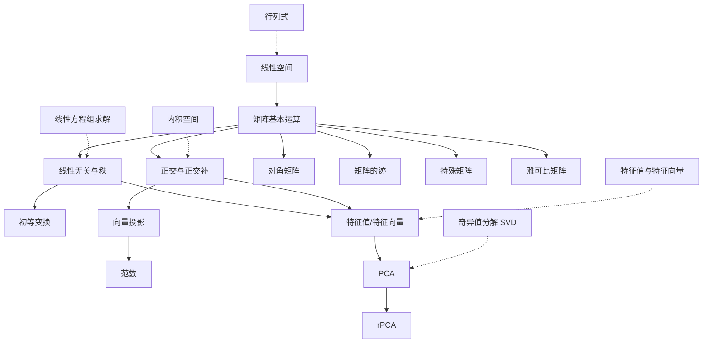

# 线性代数知识导航

## 简介

本导航文档基于线性代数知识依赖关系图设计，旨在为学习者提供清晰的学习路径和概念依赖关系。线性代数的知识点之间存在严格的逻辑依赖，按照正确的顺序学习可以事半功倍。

**博客地址**：<https://biscuit0613.github.io/posts/lineralgebra/>

## 基础知识模块

基础知识模块构建线性代数的核心理论框架，适合初学者系统学习。

### 1. 线性空间基础

- **文章标题**：线性代数基础：线性空间
- **文章链接**：[linear_space.md](https://biscuit0613.github.io/posts/lineralgebra/linearspace/)
- **简要说明**：介绍线性空间的定义、性质和基本概念，包括向量空间、子空间和线性映射
- **知识依赖**：无（起点概念）
- **学习建议**：这是线性代数的起点，理解线性空间是后续所有概念的基础

### 2. 矩阵与向量运算

- **文章标题**：线性代数：从"列"的角度理解矩阵与向量
- **文章链接**：[LinearAlgebra_Ax.md](https://biscuit0613.github.io/posts/lineralgebra/linearalgebraax/)
- **简要说明**：从列空间的角度理解矩阵向量乘法，介绍值域空间和列空间的概念
- **知识依赖**：需要线性空间基础
- **学习建议**：掌握矩阵运算的几何意义，为理解线性变换打下基础

### 3. 线性无关与秩

- **文章标题**：线性无关与秩
- **文章链接**：[LinearAlgebra_Independency_Rank.md](https://biscuit0613.github.io/posts/lineralgebra/linearalgebraindependencyrank/)
- **简要说明**：介绍线性无关、线性相关、秩的定义和性质，以及它们之间的关系
- **知识依赖**：需要线性空间和矩阵运算知识
- **学习建议**：理解线性关系的核心概念，秩是矩阵最重要的特征之一

### 4. 初等变换

- **文章标题**：矩阵的初等变换
- **文章链接**：[LinearAlgebra_Basic_Change.md](https://biscuit0613.github.io/posts/lineralgebra/linearalgebrabasicchange/)
- **简要说明**：介绍三种初等变换及其性质，初等矩阵和初等等价的概念
- **知识依赖**：需要矩阵运算和线性无关知识
- **学习建议**：掌握矩阵化简的基本方法，为线性方程组求解做准备

### 5. 正交与正交补

- **文章标题**：正交与正交补
- **文章链接**：[LinearAlgebra_orthogonal.md](https://biscuit0613.github.io/posts/lineralgebra/linearalgebraorthogonal/)
- **简要说明**：介绍正交向量、正交补空间、直和分解等概念
- **知识依赖**：需要线性空间和矩阵运算知识
- **学习建议**：理解内积空间的基础，为投影和正交分解做准备

### 6. 向量投影

- **文章标题**：向量投影
- **文章链接**：[projection.md](https://biscuit0613.github.io/posts/lineralgebra/projection/)
- **简要说明**：介绍向量投影的几何直观和计算方法，包括正交投影和最小二乘投影
- **知识依赖**：需要正交概念和矩阵运算知识
- **学习建议**：掌握投影这一重要几何操作，为PCA等应用打下基础

## 进阶知识模块

### 7. 范数

- **文章标题**：范数
- **文章链接**：[Norm.md](https://biscuit0613.github.io/posts/lineralgebra/norm/)
- **简要说明**：介绍向量范数和矩阵范数的定义、性质，包括Frobenius范数等
- **知识依赖**：需要向量投影和矩阵运算知识
- **学习建议**：理解向量和矩阵的"大小"度量，为数值计算和优化做准备

### 8. 对角矩阵

- **文章标题**：对角矩阵
- **文章链接**：[DiagonalMatrix.md](https://biscuit0613.github.io/posts/lineralgebra/diagonalmatrix/)
- **简要说明**：介绍对角矩阵的性质、对角化条件和对角化方法
- **知识依赖**：需要矩阵运算和线性无关知识
- **学习建议**：理解矩阵分解的简单形式，为特征值分解做准备

### 9. 矩阵的迹

- **文章标题**：矩阵的迹
- **文章链接**：[trace.md](https://biscuit0613.github.io/posts/lineralgebra/trace/)
- **简要说明**：介绍迹的定义、性质，迹与特征值的关系，以及Frobenius内积
- **知识依赖**：需要矩阵运算知识
- **学习建议**：掌握迹这一重要矩阵不变量，为矩阵分析提供工具

### 10. 特殊矩阵

- **文章标题**：矩阵相关知识点
- **文章链接**：[LinearAlgebra_Matrix.md](https://biscuit0613.github.io/posts/lineralgebra/linearalgebramatrix/)
- **简要说明**：介绍反对称矩阵等特殊矩阵类型及其性质
- **知识依赖**：需要矩阵运算知识
- **学习建议**：了解常见特殊矩阵，扩展矩阵理论视野

### 11. 主成分分析（PCA）

- **文章标题**：主成分分析
- **文章链接**：[PCA.md](https://biscuit0613.github.io/posts/lineralgebra/pca/)
- **简要说明**：介绍PCA的原理、算法和应用，包括方差最大化视角和特征值分解方法
- **知识依赖**：需要特征值、投影和协方差知识（部分依赖缺失概念）
- **学习建议**：学习线性代数在数据降维中的重要应用

### 12. 鲁棒主成分分析（rPCA）

- **文章标题**：鲁棒主成分分析
- **文章链接**：[rPCA.md](https://biscuit0613.github.io/posts/lineralgebra/rpca/)
- **简要说明**：介绍rPCA的原理、应用场景和算法实现
- **知识依赖**：需要PCA知识和矩阵分解知识
- **学习建议**：了解PCA的鲁棒扩展，处理含噪声数据

### 13. 雅可比矩阵

- **文章标题**：雅可比矩阵
- **文章链接**：[JacobianMatrix.md](https://biscuit0613.github.io/posts/lineralgebra/jacobianmatrix/)
- **简要说明**：介绍雅可比矩阵的定义、性质和在微分几何中的应用
- **知识依赖**：需要矩阵运算和多元微积分知识
- **学习建议**：理解矩阵在多元函数微分中的应用

## 知识依赖关系图

