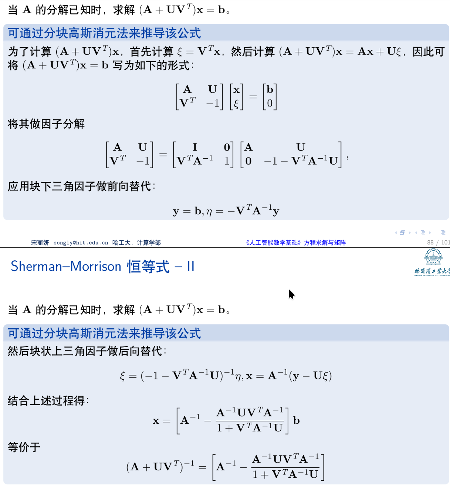

## 定义

对于一个 $n \times n$ 的矩阵 $A$，如果存在一个矩阵 $A^{-1}$ 满足：

$$
AA^{-1} = A^{-1}A = I_n
$$
其中 $I_n$ 是 $n \times n$ 的单位矩阵，那么我们称 $A^{-1}$ 是 $A$ 的逆矩阵，$A$ 是可逆

- 可逆矩阵又称为非奇异矩阵（nonsingular matrix）或正则矩阵（regular matrix）。、

## 可逆矩阵的性质

1. **唯一性**：如果 $A$ 可逆，那么它的逆矩阵 $A^{-1}$ 是唯一的。
2. **可逆矩阵的行列式不为零**：如果 $A$ 可逆，则 $\det(A) \neq 0$。推论：矩阵可逆的充要条件是：所有特征值均不为零。
3. **可逆矩阵的转置也是可逆的**：如果 $A$ 可逆，则 $A^T$ 也可逆，并且 $(A^T)^{-1} = (A^{-1})^T$。
4. **可逆矩阵的逆矩阵也是可逆的**：如果 $A$ 可逆，则 $A^{-1}$ 也可逆，并且 $(A^{-1})^{-1} = A$。
5. **可逆矩阵的乘积也是可逆的**：如果 $A$ 和 $B$ 都可逆，则 $AB$ 也可逆，并且 $(AB)^{-1} = B^{-1}A^{-1}$。

## 计算矩阵的逆

### 手算:高斯-约旦消元法

步骤：

1. 构造增广矩阵 $[A | I_n]$，其中 $I_n$ 是 $n \times n$ 的单位矩阵。

2. 对增广矩阵进**行初等行变换**，直到左边的 $A$ 被化为单位矩阵 $I_n$。这时，增广矩阵的右边部分就变成了 $A$ 的逆矩阵 $A^{-1}$。

### 手算：伴随矩阵法

伴随矩阵：

$$
\text{adj}(A) = \begin{bmatrix}C_{11} & C_{21} & \cdots & C_{n1} \\ C_{12} & C_{22} & \cdots & C_{n2} \\ \vdots & \vdots & \ddots & \vdots \\ C_{1n} & C_{2n} & \cdots & C_{nn}\end{bmatrix}\\[1em]

\text{或} \quad \text{adj}(A)_{ij} = (-1)^{i+j} M_{ij}
$$  

其中 $M_{ij}$ 是 $A$ 中去掉第 $i$ 行和第 $j$ 列后得到的 $(n-1) \times (n-1)$ 子矩阵的行列式。称为**代数余子式**

公式：

$$
A^{-1} = \frac{1}{\det(A)} \text{adj}(A)
$$

其中 $\text{adj}(A)$ 是 $A$ 的伴随矩阵

### Sherman-Morrison 公式

在机器学习中，常常需要把数据 $D$（长方形 $n \times d$ 矩阵）求内积 $D^T D$ 得到方阵 $C$，然后求逆。如果多了一个样本维度（也就是有新数据 $\mathbf{v}$），D 就变成了 $(n+1) \times d$ 的矩阵，求内积得到的方阵 $C$ 就可以更新成 $D^TD+\mathbf{v}\mathbf{v}^T$ 能不能快速求逆呢？答案是可以的，这就是 Sherman-Morrison 公式：

Sherman-Morrison 公式是用于**秩-1更新**的求逆公式。它提供了一种高效的方法来计算矩阵 $A$ 加上一个**秩-1**矩阵 $\mathbf{u}\mathbf{v}^T$ 的逆矩阵。

令 $A$ 是一个可逆的 $n \times n$ 矩阵，$\mathbf{u}$ 和 $\mathbf{v}$ 是 $n$ 维列向量，那么 $(A + \mathbf{u}\mathbf{v}^T)$是可逆的，当且仅当 $1 + \mathbf{v}^T A^{-1} \mathbf{u} \neq 0$：

$$
(A + \mathbf{u}\mathbf{v}^T)^{-1} = A^{-1} - \frac{A^{-1} \mathbf{u} \mathbf{v}^T A^{-1}}{1 + \mathbf{v}^T A^{-1} \mathbf{u}}
$$

记住形状，证明就是验证乘法是不是单位阵

这里面的向量 $\mathbf{u}$ 和 $\mathbf{v}$ 可以推广到扁平矩阵 $U(n \times k)$ 和 $V(k \times n)$，得到更一般的Woodbury 矩阵恒等式（Sherman-Morrison-Woodbury），针对**低秩-k更新** 的情况：

$$
(A + UV^T)^{-1} = A^{-1} - A^{-1} U (I + V^T A^{-1} U)^{-1} V^T A^{-1}
$$

:::tip
证明：构造了一个线性方程组来证明

:::
