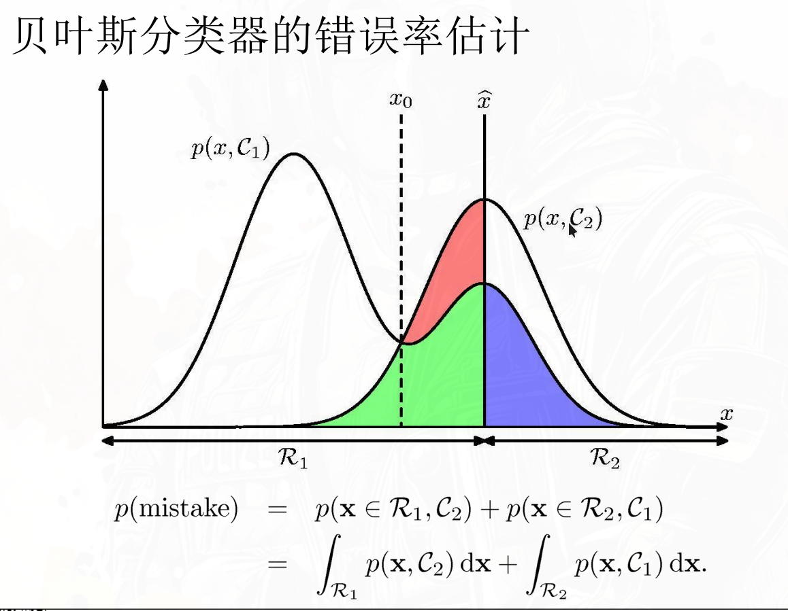

:::tip[符号约定]

本系列统一使用以下符号规则：

| 符号 | 含义 | 示例 |
|------|------|------|
| $P(\cdot)$ | **概率**（离散事件） | 先验 $P(\omega_i)$、后验 $P(\omega_i \mid \mathbf{x})$ |
| $p(\cdot)$ | **概率密度**（连续变量） | 类条件密度 $p(\mathbf{x} \mid \omega_i)$、证据因子 $p(\mathbf{x})$ |
| $\mathbf{x}$ | 加粗 = 特征向量 | $\mathbf{x} = (x_1,\dots,x_d)^T$ |
| $\omega_i$ | 第 $i$ 个类别 | $\omega_1$ 表示"正类"，$\omega_2$ 表示"负类" |
| $\hat{\omega}$ | 预测类别 | $\hat{\omega} = \arg\max_i P(\omega_i \mid \mathbf{x})$ |

**角标规则**：$\lambda_{ij}$ 中第一个下标 $i$ 为真实类别，第二个 $j$ 为预测类别。
**密度和概率永远不会出现在等式同侧参与比较**（密度可以 $>1$，概率始终 $\in [0,1]$）。

:::

三种判别准则：

1. 最小错误率准则：选择后验概率最大的类别。
2. 最小风险准则：考虑不同类型错误的损失，选择期望风险最小的类别。
3. 聂曼-皮尔逊准则：在二分类问题中，在限定一类错误率条件下使另一类错误率为最小

## 1. 最小错误率准则

### 单个样本 $\mathbf{x}$ 的条件错误率（用于决策）

- 多分类判别 $\mathbf{x}$ 为 $\hat{\omega}$ 的条件错误率：

$$
P(\text{error} | \mathbf{x}) = 1 - P(\hat{\omega} | \mathbf{x})
$$

- 二分类：

$$
\begin{cases}
    P(\text{error}_1 | \mathbf{x}) = P(\omega_2 | \mathbf{x}), & \text{if } \hat{\omega} = \omega_1 \\
    P(\text{error}_2 | \mathbf{x}) = P(\omega_1 | \mathbf{x}), & \text{if } \hat{\omega} = \omega_2
\end{cases}
$$

### 整体数据集的总体错误率（用于评估）

从联合概率密度的视角来看，可以用积分表示：设 $\hat{\mathbf{x}}$ 是决策边界，当特征向量 $\mathbf{x}$ 实际为 $\omega_1$ 时，错误率为

$P(error_2)=\int_{R_2} p( \mathbf{x}|\omega_1 )P(\omega_1) d\mathbf{x}$

当 $\mathbf{x}$ 实际为 $\omega_2$ 时，错误率为

$P(error_1 )=\int_{R_1} p( \mathbf{x}|\omega_2 ) P(\omega_2) d\mathbf{x}$。

整体：$P(mistake) = P(error_1) + P(error_2)$

### 图解

### 最小错误率决策准则

对于一个待分类样本 $\mathbf{x}$，我们计算每个类别 $\omega_j$ 的后验概率 $P(\omega_j | \mathbf{x})$，然后选择后验概率最大的类别 $\omega_i$ 作为预测结果：

$$
i = \arg\max_{1 \leq j \leq c} P(\omega_j | \mathbf{x}), x\in \omega_i
$$

### 最小错误率判别函数

对于每个类别 $\omega_j$，定义判别函数 $g_j(\mathbf{x})$：

$$
g_j(\mathbf{x}) = P(\omega_j | \mathbf{x})\propto p(\mathbf{x} | \omega_j) P(\omega_j)
$$

或对数形式：

$$
g_j(\mathbf{x}) = \ln p(\mathbf{x} | \omega_j) + \ln P(\omega_j)
$$

$$
i=\arg\max_{1 \leq j \leq c} g_j(\mathbf{x}), \mathbf{x}\in \omega_i
$$

### 对于两类问题(1)

两类问题的等价形式：似然比(或者他们的对数形式)和阈值比大小

$$
\hat{\omega} = \begin{cases}
\omega_1, & \text{if } \dfrac{p(\mathbf{x} | \omega_1) }{p(\mathbf{x} | \omega_2) } > \dfrac{P(\omega_2)}{P(\omega_1)} \\
\omega_2, & \text{otherwise}
\end{cases}
$$

决策边界 $\mathbf{x}$ 由 $\dfrac{p(\mathbf{x} | \omega_1) }{p(\mathbf{x} | \omega_2) } = \dfrac{P(\omega_2)}{P(\omega_1)}$ 定义。

## 2. 最小风险准则

### 单个样本 $\mathbf{x}$ 的条件风险 （用于决策）

将真实类别 $\omega_i$ 判断成 $\omega_j$ 的损失定义为 $\lambda_{ij}$，则对于一个待分类样本 $\mathbf{x}$，我们计算每个类别 $\omega_j$ 的期望风险：

$$
R(\omega_j | \mathbf{x}) = \sum_{i} \lambda_{ij} P(\omega_i | \mathbf{x})
$$

:::tip

$R(\omega_j | \mathbf{x})$ 是 $\mathbf{x}$ 属于 $\omega_i$ 的条件下，将 $\mathbf{x}$ 误分类为 $\omega_j$ 的期望损失。

例如有正常人(w1)和病人(w2)两类，误将病人判断为正常人的风险就是 $R(\omega_1 | \mathbf{x}) = \lambda_{21} P(\omega_2 | \mathbf{x})$，误将正常人判断为病人的风险就是 $R(\omega_2 | \mathbf{x}) = \lambda_{12} P(\omega_1 | \mathbf{x})$。

:::

### 整体数据集的总体风险（用于评估）

整个特征空间上，总体风险是对所有样本的条件风险求期望：

$$
R_\text{total} = \int R(\omega(\mathbf{x}) | \mathbf{x}) p(\mathbf{x}) d\mathbf{x}
$$

其中 $\omega(\mathbf{x})$ 是决策准则。

### 最小风险决策准则

对于一个待分类样本 $\mathbf{x}$，计算所有类别 $\omega_j$ 的期望风险 $R(\omega_j | \mathbf{x})$，然后选择风险最小的类别作为预测结果：

$$
i = \arg\min_{1 \leq j \leq c} R(\omega_j | \mathbf{x}), x\in \omega_i
$$

### 最小风险判别函数

对于每个类别 $\omega_j$，定义判别函数 $g_j(\mathbf{x})$ 为期望风险的负数，把最小风险问题转化为最大判别函数问题:

$$
g_j(\mathbf{x}) = -R(\omega_j | \mathbf{x}) = -\sum_{i=1}^{c} \lambda_{ij} P(\omega_i | \mathbf{x})\\= -\sum_{i=1}^{c} \lambda_{ij} p(\mathbf{x} | \omega_i) P(\omega_i)
$$

$$
i=\arg\max_{1 \leq j \leq c} g_j(\mathbf{x}), \mathbf{x}\in \omega_i
$$

### 对于两类问题(2)

定义决策表，里面的元素 $\lambda_{ij}$ 表示将真实类别 $\omega_i$ 判断成 $\omega_j$ 的损失。对于二分类问题，决策表可以简化为：

|                 | 预测 $\omega_1$  | 预测 $\omega_2$  |
| --------------- | ---------------- | ---------------- |
| 真实 $\omega_1$ | $\lambda_{11}=0$ | $\lambda_{12}$   |
| 真实 $\omega_2$ | $\lambda_{21}$   | $\lambda_{22}=0$ |

误分类只包括 $\lambda_{12}$ 和 $\lambda_{21}$

对于一个待分类样本 $\mathbf{x}$，计算误分类的期望风险：

$$
\begin{aligned}
R(\omega_1 | \mathbf{x}) &=  \lambda_{21} P(\omega_2 | \mathbf{x})=\lambda_{21}p(\mathbf{x}|\omega_2)P(\omega_2) \\
R(\omega_2 | \mathbf{x}) &= \lambda_{12} P(\omega_1 | \mathbf{x})=\lambda_{12}p(\mathbf{x}|\omega_1)P(\omega_1)
\end{aligned}
$$

对应的判别函数：

$$
\begin{aligned}
g_1(\mathbf{x}) &= -R(\omega_1 | \mathbf{x}) = -\lambda_{21} p(\mathbf{x} | \omega_1) P(\omega_1) \\
g_2(\mathbf{x}) &= -R(\omega_2 | \mathbf{x}) = -\lambda_{12} p(\mathbf{x} | \omega_2) P(\omega_2)
\end{aligned}
$$

判别准则：
$$
\hat{\omega} = \begin{cases}
\omega_1, & \text{if } \dfrac{p(\mathbf{x} | \omega_1) }{p(\mathbf{x} | \omega_2) } > \dfrac{P(\omega_2)\lambda_{21}}{P(\omega_1)\lambda_{12}} \\
\omega_2, & \text{otherwise}
\end{cases}
$$

当使用0-1损失函数时，$\lambda_{ij} = 0$ if $i=j$ else 1，此时最小风险准则退化为最小错误率准则。

决策边界 $\mathbf{x}$ 由 $\dfrac{p(\mathbf{x} | \omega_1) }{p(\mathbf{x} | \omega_2) } = \dfrac{P(\omega_2)\lambda_{12}}{P(\omega_1)\lambda_{21}}$ 定义。

## 3. 聂曼-皮尔逊准则

### 单个样本 $\mathbf{x}$ 的似然比检验（用于决策）

与最小错误率直接使用后验概率不同，N-P 准则不依赖先验，而是直接构造**似然比**

$$
\Lambda(\mathbf{x}) = \frac{p(\mathbf{x} | \omega_1)}{p(\mathbf{x} | \omega_2)}
$$

### 整体数据集的错误率约束（用于评估）

二分类问题中，第一类错误率（$\epsilon_1$ , $\omega_2$ 被误判为 $\omega_1$）不超过某个阈值 $\alpha$，第二类错误率（$\epsilon_2$ , $\omega_1$ 被误判为 $\omega_2$）。定义两类错误率：

$$
 \int_{R_1} p(\mathbf{x} | \omega_2)P(\omega_2) d\mathbf{x} = \epsilon_1, \\
 \int_{R_2} p(\mathbf{x} | \omega_1)P(\omega_1) d\mathbf{x} = \epsilon_2
$$

- 决策区域： $R_1$ 是将 $\mathbf{x}$ 分类为 $\omega_1$ 的区域，$R_2$ 是将 $\mathbf{x}$ 分类为 $\omega_2$ 的区域。
- 约束条件：固定 $\epsilon_2 = \alpha$，最小化 $\epsilon_1$。

### 聂曼-皮尔逊决策准则

似然比检验：大于某个阈值 $\lambda$ 则判为 $\omega_1$，否则判为 $\omega_2$

### 聂曼-皮尔逊判别函数

$$
\min \epsilon_1 \quad s.t. \quad \epsilon_2 = \alpha
$$

固定 $\epsilon_2 = \alpha$，最小化 $\epsilon_1$。用拉格朗日乘子法求解，引入拉格朗日乘子 $\mu$：

$$
\begin{aligned}
& \underset{\hat{\omega}}{\text{minimize}} \quad \mathcal{L} = \int_{R_1} p(\mathbf{x} | \omega_2) P(\omega_2) d\mathbf{x} + \mu \left( \int_{R_2} p(\mathbf{x} | \omega_1) P(\omega_1) d\mathbf{x} - \alpha \right) \\
& \text{subject to} \quad \int_{R_2} p(\mathbf{x} | \omega_1) P(\omega_1) d\mathbf{x} = \alpha
\end{aligned}
$$

推导：

$$
\begin{aligned}
\mathcal{L} &= \int_{R_1} p(\mathbf{x} | \omega_2) P(\omega_2) d\mathbf{x} + \mu \left( 1-\int_{R_1} p(\mathbf{x} | \omega_1) P(\omega_1) d\mathbf{x} - \alpha \right) \\
&= \int_{R_1} \left( p(\mathbf{x} | \omega_2) P(\omega_2) - \mu p(\mathbf{x} | \omega_1) P(\omega_1) \right) d\mathbf{x} + \mu (1-\alpha)
\end{aligned}
$$

等价于积分项里面最小化。

如果被积函数为正，则 $\mathbf{x}$ 属于 $R_2$，否则属于 $R_1$：

$$
p(\mathbf{x} | \omega_2) P(\omega_2) - \mu p(\mathbf{x} | \omega_1) P(\omega_1) < 0
$$

移项：

$$
\frac{p(\mathbf{x} | \omega_1)}{p(\mathbf{x} | \omega_2)} > \frac{P(\omega_2)}{\mu P(\omega_1)} \tag*{(*)}
$$

确定判别阈值 $\mu$:

先用 (*) 定义决策区域 $R_2$ ,然后用等式 $\int_{R_2} p(\mathbf{x} | \omega_1) P(\omega_1) d\mathbf{x} = \alpha$ 来求解 $\mu$。

:::tip

推导过程中，先验是固定的，可以最后算。

:::
