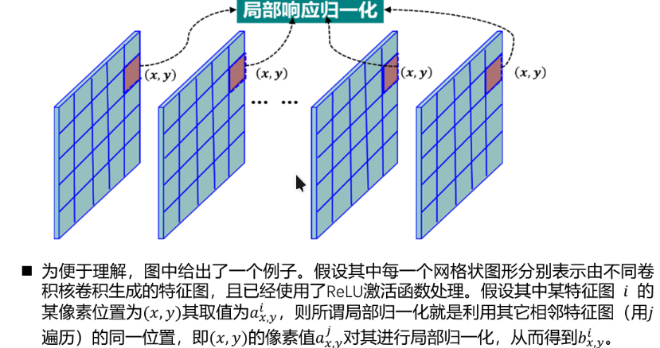

## 结构

AlexNet 是 Alex Krizhevsky 等人在 2012 年提出的卷积神经网络架构，主要用于图像分类

一共 8层有参数：

- 5层卷积（Conv）
- 3层全连接（FC）

结构可以压缩成一行：

```plaintext
Conv → Pool → Conv → Pool → Conv → Conv → Conv → Pool → FC → FC → FC
```

### Conv1 卷积层

- 输入：227 × 227 × 3 的 RGB 图像
- 卷积核：96 个 11 × 11 × 3 的卷积核(注意这里卷积核的深度是3，和输入图像的通道数相同)
- 步长为 4
- 输出：55 × 55 × 96 的特征图

卷积完后进行 ReLU + Local Response Normalization（LRN）

:::tip

LRN:局部响应归一化，模仿生物神经系统中的侧抑制机制，即对局部神经元的活动建立竞争机制（放到卷积里面就是相邻特征图的对应像素），抑制反馈较小的神经元，以增强模型的泛化能力。

局部响应归一化的原因。尽管ReLU激活函数具有一定优势，但与传统的激活函数 tanh 和 sigmoid相比，RELU 的输出范围是 [0, +∞)，可能导致某些神经元的输出过大。

LRN的计算细节：记为 $a_{x,y}^i$ 表示第 $i$ 个特征图（也就是由第 $i$ 个卷积核生成的）在位置 $(x,y)$ 的激活值，LRN 的输出 $b_{x,y}^i$ 可以表示为：

$$
b_{x,y}^i = \frac{a_{x,y}^i}{\left(k + \alpha \sum_{j=\max(0, i-n/2)}^{\min(N-1, i+n/2)} (a_{x,y}^j)^2\right)^\beta}
$$

其中超参数： $k$ 是一个常数，通常设置为 2；$\alpha$ 是一个缩放参数，通常设置为 10^{-4}；$\beta$ 是一个指数参数，通常设置为 0.75；$n$ 是参与归一化的相邻特征图数量，通常设置为 5；$N$ 是总的特征图数量（总卷积核数量）。

图解如下：



:::

### Pool1 池化层：重叠最大池化（overlapping max pooling）

:::tip

重叠池化是指池化步长比池化核的尺寸小， 从而使池化的输出特征图之间有重叠，目的是使特征更丰富，减少信息 丢失。

:::

- 滑动窗口大小：3 × 3，步长为 2
- max pooling
- 输出：27 × 27 × 96 的特征图

### Conv2 卷积层

- 卷积核：256 个 5 × 5 的卷积核
- 补边（padding）为 2
- 步长为 1
- 输出：27 × 27 × 256 的特征图

使用 分组卷积（group=2）（历史原因：GPU不够）

然后进行 ReLU + LRN，再进行 Pooling，输出尺寸：13 × 13 × 256 的特征图

### Conv3 卷积层

- 卷积核：384 个 3 × 3 的卷积核
- 补边（padding）为 1
- 步长为 1
- 输出：13 × 13 × 384 的特征图

处理完后进行 ReLU+LRN，输出尺寸：13 × 13 × 384 的特征图

注意：Conv3 卷积层没有池化层pooling

### Conv4 卷积层

- 卷积核：384 个 3 × 3 的卷积核
- 补边（padding）为 1
- 步长为 1
- 输出：13 × 13 × 384 的特征图

处理完后进行ReLU+LRN,同Conv3这里也没有pooling

### Conv5 卷积层

- 卷积核：256 个 3 × 3 的卷积核
- 补边（padding）为 1
- 步长为 1
- 输出：13 × 13 × 256 的特征图

处理完后进行ReLU+LRN

再进行Pooling，输出尺寸：6 × 6 × 256 的特征图

### FC6 全连接层

- 输入：6 × 6 × 256 的特征图（展平为 9216 维的向量，nn.Flatten）
- 卷积核：4096 个 1 × 1 的卷积核（全连接层等价于卷积核大小为输入特征图大小的卷积层）
- 输出：4096 维的特征向量

Dropout 是一种正则化方法，在训练过程中以一定概率随机丢弃部分神经元（将其输出置为0），从而减少神经元之间的依赖关系，防止过拟合。在测试阶段不使用 Dropout。AlexNet 在全连接层（FC6、FC7）中使用了 Dropout（ p=0.5 9216 -> 4096）。

然后ReLu + LRN，输出尺寸：4096 维的特征向量

### FC7 全连接层

- 输入：4096 维的特征向量
- 全连接
- 输出：4096 维的特征向量

也用了 Dropout，输出尺寸：4096 维的特征向量

### FC8 输出层

- 输入：4096 维的特征向量
- 全连接
- Softmax 输出：1000 维的特征向量（对应 ImageNet 的 1000 个类别）

## 对比LeNet5

1. Conv层更多
2. 激活函数不同：AlexNet用ReLU，LeNet5用Sigmoid。
   - 算得更快
   - 缓解梯度消失问题
3. 使用了LRN（卷积层）、和Dropout（全连接层）来提高泛化能力，减少过拟合。
4. 池化层的设计不同：重叠最大池化（overlapping max pooling） vs 非重叠池化（non-overlapping pooling）
    - AlexNet使用最大池化处理，以避 免平均池容易导致的模糊化问题。
    - 重叠池化是指池化步长比池化核的尺寸小， 从而使池化的输出特征图之间有重叠，目的是使特征更丰富，减少信息 丢失。
5. 图像增强处理：有利于扩⼤训练数据集，缓解过拟合，提升泛化能力。
   1. 对图像进行翻转，裁剪和颜色调整等处理，使图像特征发生变化
   2. 图像数据进行主成分（PCA）处理，并对主成分施加一个标准差为 0.1的高斯扰动，
6. GPU加速。
