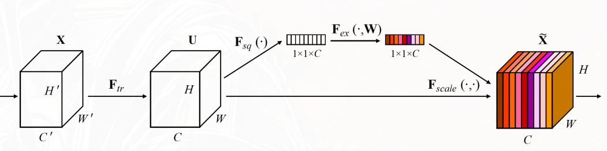
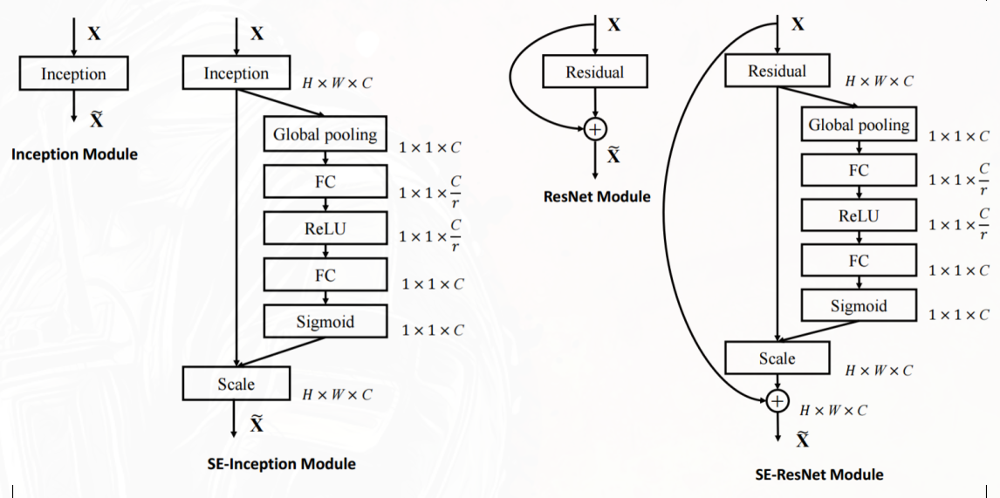

**通道注意力机制（Channel Attention）**：

让模型学会在 **通道维度** 上（C）给不同的特征通道分配不同的权重。让网络动态地学习每个通道的“门控值（Gate）”，用 0~1 的标量去放大有用通道、抑制无用通道。

## 以SENet为例

（Squeeze-and-Excitation）

符号定义：

- 最后一层卷积特征图 $\mathbf{X} \in \mathbb{R}^{C \times H \times W}$，其中 $C$ 是通道数，$H$ 是高度，$W$ 是宽度
- $\mathbf{X}_c \in \mathbb{R}^{H \times W}$：第 $c$ 个通道的特征图

### Squeeze（压缩）

将每个通道的空间信息（H×W）压缩成一个全局标量，捕捉该通道的“全局响应强度”。

操作：全局平均池化（Global Average Pooling，GAP）对于第 $c$ 个通道的特征图 $\mathbf{X}_c$：

$$
z_c = \frac{1}{H \times W} \sum_{i=1}^{H} \sum_{j=1}^{W} X_c(i,j)
$$

得到一个长度为 $C$ 的向量 $\mathbf{z} = [z_1, z_2, \ldots, z_C]$，表示每个通道的全局统计信息（Global Descriptor）。

### Excitation（激励）

利用压缩后的 $z_c$，学习每个通道的门控权重（Gating Weights）。这一步必须能够捕捉通道间的非线性交互（而非独立判断）。

操作：使用一个两层的全连接网络（FC）来学习通道间的依赖关系。具体步骤如下：

1. **降维**：将 $C$ 维的向量 $\mathbf{z}$ 映射到一个较低维度的空间（通常是 $C/r$，其中 $r$ 是一个缩放因子，常用值为 16），以减少参数量和计算量。使用 ReLU 激活函数：
2. **升维**：将降维后的向量映射回 $C$ 维空间，得到每个通道的门控权重。使用 sigmoid 激活函数，确保权重 $s_c$ 在 0~1 之间。

$$
\mathbf{s} = \sigma(W_2 \cdot \text{ReLU}(W_1 \cdot \mathbf{z}))
$$

:::tip

因为两层全连接引入了跨通道的交互（参数矩阵 $W$  是全连接，每个通道的权重都受其他所有通道影响），而不是孤立地看单个通道。

:::

### Scale（缩放）

将学习到的门控权重 $s_c$ 应用于原始特征图 $\mathbf{X}_c$，实现通道的自适应重标定（Recalibration）：

$$
\hat{\mathbf{X}}_c = s_c \cdot \mathbf{X}_c
$$

对于多通道，就是逐元素相乘：

$$
\hat{\mathbf{X}} = \mathbf{s} \odot \mathbf{X}
$$

看作是对输入特征图进行了一次自适应的缩放

## 与主流网络结构结合

