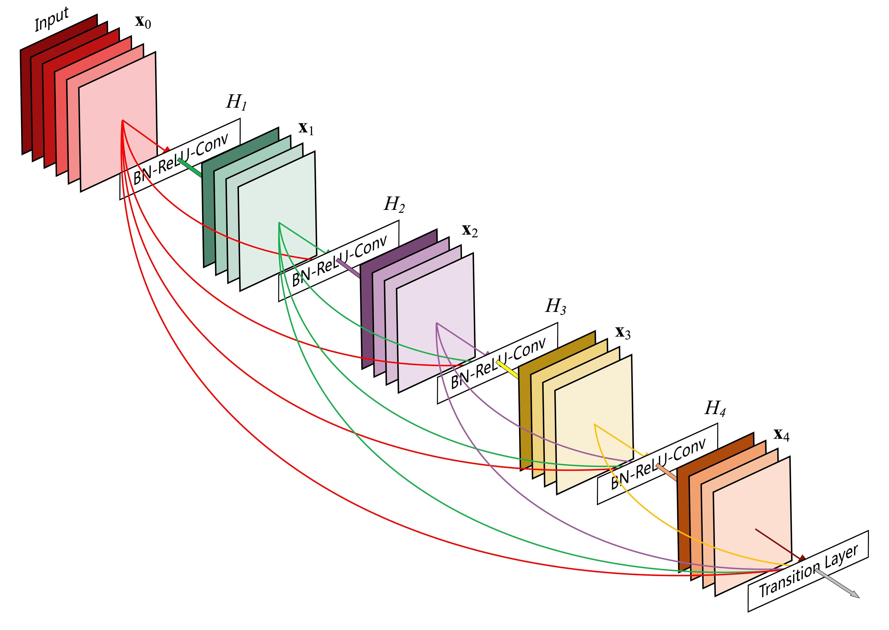

既然跨层连接效果这么好，那为什么不把前面所有层的特征图都直接拿过来用呢？

ResNet只是把前面一层的特征图拿过来用，DenseNet则是把前面所有层的特征图都拿过来用。

在同一个**密集块**（Dense Block）内，每一**层**的输入，来自前面所有**层** 的输出（特征图）的 **串联/拼接**（Concatenation）。

符号定义：

- 原始输入：$x_0$ 是输入到一个 Dense Block 的初始特征图。该 Block 内有 $L$ 层

- $x_l$ 是第 $l$ 层的输出特征图，$l=1,2,...,L$

$$
x_l = H_l([x_0, x_1, ..., x_{l-1}])
$$

- $[\cdot]$ 表示在 **通道维度** （Channel）上进行的串联/拼接（Concatenation）操作。
- $H_l(\cdot)$ 是第 $l$ 层的非线性变换，通常是
  - BN → ReLU → Conv（1×1）→ BN → ReLU → Conv（3×3）(带bottleneck结构)
  - 和 BN → ReLU → Conv（3×3）(不带bottleneck结构)。

## DenseNet 结构简介

## 关键超参数：增长率（Growth Rate）

如果每一层都把前面所有层的特征图拼起来，那通道数不是爆炸了吗？

解决方法：每一层只输出固定数量的特征图（例如 k=32）（新增固定数量的通道），这个数量被称为增长率（Growth Rate）。

不管这个dense block收到的 $[\cdot]$ 里面有多少个特征图，经过$H_l(\cdot)$都只输出 k 个特征图。每层只“贡献” k 个新通道，但“消费”所有历史通道。
