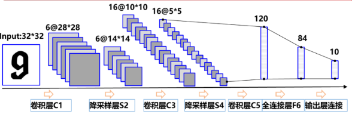
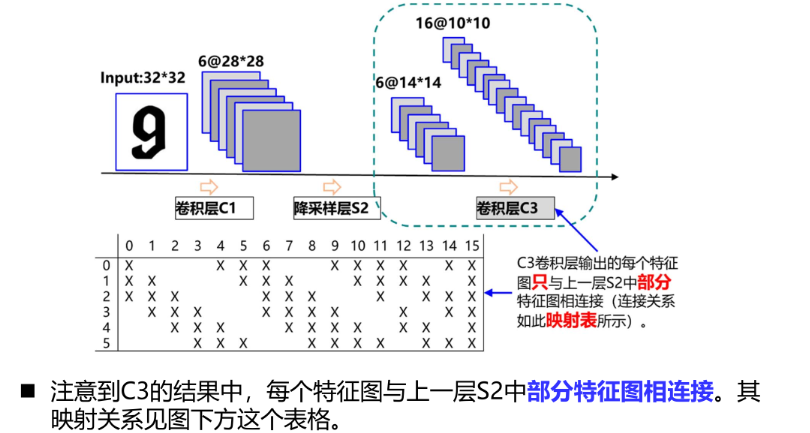

## 结构

LeNet5 是 Yann LeCun 等人在 1998 年提出的卷积神经网络架构，主要用于手写数字识别。它由以下层次结构组成：

### C1 卷积层

- 输入：32x32 灰度图像
- 卷积核：6 个 5x5 的卷积核
- 输出：6 个 28x28 的特征图

回顾CNN的特点：

- 参数共享：这里总共 $(5\times5+1) \times 6 = 156$ 个参数（卷积核权重 + 偏置），相比全连接层大大减少了参数数量。
- 局部连接：每个卷积核26个参数，输出28x28=784个像素，每个像素六次卷积，总共 $156 \times 28 \times 28 = 122,472$ 次乘加运算(连接)。

### S2 池化层

滑动窗口大小：2x2，输出尺寸：6 个 14x14 的特征图

### C3 卷积层

- 输入：6 个 14x14 的特征图
- 卷积核：16 个 5x5 的卷积核
- 输出：16 个 10x10 的特征图

注意这一步卷积核的连接方式：

- 前 6 个输出通道：各连接 3 个输入通道
- 中间 9 个输出通道：各连接 4 个输入通道
- 最后 1 个输出通道：连接 全部 6 个输入通道

这一层的参数量，根据公式：$\sum_{i=1}^{16} (M \times N \times C_{in,i} + 1)$，其中 $C_{in,i}$ 是第 $i$ 个输出通道连接的输入通道数，总共 1516 个参数。

连接数：(5×5×3×6+5×5×4×9+5×5×6×1)×10×10=151600

### S4 池化层

滑动窗口大小：2x2，输出尺寸：16 个 5x5 的特征图

### C5 卷积层

- 输入：16 个 5x5 的特征图
- 卷积核：120 个 5x5 的卷积核
- 输出：120 个 1x1 的特征图（全连接层）

参数量：$(5\times5\times16 + 1) \times 120 = 48120$ 个参数

连接数：48120 x 1 x 1 = 48120

### F6 全连接层

- 输入：120 个 1x1 的特征图
- 输出：84 个神经元
- 参数量：$(120 + 1) \times 84 = 10164$ 个参数

这一层类类似于多层感知机神经网络的全连接层，参数量较大。用反向传播算法训练。

### 输出层

- 输入：84 个神经元
- 输出：10 个神经元（对应 10 个数字类别）
- 参数量：$(84 + 1) \times 10 = 850$ 个参数
