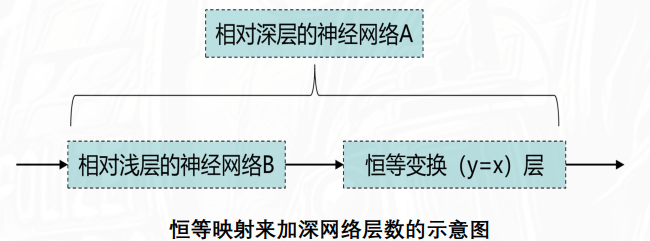
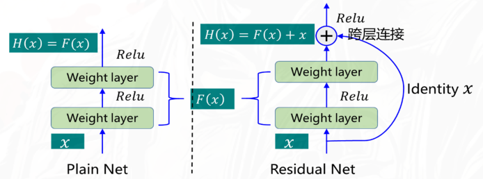
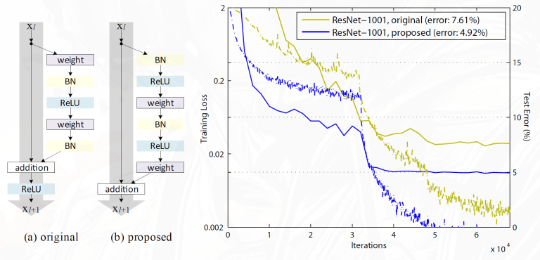

网络越深，真的越好吗

符号定义：

- $x$ 是即将输入到新增层堆叠部分的“原始底层特征”，例如浅层网络B输出后的特征图
- 映射：$\mathcal{H}(x)$ 表示深层网络A最终希望的理想输出映射。也就是我们期望新增的那些层，在 $x$ 的基础上，能提炼出的最终高级特征。
- $\mathcal{F}(x)$ A比B新增的那些层，理论上要学习的潜在映射关系。
- $y$ 整个残差块的输出（传统网络就是每一层的输出），未经过激活函数，经过Relu激活函数后传递给下一层。

理论上来说，越深的网络只要学习到更多层恒等映射，就能获得至少和浅层网络一样的性能，甚至更好。

- 如果新增的这几层（虚线框）是冗余的，我们并不指望它提取新特征，只希望它“原封不动”地把浅层特征传过去。
- 这等价于我们强行要求新层的实际输出 $y=\mathcal{F}(x)$ 等于输入 $x$：
- 此时，深层网络A的最终映射 $\mathcal{H}(x)$ 就等于浅层网络B的映射 $x$，也就是恒等映射 $\mathcal{H}(x)=x$。
- 但需要优化器需要把虚线框内所有卷积层的权重矩阵 W全部训练为 0，在高维空间中，强迫一个复杂的非线性映射退化为严格的恒等函数，极其困难。

## 实践中网络层加深可能会带来两大问题

问题一：梯度消失或与梯度爆炸问题

简单地增加深度可能会导致梯度消失或梯度爆炸。二者产生的根本原因都是在反向传播训练过程中，低隐层（接近输入层）上的梯度是来自后面高隐层（接近输出层）上梯度的乘积。当存在过多的层时，多次连乘可能会出现梯度越来越小或者逐步放大，并分别导致梯度消失或梯度爆炸。对于该问题的解决方法包括正则化层（Batch Normalization）处理

问题二：退化问题

单地增加深度可能还会导致退化（Degradation）。在ImageNet和CIFAR-10图像分类任务上的研究发现，随着网络层的加深，模型在训练集上的准确率开始的趋势是不断提高，并在达到峰值（准确率饱和）后开始大幅度降低，即网络的加深反而导致预测能力降低，与人们的印象相背离。这一现象被称之为网络退化。

退化的原因不能归结为模型过拟合，因为过拟合是指在训练集上表现更好而在测试集上效果较差

对退化现象原因的一个解释是，现有的多层非线性神经网络结构难以拟合恒等映射函数（即y=x）

## 从直接拟合到拟合残差

不再直接学习映射 $\mathcal{H}(x)$，而是学习残差函数 $\mathcal{F}(x) = \mathcal{H}(x) - x$

此时输出 $\mathcal{H}(x) = \mathcal{F}(x) + x$。

对于冗余层来说，理想的情况是 $\mathcal{H}(x) = x$，此时残差函数 $\mathcal{F}(x) = 0$。相比于直接学习恒等映射，学习残差函数更容易优化，因为它只需要将残差函数的输出调整为零，而不是强迫整个网络学习一个复杂的恒等映射。

## 一个经典的残差块

一个基本的残差单元（Basic Block）长右边这样：

x → Conv → BN → ReLU → Conv → BN → (+ x) → ReLU

**主路径**：输入x → 卷积（3×3）→ BN → ReLU → 卷积（3×3）→ BN。

**捷径路径**（Shortcut / Skip Connection）：输入x 直接通过恒等映射（Identity Mapping），不经过任何计算，直接与主路径的输出相加（Addition）。

相加后，再过一次 ReLU 激活函数.

>注意ResNet使用的是 加和（Add），而不是U-Net的 串联（Concat）。加法不增加通道数，计算量极小，仅传递梯度信号.

### 何恺明的优化:预激活（Pre-activation）

原来的

Conv → BN → ReLU → Conv → BN → (+ x) → ReLU

$$
x_{l+1} = \text{ReLU}(y_l) = \text{ReLU}(\mathcal{F}(x_l) + x_l)
$$

改成（注意：加完后不再跟 ReLU）：

BN → ReLU → Conv → BN → ReLU → Conv → (+ x)

$$
x_{l+1} = y_l = \mathcal{F}(x_l) + x_l
$$

即把BN和ReLU挪到卷积层之前，而不放在相加之后。这种结构让跨层捷径彻底变成了纯粹的恒等映射（没有任何BN或ReLU阻碍）

## 梯度推导分析

对于一个残差单元，输入为 $x_l$，输出为 $y_l$，捷径的恒等映射为 $\mathcal{I}(x_l) = x_l$，残差函数为 $\mathcal{F}(x_l)$，则有：

$$
y_l = \mathcal{F}(x_l) + \mathcal{I}(x_l)
$$

给下一层输入 $x_{l+1} = f(y_l)$，忽略激活函数 $f$ 的影响

正向传播：浅层 $x_l$ 经过残差块后得到深层的输入 $x_L$：

$$
x_L = \sum_{i=l}^{L-1} \mathcal{F}(x_i,W_i) + x_l
$$

反向传播：对于损失函数 $\mathcal{E}$，计算相对于输入 $x$ 的梯度：

$$
\frac{\partial \mathcal{E}}{\partial x_l} = \frac{\partial \mathcal{E}}{\partial y_l} \cdot \frac{\partial y_l}{\partial x_l} = \frac{\partial \mathcal{E}}{\partial y_l} \cdot \left( \sum_{i=l}^{L-1} \frac{\partial \mathcal{F}(x_i,W_i)}{\partial x_l} + I \right)
$$

这个式子表明，输入 $x_l$ 的梯度由两部分组成：

1. 来自残差函数 $\mathcal{F}(x_i,W_i)$ 的梯度 $\sum_{i=l}^{L-1} \frac{\partial \mathcal{F}(x_i,W_i)}{\partial x_l}$，这部分可能会出现梯度消失或爆炸。
2. 来自捷径路径的梯度 $I$，这是一个恒定的项，不会随着网络深度增加而消失或爆炸。
