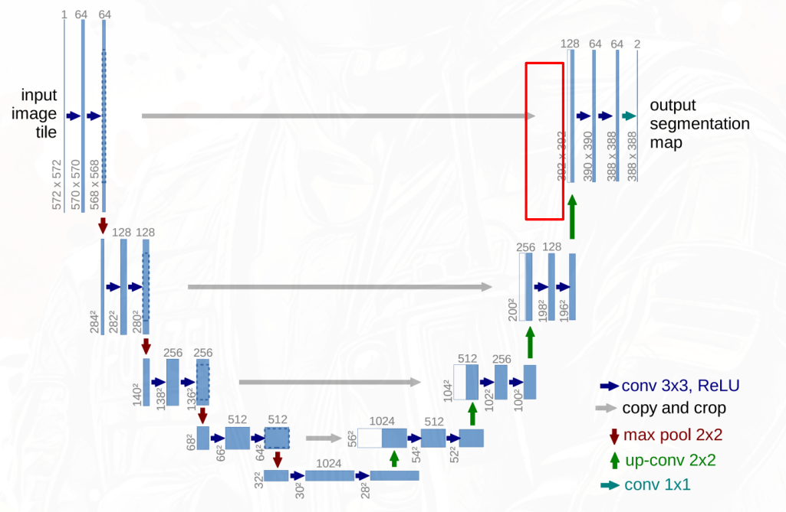

U-Net（Ronneberger et al., 2015）是最具影响力的语义分割架构之一。它用完全对称的编码器-解码器结构和密集的跳跃连接，在医学图像分割等小样本精细分割任务中表现出色。

## 整体结构

U-Net 的结构形如大写字母 U，由对称的两半组成：

### 编码器（收缩路径）

编码器逐层下采样，捕获多尺度上下文语义。每一层的操作序列：

$$
\text{Conv}_{3\times3} \rightarrow \text{ReLU} \rightarrow \text{Conv}_{3\times3} \rightarrow \text{ReLU} \rightarrow \text{Pooling}_{2\times2}
$$

两次 $3\times3$ 卷积提取局部特征，步长为 2 的 $2\times2$ 最大池化将空间尺寸减半、感受野扩大一倍。通道数逐层加倍（64 → 128 → 256 → 512 → 1024），用更多的卷积核编码更丰富的语义信息。空间分辨率 $H \times W$ 逐层减半。

### 解码器（扩张路径）

解码器将低分辨率特征图逐步恢复到原始输入尺寸，同时融合编码器各层的空间细节。

每一层的操作序列：

$$
\text{UpConv}_{2\times2} \rightarrow [\text{concat with encoder features}] \rightarrow \text{Conv}_{3\times3} \rightarrow \text{ReLU} \rightarrow \text{Conv}_{3\times3} \rightarrow \text{ReLU}
$$

首先用 $2\times2$ 上采样（UpConv）将特征图尺寸翻倍、通道数减半。然后将上采样后的特征图与编码器对应层的特征图沿通道维度拼接（concatenation），叠加后的通道数经过两次 $3\times3$ 卷积恢复为减半后的值。

最后一层用 $1\times1$ 卷积将通道数映射到类别数 $C$，输出 $H \times W \times C$ 的逐像素分类结果。

### 上采样的两种实现

| 方式 | 实现 | 特点 |
|------|------|------|
| **转置卷积**（Transposed Conv / UpConv） | 在输入元素间插入 0，再用标准卷积。核可学习 | 能学到上采样参数，但棋盘伪影风险 |
| **上采样+卷积** | 先双线性插值放大，再 3×3 卷积 | 无伪影，参数量少，但插值方式固定 |

原始 U-Net 使用转置卷积。实践中上采样+卷积更常用，因为双线性插值固定且稳定，后续可学习的卷积层能对上采样结果做纠偏。

### 拼接 vs 逐元素相加

U-Net 的跳跃连接使用 **拼接（concat）** 而非 ResNet 式的逐元素相加（add）：

- **concat**：保留两份完整的信息，让解码器自行选择从浅层取多少细节、从深层取多少语义。通道数翻倍，参数量更大。
- **add**：对两张特征图做加权平均，隐式地控制融合比例，参数量更节约。FPN 等后续工作证明了 add 在特定场景下同样有效。

U-Net 选择 concat 的原因在于分割任务需要精确定位，浅层边缘信息以原始形式保留得更完整。

## 损失函数

### FCN 式逐像素交叉熵

对每个像素位置 $(x,y)$，计算预测类别分布与真实标签的交叉熵：

$$
\mathcal{L}_{\text{CE}} = -\sum_{x,y} \sum_{c=1}^{C} \hat{y}_{c}(x,y) \log y_{c}(x,y)
$$

$\hat{y}$ 是 one-hot 标签，$y$ 是 softmax 输出。在类别不平衡时（背景像素远多于前景），CE 会偏向背景类。

### Dice loss

Dice 系数衡量两个集合的相似度。对于二值分割，真实掩码 $G$ 和预测掩码 $P$ 的 Dice 系数为：

$$
\text{Dice}(G, P) = \frac{2|G \cap P|}{|G| + |P|}
$$

Dice loss 定义为 $1 - \text{Dice}$，可微形式的近似（逐像素计算）：

$$
\mathcal{L}_{\text{Dice}} = 1 - \frac{2 \sum_{x,y} G_{x,y} P_{x,y} + \varepsilon}{\sum_{x,y} G_{x,y} + \sum_{x,y} P_{x,y} + \varepsilon}
$$

$\varepsilon$ 是平滑项，防止除零。Dice loss 对小区域敏感——即使漏检了很小的病灶区域，Dice 系数也会明显下降。但梯度在区域很小时不稳定，因此通常与 CE 联合使用。

### CE + Dice 联合损失

$$
\mathcal{L} = \lambda \mathcal{L}_{\text{CE}} + (1-\lambda) \mathcal{L}_{\text{Dice}}
$$

$\lambda \in [0,1]$ 平衡两项，通常取 $\lambda=0.5$。CE 提供稳定的梯度信号，Dice 聚焦于区域匹配质量，两者互补。

## 数据增强：弹性变形

U-Net 发表的医学分割场景普遍面临训练数据少（数十张标注）的问题。Ronneberger 使用了大量的实时数据增强，尤其是**弹性变形**协同重要性：

1. 在随机初始化 $\Delta x, \Delta y$ 的随机场（标准差为 $\sigma$ 的二维高斯分布）。
2. 对位移场用 $s$ 做缩放（控制变形幅度）。
3. 对图像和标注做相同的变形（保持对应关系）。

参数 $\sigma$ 和 $s$ 控制变形的平滑度和幅度。典型值 $\sigma=4, s=34$。此外还配合旋转 $+45^\circ \sim -45^\circ$、缩放 $0.7$–$1.3$、灰度偏移等常规增强。

## Overlap-tile 策略

U-Net 使用 overlap-tile 策略处理大图。对于超过输入尺寸的图像，以滑动窗口方式分块预测，相邻块之间重叠部分（tile）的边缘因填充损失而精度较低，但中心区域的预测可靠。取每个 tile 的中心区域拼接，边缘丢弃。

:::tip

U-Net 是语义分割的经典架构。详细的分割任务定义、FCN 起源、DeepLab 系列、Mask R-CNN 等现代方法，以及它与传统分割方法的衔接，参见 CV 篇 `CV-Seg-DeepLearning.md`。

:::
