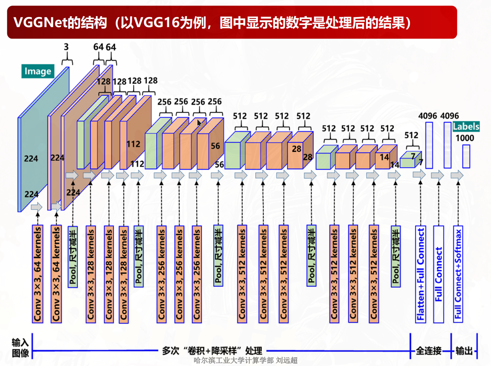

其对输入图像（224 x 224 x 3）的逐层处理过程为：

1) 两次卷积+ReLU。两次卷积都使用了64个3x3的卷积核，且输出特征图的尺寸都为224 x 224 x 64（即高和宽不变，但通道数变为64）；而后进行最大化池化处理：池化核的尺寸为
2x2，其效果为图像尺寸减半，因此输出特征图的尺寸变为112 x 112 x 64；
2) 两次卷积+ReLU。两次卷积都使用128个3x3的卷积核，输出特征图的尺寸变为112 x 112 x
128；而后最大化池化处理：池化核的尺寸为2x2，其效果为图像尺寸减半，因此输出特征图
的尺寸变为56 x 56 x 128；
3) 三次卷积+ReLU。三次卷积都使用256个3x3的卷积核作，输出特征图的尺寸变为56 x 56 x
256；而后最大化池化处理，尺寸再次减半变为28 x 28 x 256；
4) 三次卷积+ReLU。三次卷积都使用512个3x3的卷积核，输出特征图的尺寸变为28 x 28 x 512；
而后最大化池化处理，尺寸再次减半变为14 x 14 x 512；
5) 三次卷积+ReLU。三次卷积都使用512个3x3的卷积核，尺寸变为14 x 14 x 512；而后最大化
池化处理，尺寸再次减半变为7 x 7 x 512；
6) 三次全连接+ReLU。前两层的输出特征图尺寸为1 x 1 x 4096，最后一层的输出特征图尺寸为
1 x 1 x 1000；
7) Softmax层。得到输入图像在1000个类别上的预测概率。
