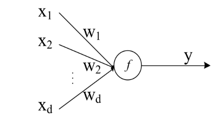
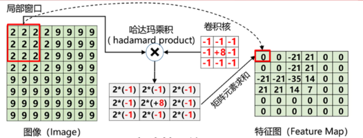
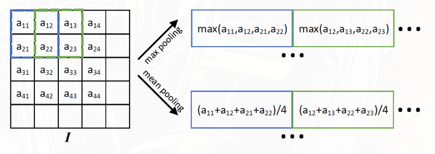

MLP 要求输入是固定维度的向量，且所有特征之间是全连接关系，这带来了两个问题：图像中的局部空间结构被破坏，参数量随图像尺寸增长极快。

卷积神经网络（CNN）通过**局部连接**（每个神经元只响应一个局部区域）和**权重共享**（同一个卷积核在图像各处复用）解决了这些问题——参数量与图像尺寸基本解耦，同时保留了像素间的空间关系。

## CNN 和传统神经网络

对比一般神经网络的结构和计算方式：

一般神经网络的一个神经元：



神经元的输出为（一次前向传播）：

$$
y = f(\sum_{i=1}^n w_i x_i + b)
$$

$f$ 是激活函数，$w_i$ 是权重，$x_i$ 是输入，$b$ 是偏置。

CNN 的一个卷积层：



单纯卷积得到特征图Feature Map：

$$
z_{i,j} = \sum_{m=1}^{M} \sum_{n=1}^{N} w_{m,n} x_{i+m-1, j+n-1}
$$

CNN一次的输出为（一次前向传播）：

$$
y_{i,j} = f\left( \sum_{m=1}^{M} \sum_{n=1}^{N} w_{m,n} x_{i+m-1, j+n-1} + b \right)
$$

其中$f$ 是激活函数，$w_{m,n}$ 是卷积核的权重，$x_{i+m-1, j+n-1}$ 是输入图像的像素值，$b$ 是偏置，和卷积核一样是共享的，在计算时会自动广播加到每个输出像素上。

卷积过程也是一种加权求和，但权重是共享的，并且只关注局部区域。

完全等价于一个神经元的前向计算。

卷积核在输入图像上滑动，每走一步：

- 就会计算一个新的输出
- $\iff$ 应用**同一个神经元**在不同位置进行计算
- $\iff$ 产生特征图中的一个**新像素**。
- 一张特征图 = 很多神经元（同参数）组成的空间结构

在 深度学习 中，训练步骤是：

- 前向传播（forward）
- 计算损失（loss）
- 反向传播（BP）
- 参数更新（梯度下降）

卷积层在这个流程里：

- 卷积核 $\iff$ 权重 W
- bias = 偏置 b

## CNN的特点

### 1. 局部连接（稀疏交互）

感受野：指卷积核在输入图像上覆盖的区域。

每个卷积核只关注输入图像的一个局部区域（ **感受野** ），而不是全局连接。

1. CNN能够捕捉局部特征，如边缘、纹理等。
2. 大大减少了全连接网络中的参数数量，降低了过拟合的风险。

### 2. 权重（参数）共享

卷积核在整个输入图像上滑动，卷积核元素不变，所以网络使用 **相同的权重（包括偏置）** 进行计算。

例如上图中3x3卷积核有9个权重参数，对于生成的特征图的每个像素，在神经网络结构里就有9条边，连接感受野内的输入像素。

然后统一加上一个偏置参数。

:::tip

偏置项的数量和卷积核的数量是一样的，每个卷积核对应一个偏置参数。

:::

### 3. 多channel特征提取（多卷积核）

CNN通常使用多个卷积核来提取**不同类型的特征**

- 卷积核数量 = 输出通道数 = 特征图数量 = 特征维度
- 每个卷积核提取一种特征，生成一个 **特征图** （通道）。 $C$ 个卷积核就生成$C$个 **特征图**，形成一个 $C$ **通道** 的输出。
- 结果天然是一个高维 **张量** ：H(图像高度) x W(图像宽度) x C(通道数)

### 4. 池化层（Pooling Layer）/降采样层（Subsampling Layer）

池化是对“卷积层输出的特征图”做的操作，而且是对每个通道分别进行的

- 输入：一组特征图（H × W × C）
- 池化：在每一张特征图上独立进行
- 输出：尺寸（H, W）变小，通道数C不变

常见的**池化操作**：

池化窗口：定义一个固定大小的窗口（如2x2），在特征图上滑动，对不同位置的特征进行聚合统计

- **最大池化（Max Pooling）**：取窗口内的最大值，保留最显著的特征。
- **平均池化（Mean Pooling）**：取窗口内的平均值，平滑特征图，减少噪声。



池化的作用：

1. **降维**：减少特征图的**空间尺寸**，降低计算量和内存使用。
2. **增加** 卷积核的 **感受野**，使模型能够捕捉更大范围的特征。
3. 降低模型的复杂度。能够在一定程度上控制过拟合，提高分类器的泛化能力
4. **增强特征的平移旋转不变性**：通过聚合局部特征，池化可以使模型对输入图像的小变形、旋转和位移具有更好的鲁棒性。

### 5. 等变表示和不变表示

等变表示：对平移等变（输入平移，输出也平移）。

不变表示：通过池化等操作实现平移、旋转、光照等不变性。

## CNN的主要流程

```plaintext
输入图像 → 卷积层 → 激活函数 → 池化层 → 归一化层 
        ...
        → 卷积层 → 激活函数 → 池化层 → 归一化层
        ...                                → 全连接层 → 输出 
        提取特征             降 维    多用BN
        （学参数）          （无参数）          
```

## 做题区

标准二维卷积（无分组、无膨胀、无深度可分离等变体）

**特征图**尺寸计算公式：

$$
H_{out} = \frac{H_{in} + 2 \times padding - (kernel\_size - 1) - 1}{stride} + 1\\[6pt]
W_{out} = \frac{W_{in} + 2 \times padding - (kernel\_size - 1) - 1}{stride} + 1
$$

**参数量** 计算公式：

卷积核尺寸：$M \times N$，输入通道数：$C_{in}$，输出通道数（卷积核数量）：$C_{out}$ ，每个卷积核对应一个偏置参数：

$$
\text{参数量} = (M \times N \times C_{in} + 1) \times C_{out}
$$

**连接数**（乘加运算次数）计算公式：

每个输出像素需要 $M \times N \times C_{in}$ 次乘加运算，输出特征图的尺寸为 $H_{out} \times W_{out}$，输出通道数为 $C_{out}$：

:::tip

bias 不参与连接数！

:::

$$
\text{连接数} = M \times N \times C_{in} \times H_{out} \times W_{out} \times C_{out}
$$
