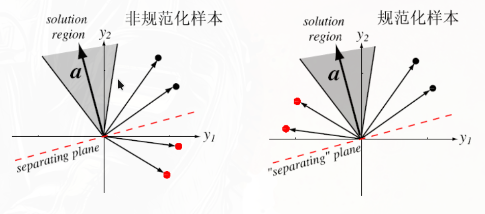

# 两类问题的线性分类器及其求解

:::tip

想象二维平面上有两类点（比如红点和蓝点），线性分类器就是用一条直线把它们分开。

在三维空间里，就是用一个平面分开；更高维空间里，用一个超平面分开。

:::

**核心假设：线性可分**：数据点可以通过一个 **线性函数**（超平面）$g(\mathbf{x}) = \mathbf{w}^T \mathbf{x}$ 来分割成不同的类别。

定义：对于输入空间 $\mathbb{R}^d$ 中的一个$d$ 维原始特征向量 $\mathbf{x}=(x_1, x_2, \ldots, x_d)^T$，线性分类器通过一个 **线性函数** $g(\mathbf{x}) = \mathbf{w}^T \mathbf{x} + b$ 来进行分类，其中 $\mathbf{w}=(w_1, w_2, \ldots, w_d)^T$ 是权重向量，$b$ 是偏置项。

- 如果 $g(\mathbf{x}) > 0$，则 $\mathbf{x}$ 被分类为正类（例如类别+1）。
- 如果 $g(\mathbf{x}) < 0$，则 $\mathbf{x}$ 被分类为负类（例如类别-1）。
- 如果 $g(\mathbf{x}) = 0$，则 $\mathbf{x}$ 就是决策边界。

- 在权空间中，$\mathbf{w}^T \mathbf{x} = 0$ (均经过增广)定义了一个超平面（分类面）

- 权向量 $\mathbf{w}$ 是垂直于分类面的向量（法向量），指向正类的一侧。如下图的两类二维数据点，黑色的权向量 $\mathbf{w}$ 垂直于分类面（红色虚线），指向黑色点所在的正类区域。

:::tip

推导：

对于两类标签 $y_i\in\{-1,1|i=1,2\}$ 训练数据:$y_1\{\mathbf{x}_1, \mathbf{x}_2, \ldots, \mathbf{x}_{n_1}\}$, $y_2\{\mathbf{x}_{n_1+1}, \mathbf{x}_{n_1+2}, \ldots, \mathbf{x}_{n_1+n_2}\}$
目标：找到一个 $\mathbf{w}$ 和 $b$ 使得：

$$
\begin{cases}
\mathbf{w}^T \mathbf{x}_i + b > 0, & \text{for } i=1,2,\ldots,n_1 \\
-(\mathbf{w}^T \mathbf{x}_j + b) > 0, & \text{for } j=n_1+1,n_1+2,\ldots,n_1+n_2
\end{cases}
$$

这里的负号是为了统一表示，所有样本都满足 $\mathbf{w}^T \mathbf{x} + b > 0$ 的形式。这一步称为规范化。当标签 $y_i\in\{-1,1|i=1,2\}$ 规范化就是 $y_i(\mathbf{w}^T \mathbf{x}_i + b)$

写成矩阵形式，把两类训练数据合到一个矩阵中,并且纳入偏置项1,称为**增广矩阵**，$\mathbf{X}$ 是增广矩阵(d+1列)，$\mathbf{w}$ 是增广权重向量。

$$
\begin{bmatrix}
\mathbf{x}_1^T & \cdots & 1 \\
\mathbf{x}_2^T & \cdots & 1 \\
\vdots & \ddots & \vdots \\
\mathbf{x}_{n_1}^T & \cdots & 1 \\
-\mathbf{x}_{n_1+1}^T & \cdots & -1 \\
-\mathbf{x}_{n_1+2}^T & \cdots & -1 \\
\vdots & \vdots \\
-\mathbf{x}_{n_1+n_2}^T & \cdots & -1 \\
\end{bmatrix}
\begin{bmatrix}
w_1 \\
w_2 \\
\vdots \\
w_d \\
b
\end{bmatrix}
>
\mathbf{0}\iff
\begin{bmatrix}
    x_{11} & x_{12} & \cdots & x_{1d} &1\\
    x_{21} & x_{22} & \cdots & x_{2d} & 1\\
    \vdots & \vdots & \ddots & \vdots & \vdots \\
    x_{n_1 1} & x_{n_1 2} & \cdots & x_{n_1 d} & 1\\
    -x_{n_1+1 1} & -x_{n_1+1 2} & \cdots & -x_{n_1+1 d} & -1\\
    -x_{n_1+2 1} & -x_{n_1+2 2} & \cdots & -x_{n_1+2 d} & -1\\
    \vdots & \vdots & \ddots & \vdots & \vdots \\
    -x_{n_1+n_2 1} & -x_{n_1+n_2 2} & \cdots & -x_{n_1+n_2 d} & -1\\
\end{bmatrix}
\begin{bmatrix}
w_1 \\
w_2 \\
\vdots \\
w_d \\
b
\end{bmatrix}
>
\mathbf{0}\\[1ex]
\mathbf{X}\mathbf{w}>0
$$

这个解 **不唯一**，定义一个**准则函数** $J(\mathbf{w})$，当 $\mathbf{w}$ 是解向量时，$J(\mathbf{w})$ 为最小；

采用最优化方法求解标量函数 $J(\mathbf{w})$ 的极小值。

最优化方法采用最多的是梯度下降法，设定初始权值向量 $\mathbf{w}^{(1)}$，然后沿梯度的负方向迭代计算。

:::

## 感知机算法

定义输入样本的d维特征向量 $\mathbf{x}=(x_1, x_2, \ldots, x_d)^T$，增广特征向量 $\mathbf{x}=(x_1, x_2, \ldots, x_d, 1)^T$，权重向量 $\mathbf{w}=(w_1, w_2, \ldots, w_d, b)^T$。

**决策函数**（$\mathbf{x}$ 经过增广并 **规范化**：这里是对第二类的特征向量取反 ）：$g(\mathbf{x}) = \mathbf{w}^T \mathbf{x}$

- 一个样本 $\mathbf{x}_i$ 到决策面的 **距离** 为 $\dfrac{g(\mathbf{x}_i)}{\|\mathbf{w}\|}$，其中 $\|\mathbf{w}\|$ 是权重向量的范数，忽略。符号表示点位于哪一侧，大小表示离平面多远。
- 分类正确：$g(\mathbf{x}_i) > 0$ 即真实标签与预测值同号。
- 分类错误：$g(\mathbf{x}_i) < 0$ 即真实标签与预测值异号。

**感知器准则**：错分样本到分类界面“距离”之和最小化。

:::tip

1. choice1 :用分类错误的个数来定义，但是不可导
2. choice2 :只考虑错分样本，并让它们到决策面的距离之和最小化。

:::

**准则函数**（批量下降）：设**错分类**的样本集合为 $\mathcal{X}$。

$$
J_p(\mathbf{w})=\sum_{x\in\mathcal{X}} -g(\mathbf{x}_i)=\sum_{x\in \mathcal{X}} -\mathbf{w}^T \mathbf{x}_i=\sum_{x\in \mathcal{X}} -\mathbf{x}_i^T \mathbf{w}\\[1ex]
\argmin_{\mathbf{w}} J_p(\mathbf{w})
$$

得到梯度：$\nabla J_p(\mathbf{w})=\sum_{x\in \mathcal{X}} -\mathbf{x}_i$

**梯度下降更新权重**（批量下降，注意这里 $\mathbf{x}$ 是规范化了的）：

$$
\mathbf{w}^{(t+1)} = \mathbf{w}^{(t)} + \eta \sum_{x\in \mathcal{X}} \mathbf{x}
$$

**感知器算法的特点**如下：

- 当样本线性可分情况下，学习率合适时，算法具有收敛性。
- 收敛速度较慢。
- 当样本线性不可分情况下，算法不收敛，且无法判断样本是否线性可分。

**感知器算法的一般步骤** 如下：

1. 初始化权重向量 $\mathbf{w}^{(0)}$ 和学习率 $\eta$。
2. 对训练样本的特征向量进行增广，第二类进行规范化。
3. 对于每个增广规范的特征向量 $\mathbf{x}$，计算决策函数 $g(\mathbf{x})$。
    - 如果 $g(\mathbf{x}) > 0$，则分类正确，不变；
    - 如果 $g(\mathbf{x}) < 0$，则分类错误，更新权重向量 $\mathbf{w} \leftarrow \mathbf{w} + \eta \mathbf{x}$。
4. 收敛判断：反复遍历所有样本，直到某一轮所有样本均分类正确（线性可分时保证收敛）

## LMSE 最小均方误差线性分类器(线性回归模型用于分类)

LMSE将求解线性不等式组的问题转化为求解线性方程组。我们希望每个不等式都是大于0的，既然这样，LMSE设定了任意的正常数b，将不等式转化为等式，只要等式成立，那左边的多项式一定是大于0的。

右端项 b 纯粹是为了“凑”出一个可解的线性方程组而人为设定的正数目标值（通常取 1）。它没有任何几何或物理意义，仅仅是为了让我们能够拿起“最小二乘”这把数学工具去撬开分类问题的大门。

$$
\mathbf{X} \mathbf{w} = b
$$

$\mathbf{X}$ 是增广矩阵(d+1列，每一行对应一个增广+规范化的特征向量)，$\mathbf{w}$ 是增广权重向量。

### 梯度下降求近似解

X不是方阵。求最小二乘近似解：

**决策函数**：$g(\mathbf{x}) = \mathbf{w}^T \mathbf{x}$ (和感知器一样)

**准则函数**(批量下降)：让所有样本的输出尽可能接近预设的目标值 $b$, 避免离决策面太近
$$
J_s(\mathbf{w}) = \frac{1}{2}\sum_{i=1}^n (\mathbf{w}^T \mathbf{x}_i - b)^2\\
\nabla J_s(\mathbf{w}) =  \sum_{i=1}^n (\mathbf{w}^T \mathbf{x}_i - b) \mathbf{x}_i
$$

**迭代更新权重**（批量下降）：

$$
\mathbf{w}^{(t+1)} = \mathbf{w}^{(t)} - \eta \sum_{i=1}^n (\mathbf{w}^T \mathbf{x}_i - b) \mathbf{x}_i
$$

### 用伪逆求闭式解

前提：$\mathbf{X}^T \mathbf{X}$ 可逆

$$
\mathbf{X}\mathbf{w} = b \implies \mathbf{w} = (\mathbf{X^T X})^{-1} \mathbf{X^T} b
$$

结合权向量的几何解释，这里求出了分类超平面的法向量以及偏置项。

LMSE算法的特点如下：

- 算法的收敛程度依赖于学习率的衰减。
- 算法对于线性不可分的训练样本也能够收敛于一个均方误差最小解。
- 取b=1时，当样本数趋于无穷多时，算法的解以最小均方误差逼近贝叶斯判别函数。

- 当训练样本线性可分的情况下，算法未必收敛于一个分类超平面。
