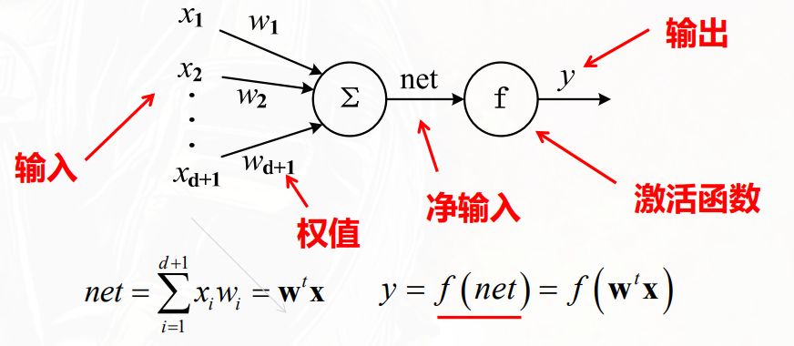

# 多层感知机分类器

基本思想：通过多个**隐藏层**的**非线性变换**，将输入数据映射到一个**新的特征空间**，使得在这个空间中数据可以被**线性分割**。

可以同时学习：

1. 非线性映射方式
2. 线性判别函数

## 关于神经元

单个神经元的结构如图



$$
y=f(\mathbf{w}^T\mathbf{x})=f\left( \sum_{i=0}^{d+1} w_i x_i\right)
$$

- 其中 $\mathbf{w}$ 是权重向量(已经增广包含偏置项)，$\mathbf{x}$ 是输入向量（已经是增广向量），$f$ 是激活函数。

- 当 f 为符号函数时，“神经元”等价于“线性判别函数”

### 激活函数

激活函数 $f$ 为网络引入非线性。不同激活函数的选择直接影响训练难度和模型容量：

| 激活函数 | 公式 | 输出范围 | 优点 | 缺点 |
|---------|------|---------|------|------|
| **Sigmoid** | $\sigma(z) = 1/(1+e^{-z})$ | $(0, 1)$ | 光滑、可解释为概率 | 饱和区梯度接近 0（梯度消失），输出非零均值 |
| **Tanh** | $\tanh(z) = (e^z - e^{-z})/(e^z + e^{-z})$ | $(-1, 1)$ | 零均值输出，比 Sigmoid 更稳定 | 仍有饱和区梯度消失问题 |
| **ReLU** | $\text{ReLU}(z) = \max(0, z)$ | $[0, \infty)$ | 计算简单、正区间梯度恒为 1，缓解梯度消失 | 负区间梯度为 0，可能导致神经元死亡（dead ReLU） |
| **Leaky ReLU** | $\max(\alpha z, z), \alpha \approx 0.01$ | $(-\infty, \infty)$ | 解决 dead ReLU，负区间保留小梯度 | 超参数 $\alpha$ 需设定 |

现代深度网络默认使用 ReLU 或其变体。Sigmoid 主要用于二分类输出层（与交叉熵搭配），Tanh 偶尔在 RNN 中使用——但总的来说，**隐藏层优先选 ReLU**。

### 网络设置

多层感知机由输入层、一个或多个隐藏层和输出层组成。每层由多个神经元组成，层与层之间全连接。

通常采用三层神经网络（输入层-隐藏层-输出层）来实现非线性分类。

| 层     | 节点数量             | 激活函数                            |
| ------ | -------------------- | ----------------------------------- |
| 输入层 | $n=\dim(\mathbf{x})$ | 线性函数                            |
| 隐藏层 | $m$，需要设定        | 非线性函数（如ReLU、Sigmoid、Tanh） |
| 输出层 | $c=$ 类别数量        | 线性函数或Sigmoid函数               |

## 前向传播的函数

第 $k$ 个输出层神经元的输出为：

$$
\mathbf{z}_k=g_k(\mathbf{x}) = f_2\left( \sum_{j=0}^{n_H} w_{kj}^{(2)} f_1\left( \sum_{i=0}^{\dim(\mathbf{x})} w_{ji}^{(1)} x_i \right) \right)
$$

或者把偏置项提出来

$$
\mathbf{z}_k=g_k(\mathbf{x}) = f_2\left( \sum_{j=1}^{n_H} w_{kj}^{(2)} f_1\left( \sum_{i=1}^{\dim(\mathbf{x})} w_{ji}^{(1)} x_i + w_{j0}^{(1)} \right) + w_{k0}^{(2)} \right)
$$

## 训练算法-BP:反向传播算法

:::tip

神经网络的其他学习机制还包括记忆学习SOM、竞争学习、Hebbian学习等。

:::

BP 算法的实质是一个均方误差最小LMS问题，采用梯度下降法来更新权重。

### 符号说明

| 符号                                  | 含义                                                                  | 维度/说明                                               |
| ------------------------------------- | --------------------------------------------------------------------- | ------------------------------------------------------- |
| $d$                                   | 输入特征维数                                                          | 标量                                                    |
| $n_H$                                 | 隐藏层节点数                                                          | 标量                                                    |
| $c$                                   | 输出节点数（类别数）                                                  | 标量                                                    |
| $\mathbf{x} = (x_1, x_2, ..., x_d)^T$ | 一个训练样本的输入特征向量                                            | $d \times 1$                                            |
| $\mathbf{t} = (t_1, ..., t_c)^T$      | 样本对应的期望输出（标签）                                            | $c \times 1$，分类任务常用 one-hot 编码                 |
| $w_{ji}$                              | 输入层 → 隐藏层的连接权重                                             | $i$ 输入节点，$j$ 隐藏节点                              |
| $w_{j0}$                              | 隐藏层第 $j$ 个节点的偏置（bias）                                     | 可视为输入固定为 1 时的权重                             |
| $net_j$                               | 隐藏层第 $j$ 个节点的加权输入和，理解为输入层的净输出，隐藏层的净输入 | $net_j = \sum_{i=1}^{d} w_{ji} x_i + w_{j0}$            |
| $y_j$                                 | 隐藏层第 $j$ 个节点的输出                                             | $y_j = f_1(net_j$)，$f_1$ 为隐藏层激活函数              |
| $w_{kj}$                              | 隐藏层 → 输出层的连接权重                                             | $j$ 隐藏节点，$k$ 输出节点                              |
| $w_{k0}$                              | 输出层第 $k$ 个节点的偏置                                             |                                                         |
| $net_k$                               | 输出层第 $k$ 个节点的加权输入和，理解为隐藏层的净输出，输出层的净输入 | $net_k = \sum_{j=1}^{n_H} w_{kj} y_j + w_{k0}$          |
| $z_k$                                 | 输出层第 $k$ 个节点的实际输出                                         | $z_k = f_2(net_k$)，$f_2$ 为输出层激活函数              |
| $J$                                   | 损失函数（误差平方和的一半）                                          | $J = \frac{1}{2} \sum_{k=1}^{c} (t_k - z_k)^2$          |
| $\eta$                                | 学习率                                                                | 正标量，控制权重调整步长                                |
| $\delta_k$                            | 输出层第 $k$ 节点的局部梯度                                           | $\delta_k = (t_k - z_k) f_2'(net_k$)                    |
| $\delta_j$                            | 隐藏层第 $j$ 节点的局部梯度                                           | $\delta_j = f_1'(net_j) \sum_{k=1}^{c} \delta_k w_{kj}$ |

BP 算法是**梯度下降**在多层神经网络上的具体实现，分为三步：  
**前向传播 → 输出层梯度计算 → 反向传播 → 权重更新**。

### 步骤 1：前向传播（计算所有节点输出）

对于单个训练样本 $(\mathbf{x}, \mathbf{t}$)：

1. 计算隐藏层每个节点的加权输入和  
   $$
   net_j = \sum_{i=1}^{d} w_{ji} x_i + w_{j0}, \quad j = 1, 2, ..., n_H
   $$

2. 通过激活函数 $f_1$ 得到隐藏层输出  
   $$
   y_j = f_1(net_j)
   $$

3. 计算输出层每个节点的加权输入和  
   $$
   net_k = \sum_{j=1}^{n_H} w_{kj} y_j + w_{k0}, \quad k = 1, 2, ..., c
   $$

4. 通过激活函数 $f_2$ 得到网络最终输出  
   $$
   z_k = f_2(net_k)
   $$

5. 计算当前样本的损失（单个样本）  
   $$
   J = \frac{1}{2} \sum_{k=1}^{c} (t_k - z_k)^2
   $$

---

### 步骤 2：反向传播（计算梯度）

目的是求出损失函数对每个权重的偏导数 $\dfrac{\partial J}{\partial w}$。

#### 2.1 输出层局部梯度 $\delta_k$

根据链式法则：

$$
\frac{\partial J}{\partial w_{kj}} = \frac{\partial J}{\partial z_k} \cdot \frac{\partial z_k}{\partial net_k} \cdot \frac{\partial net_k}{\partial w_{kj}}
$$

- $\dfrac{\partial J}{\partial z_k} = -(t_k - z_k$)

- $\dfrac{\partial z_k}{\partial net_k} = f_2'(net_k$)
- $\dfrac{\partial net_k}{\partial w_{kj}} =\dfrac{\partial\sum_{j=1}^{n_H}w_{kj} y_j + w_{k0}}{\partial w_{kj}} = y_j$

因此：

$$
\frac{\partial J}{\partial w_{kj}} = -(t_k - z_k) f_2'(net_k) \, y_j
$$

定义输出层局部梯度：

$$
\delta_k \triangleq (t_k - z_k) f_2'(net_k) \quad \Rightarrow \quad \frac{\partial J}{\partial w_{kj}} = -\delta_k y_j
$$

#### 2.2 隐藏层局部梯度 $\delta_j$

对于隐藏层权重 $w_{ji}$：

$$
\frac{\partial J}{\partial w_{ji}} = \frac{\partial J}{\partial y_j} \cdot \frac{\partial y_j}{\partial net_j} \cdot \frac{\partial net_j}{\partial w_{ji}}
$$

- $\dfrac{\partial y_j}{\partial net_j} = f_1'(net_j$)

- $\dfrac{\partial net_j}{\partial w_{ji}} = x_i$

难点是 $\dfrac{\partial J}{\partial y_j}$，因为 $y_j$ 会影响所有输出 $z_1...z_c$：

$$
\frac{\partial J}{\partial y_j} = \sum_{k=1}^{c} \frac{\partial J}{\partial z_k} \cdot \frac{\partial z_k}{\partial net_k} \cdot \frac{\partial net_k}{\partial y_j}
$$

已知：

- $\dfrac{\partial J}{\partial z_k} = -(t_k - z_k$)

- $\dfrac{\partial z_k}{\partial net_k} = f_2'(net_k$)
- $\dfrac{\partial net_k}{\partial y_j} = w_{kj}$

所以：

$$
\frac{\partial J}{\partial y_j} = -\sum_{k=1}^{c} (t_k - z_k) f_2'(net_k) w_{kj} = -\sum_{k=1}^{c} \delta_k w_{kj}
$$

代入原式：

$$
\frac{\partial J}{\partial w_{ji}} = \left( -\sum_{k=1}^{c} \delta_k w_{kj} \right) \cdot f_1'(net_j) \cdot x_i
$$

定义隐藏层局部梯度：

$$
\delta_j \triangleq f_1'(net_j) \sum_{k=1}^{c} \delta_k w_{kj}
$$

于是：

$$
\frac{\partial J}{\partial w_{ji}} = -\delta_j x_i
$$

---

### 步骤 3：权重更新（梯度下降）

对于输出层权重：

$$
w_{kj} \leftarrow w_{kj} - \eta \frac{\partial J}{\partial w_{kj}} = w_{kj} + \eta \,\delta_k y_j
$$

对于隐藏层权重：

$$
w_{ji} \leftarrow w_{ji} + \eta \,\delta_j x_i
$$

偏置（$w_{j0}, w_{k0}$）的更新：  
将偏置视为输入为 +1 的权重，只需把上面公式中的 $x_i$ 或 $y_j$ 换为 1 即可。

:::tip[梯度消失]

BP 的链式法则中，隐藏层梯度 $\delta_j = f_1'(net_j) \sum_k \delta_k w_{kj}$ 包含激活函数的导数。当使用 Sigmoid 或 Tanh 时，导数在饱和区接近 0，多层连乘后梯度指数级衰减——浅层几乎无法更新，称为**梯度消失（vanishing gradient）**。

解决方案包括：改用 ReLU（正区间导数为 1，不衰减）、残差连接（ResNet）、门控机制（LSTM）。这些问题和对策会在后续网络结构中反复出现。

:::

:::tip[损失函数的选择]

这篇使用的 MSE 适合回归任务。对于分类任务，更推荐的组合是：
- 二分类：Sigmoid 输出 + 交叉熵损失（见逻辑回归一节）
- 多分类：Softmax 输出 + 交叉熵损失（见多分类一节）

MSE + Sigmoid 在饱和区梯度极低，训练效率远不如交叉熵。

:::

---

## BP 算法的批量版本（BGD）

实际中通常使用**批量更新**（一次处理多个样本后累加梯度）：

```bash
初始化所有权重为小的随机值
repeat (epoch)：
    Δw_kj = 0, Δw_ji = 0   // 累积梯度变量
    for each 样本 (x, t) in 训练集：
        // 前向传播
        计算所有 y, z
        // 反向传播计算当前样本的梯度分量
        计算输出层 δ_k
        计算隐藏层 δ_j
        // 累加梯度
        Δw_kj += η * δ_k * y_j
        Δw_ji += η * δ_j * x_i
    end
    // 批量更新
    w_kj = w_kj + Δw_kj
    w_ji = w_ji + Δw_ji
until 终止条件（如验证集误差不再下降 或 达到最大迭代次数）
```

---

## 关键点总结

1. **前向传播**得到网络输出和损失。
2. **反向传播**利用链式法则，将输出层的误差“传播”回隐藏层，从而计算出每一层权重的梯度。
3. **局部梯度 $\delta$** 扮演核心角色：
   - 输出层 $\delta_k$ 直接由预测误差和激活函数导数决定。
   - 隐藏层 $\delta_j$ 依赖于输出层的 $\delta_k$ 和连接权重 $w_{kj}$。
4. 权重更新沿负梯度方向，使损失下降。
