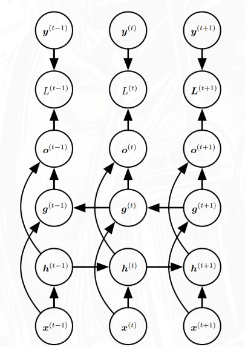

## 动机

标准RNN在计算 $h^{(t)}$ 时，只能看到**过去**的信息 $x^{(1)}, \ldots, x^{(t)}$，但很多任务中当前时刻的预测需要依赖**整个序列**，包括未来的信息。

典型例子：

- **语音识别**：一个音节的发音可能受后续音节影响
- **图像描述**：描述某个词时需要参考整句话的语义
- **手写识别**：当前笔画的含义依赖前后文

## 结构

双向RNN由**两个方向相反的RNN**组合而成：

- **前向RNN**：从左到右处理序列，得到前向隐藏状态 $h^{(t)}$
- **后向RNN**：从右到左处理序列，得到后向隐藏状态 $g^{(t)}$
- **输出层**：同时接收 $h^{(t)}$ 和 $g^{(t)}$，综合两个方向的信息

$$o^{(t)} = f(h^{(t)}, g^{(t)})$$

这样每个时刻的输出都能同时利用**过去和未来**的上下文信息。

### 与MRF/CRF的关联

PPT中提到，双向RNN可以推广到**二维**情形，比如处理图像时需要考虑上下左右四个方向的上下文，这就与**马尔可夫随机场（MRF）**和**条件随机场（CRF）**的思想产生了联系——它们都是在结构化数据上建模全局依赖关系的工具。

