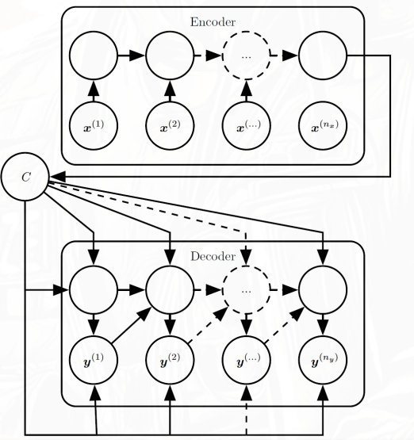

## 动机

前面三种RNN模式要求输入和输出序列**等长**，但机器翻译这类任务中输入输出长度往往不同，需要一种更灵活的架构。

## 序列到序列架构：编码器-解码器

Seq2Seq由两个RNN组成：

**编码器（Encoder）/读取器（Reader）：**

- 读取输入序列 $x^{(1)}, \ldots, x^{(n_x)}$
- 将整个输入序列压缩成一个**上下文向量** $C$
- 通常取最后一个隐藏状态或者其简单的函数：$C = h^{(n_x)}$

**解码器（Decoder）/写入器（Writer）：**

- 以上下文向量 $C$ 为条件
- 逐步生成输出序列 $y^{(1)}, \ldots, y^{(n_y)}$
- 每一步的输入是上一步的输出（或训练时用Teacher Forcing）

**训练目标：** 最大化条件对数似然

$$
\log P(y^{(1)}, \ldots, y^{(n_y)} \mid x^{(1)}, \ldots, x^{(n_x)})
$$

## Seq2Seq的瓶颈问题

基础Seq2Seq有一个明显缺陷：**整个输入序列被压缩成固定长度的向量 $C$**，当输入序列很长时，$C$ 很难保留所有关键信息，导致翻译质量下降。

## 注意力机制（Attention）

注意力机制正是为了解决上述瓶颈而提出的。核心思想是：

解码器在生成每个输出词时，不再只依赖固定的 $C$，而是**动态地关注编码器不同时刻的隐藏状态**。

假设encoder的隐藏状态为 $h^{(1)}, \ldots, h^{(n_x)}$，decoder在生成第 $t$ 个输出时，会计算一个**上下文向量** $C_t$，它是编码器隐藏状态的加权和：

1. **解码器在每一步**计算当前状态与编码器各时刻隐藏状态的**相关性权重**：

    $$
    \alpha_{t,i} = \frac{\exp(e_{t,i})}{\sum_j \exp(e_{t,j})}
    $$

    - 其中 $e_{t,i}=score(h^{(i)}, s^{(t)})$ 衡量解码器第 $t$ 步与编码器第 $i$ 步的匹配程度。
    - score函数可以是点积、可学习的前馈网络(MLP)等。

2. 然后用这些权重对编码器隐藏状态做**加权求和**，得到当前步专属的上下文向量：

    $$
    C_t = \sum_i \alpha_{t,i} h^{(i)}
    $$

3. 最后，解码器在生成输出时使用 $C_t$ 而不是固定的 $C$

这样解码器每一步都能**有选择地聚焦**在输入序列的不同部分，类似人类翻译时会反复回看原文的不同片段。

## 对比总结

|            | 基础Seq2Seq                    | 加入注意力机制               |
| ---------- | ------------------------------ | ---------------------------- |
| 上下文向量 | 固定的 $C$，只来自最后隐藏状态 | 动态的 $C_t$，每步重新计算   |
| 长序列表现 | 较差，信息易丢失               | 较好，可以直接访问任意位置   |
| 计算复杂度 | 低                             | 较高（需计算所有位置的权重） |
| 可解释性   | 差                             | 好（注意力权重可可视化）     |

1. 从“压缩”到“访问”
    - Seq2Seq：压缩encoder的所有 $h^{(i)}$ 到一个固定向量 $C$
    - Attention：随时访问encoder的所有隐藏状态 $h^{(i)}$，动态计算 $C_t$
2. 从“固定上下文”到“动态上下文”
    - $C → C_t$
3. 从“链式依赖”到“直接连接”
    - RNN路径 → Attention跳跃连接
