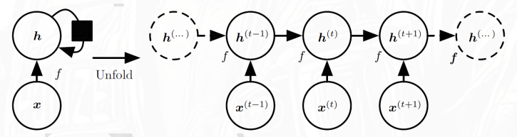
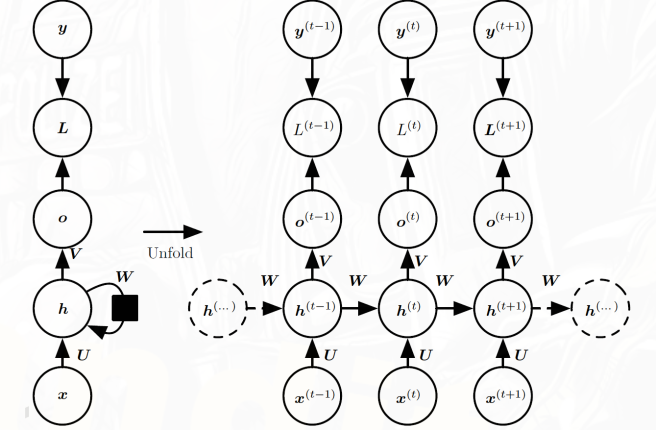
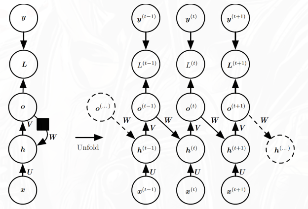
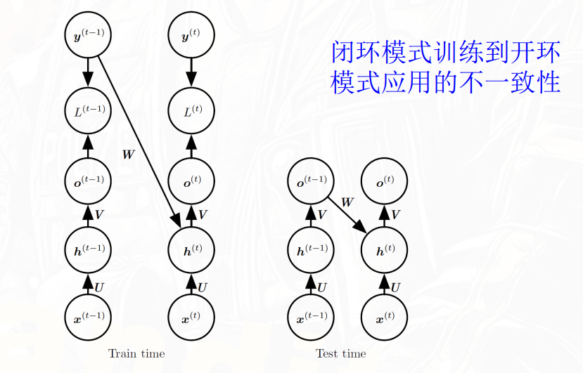
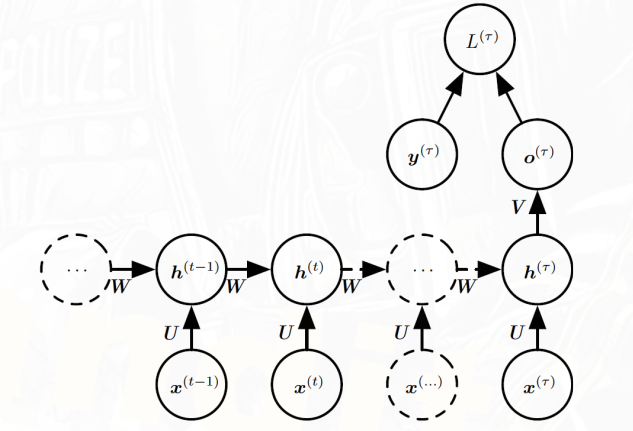

MLP 和 CNN 都假设输入是一个**固定大小的向量**——样本之间（或像素之间）没有时序依赖。但很多数据天然是序列：文本中的词汇有先后顺序，语音有时间延续，传感器数据按时间步采集。对这些数据，需要能建模时间依赖关系的网络结构。

循环神经网络（RNN）在 MLP 的基础上增加了一个**隐状态循环**：每个时间步的输出不仅依赖当前输入，还依赖上一个时间步的隐状态。这个简单的改变使网络具备了"记忆"能力。

## 序列数据

**序列数据**：$\mathbf{x} = \{x^{(1)}, x^{(2)}, \ldots, x^{(T)}\}$，其中 $T$ 是序列长度。

$t$ 表示时间步，$x^{(t)}$ 是序列在时间步 $t$ 的输入。

例如：

- 序列分类：输入一段时间序列，输出一个类别标签（如天文信号分类）
- 图像描述生成：输入图像（CNN提取特征），输出一段自然语言描述
- 机器翻译：输入一种语言的序列，输出另一种语言的序列
- 时间序列预测：根据历史帧预测未来帧（如ConvLSTM）

- 特点：输入或输出的长度是可变的，而且元素之间存在时序依赖关系，前后顺序不能打乱。

树和图统称结构化数据，是序列建模的进一步推广。

## RNN的基本概念

传统前馈网络要求输入是**固定**长度的向量，无法直接处理变长序列。

RNN可以处理变长序列，并且可以捕捉序列中元素之间的依赖关系。

1. 引入了隐藏状态的概念，隐藏状态 $h^{(t)}$ 作为对序列历史信息 $x$ 的记忆，随着时间步的推进不断更新。

2. 对序列中每个位置使用同一套参数 $\theta$，
3. $f$ 是状态转移函数，所有时间步的参数相同，状态转移函数是共享的。

$$
h^{(t)} = f(h^{(t-1)}, x^{(t)}; \theta)
$$

这带来两个关键能力：

- 处理长序列：参数量不随序列长度增加

- 处理变长序列：同一模型可以应对不同长度的输入

更通用一点的写法：

$$
h^{(t)} = \phi(W_{xh} x^{(t)} + W_{hh} h^{(t-1)} + b_h)\\
\hat{y}^{(t)} =\psi(W_{hy} h^{(t)} + b_y)
$$

| 符号        | 含义                              |
| ----------- | --------------------------------- |
| $W_{xh}$    | 输入层 → 隐藏层的参数             |
| $W_{hh}$    | 隐藏层 → 隐藏层（记忆传递的参数） |
| $W_{hy}$    | 隐藏层 → 输出层的参数             |
| $b_h, b_y$  | 偏置                              |
| $\phi,\psi$ | 激活函数（tanh / ReLU）           |

## 计算图的展开（Unfolding）

$$
h^{(t)} = f(h^{(t-1)}, x^{(t)}; \theta)\\
h^{(t)} = g^{(t)}(x^{(1)}, x^{(2)}, \ldots, x^{(t)}; \theta)
$$

$g^{(t)}$ 是将整段历史输入序列压缩为当前隐藏状态的复合函数

## 三种典型RNN设计模式

在展开计算图的基础上，根据**输出方式**和**循环连接方式**的不同，RNN有三种典型设计模式。

### 符号补充

在介绍三种架构之前，先把新出现的符号统一：

| 参数符号 | 含义                                 |
| -------- | ------------------------------------ |
| $U$      | 输入到隐藏层的权重矩阵               |
| $W$      | 隐藏层到隐藏层的权重矩阵（循环权重） |
| $V$      | 隐藏层到输出层的权重矩阵             |
| $b$      | 隐藏层的偏置向量                     |
| $c$      | 输出层的偏置向量                     |

| 中间量          | 含义                                 |
| --------------- | ------------------------------------ |
| $a^{(t)}$       | 第 $t$ 时刻隐藏层的净输入（激活前）  |
| $h^{(t)}$       | 第 $t$ 时刻隐藏层的输出（激活后）    |
| $o^{(t)}$       | 第 $t$ 时刻的输出层净输入            |
| $\hat{y}^{(t)}$ | 第 $t$ 时刻的预测输出（经softmax后） |
| $y^{(t)}$       | 第 $t$ 时刻的真实标签                |
| $L^{(t)}$       | 第 $t$ 时刻的损失值                  |

### 模式一：隐藏层之间有循环连接，每步都有输出

结构特点：

- 每个时间步都产生一个输出 $\hat{y}^{(t)}$
- 循环连接来自**隐藏层到隐藏层**（$h^{(t-1)} \to h^{(t)}$）
- 每步都计算损失 $L^{(t)}$，总损失是各步之和

**前向传播公式：**

路径：$x^{(t)} \to a^{(t)} \to h^{(t)} \to o^{(t)} \to \hat{y}^{(t)}$

$$a^{(t)} = b + Wh^{(t-1)} + Ux^{(t)}$$

$$h^{(t)} = \tanh(a^{(t)})$$

$$o^{(t)} = c + Vh^{(t)}$$

$$\hat{y}^{(t)} = \text{softmax}(o^{(t)})$$

**损失函数：**

$$
L = \sum_t L^{(t)} = -\sum_t \log p_{\text{model}}(y^{(t)} \mid x^{(1)}, \ldots, x^{(t)})
$$

一般取交叉熵损失函数：

$$
L^{(t)} = -\log p_{\text{model}}(y^{(t)} \mid x^{(1)}, \ldots, x^{(t)}) = -\log \hat{y}^{(t)}_{y^{(t)}}
$$

**特点分析：**

| 优点                               | 缺点                                             |
| ---------------------------------- | ------------------------------------------------ |
| 隐藏层之间直接传递信息，表达能力强 | 必须串行计算，无法并行                           |
| 每步都有监督信号，梯度更稳定       | BPTT计算时间和存储复杂度均为 $\mathcal{O}(\tau)$ |

**典型应用：** 语言模型、序列标注

### 模式二：输出到隐藏层有循环连接，每步都有输出

结构特点：

- 每个时间步都产生一个输出 $\hat{y}^{(t)}$
- 循环连接来自**上一步输出到当前隐藏层**（$o^{(t-1)} \to h^{(t)}$）
- 隐藏层之间**没有**直接的循环连接

**前向传播公式：**

$$a^{(t)} = b + \boxed{Wo^{(t-1)}} + Ux^{(t)}$$

$$h^{(t)} = \tanh(a^{(t)})$$

$$o^{(t)} = c + Vh^{(t)}$$

$$\hat{y}^{(t)} = \text{softmax}(o^{(t)})$$

**与模式一的核心区别：** 框里面的循环连接来自上一步的输出，而不是隐藏层之间的循环连接。

|                | 模式一                  | 模式二                  |
| -------------- | ----------------------- | ----------------------- |
| 循环连接来源   | $h^{(t-1)} \to h^{(t)}$ | $o^{(t-1)} \to h^{(t)}$ |
| 表达能力       | 较强                    | 较弱                    |
| 是否可并行训练 | 否                      | **是（导师驱动）**      |

**导师驱动过程（Teacher Forcing）：**

模式二的关键训练技巧。训练时不用上一步的**预测输出** $\hat{y}^{(t-1)}$，而是直接用**真实标签** $y^{(t-1)}$ 作为下一步的输入：

$$h^{(t)} = f(y^{(t-1)}, x^{(t)}; \theta)$$

这样每个时间步的计算变得**相互独立**，可以并行训练，避免了完整的BPTT。

但这带来一个问题：**训练和测试不一致**——训练时用真实值，测试时只能用预测值，分布可能存在偏差。改进方案是结合**课程学习**，训练初期多用真实值，后期逐步增加使用预测值的比例。

**典型应用：** 图像描述生成、语音合成

### 模式三：隐藏层之间有循环连接，只在最后输出

结构特点：

- 隐藏层之间有循环连接（同模式一）
- 但**只在序列末尾**产生一个输出 $\hat{y}^{(\tau)}$ 和损失 $L^{(\tau)}$
- 这里的 $\tau$ 是序列长度，就是$T$，即最后一个时间步

**特点分析：**

- 网络需要把整个序列的信息**压缩进最后一个隐藏状态** $h^{(\tau)}$ 中
- 梯度只从最后一步回传，长序列时梯度消失问题更严重
- 结构简单，适合序列级别的判断任务

**典型应用：** 情感分类、序列分类

### 三种模式对比总结

|          | 模式一        | 模式二              | 模式三        |
| -------- | ------------- | ------------------- | ------------- |
| 循环连接 | 隐藏层→隐藏层 | 输出→隐藏层         | 隐藏层→隐藏层 |
| 输出时机 | 每步都输出    | 每步都输出          | 只在末尾输出  |
| 表达能力 | 强            | 较弱                | 强            |
| 训练方式 | BPTT          | 可用Teacher Forcing | BPTT          |
| 典型任务 | 序列标注      | 序列生成            | 序列分类      |

这三种模式是RNN的基础骨架，后续的双向RNN、seq2seq、LSTM等都是在此基础上的扩展。

## 作为有向图模型的循环网络

说白了就是给RNN一个数学上说得通的解释

RNN从概率图模型的角度来看，是一个有向图模型（Directed Graphical Model, DGM），每个时间步的输出依赖于前一时间步的隐藏状态和当前输入。

- 每个节点依赖前一个节点
- 没有回路（展开后）
- 所以本质是：一个有向无环图（DAG）

RNN做的事情本质上是预测：给定输入序列，预测输出。预测天然可以用概率来描述：

$$
P(y^{(t)} \mid x^{(1)}, x^{(2)}, \ldots, x^{(T)}) = \prod_{t=1}^{T} P(y^{(t)} \mid h^{(t)})
$$

可以取负对数作为损失函数

读作： 给定从第1步到第t步的所有输入，第t步输出为 $y^{(t)}$ 的概率。

这里只考虑输入序列，输出之间没有显式的依赖关系。

如果额外加入了历史输出作为条件（$y^{(1)}, y^{(2)}, \ldots, y^{(t-1)}$ 也放到 | 的右边）就是当前输出不仅依赖输入，也依赖过去的输出。

$$
P(y^{(t)} \mid x^{(1)}, x^{(2)}, \ldots, x^{(T)}, y^{(1)}, y^{(2)}, \ldots, y^{(t-1)}) = \prod_{t=1}^{T} P(y^{(t)} \mid h^{(t)})
$$

这个视角有三个启发：

1. 解释了模式二（输出到隐藏层的循环）为什么合理，因为当前输出本来就应该依赖历史输出，模式二只是把这个依赖关系显式地建模出来了。
2. 导师驱动（Teacher Forcing）训练的本质是：训练时用真实标签代替历史预测输出，从概率图的角度看就是 | 右边的条件变成了真实标签，避免了训练和测试分布不一致的问题。
3. VAE、GAN等生成模型也可以用类似的有向图模型来描述，只不过它们的输出是连续的潜在变量，而不是离散的标签。
