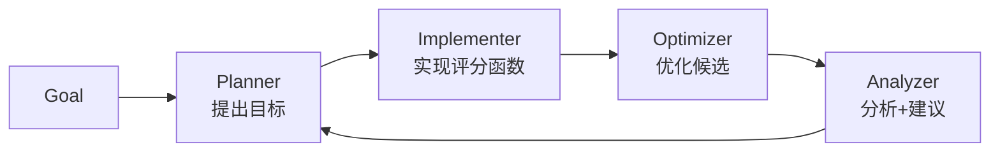

## 论文信息

**Accelerating Scientific Discovery with Autonomous Goal-evolving Agents** (SAGA)
Yuanqi Du, Botao Yu, et al. | arXiv 2512.21782 | 2025.12
代码: [github.com/btyu/SAGA](https://github.com/btyu/SAGA) (MIT)

## 核心思想

现有 AI 科学发现 agent 都假设目标函数已知且固定，但真实科研中科学家需要根据中间结果不断调整优化目标。SAGA 提出 **双层架构**：外循环自动演化目标函数，内循环优化候选解。核心 insight：**自动设计目标函数比自动优化固定目标更关键**。

## 方法

- **双层循环**：外循环（Planner→Implementer→Analyzer）演化目标，内循环（Optimizer）搜索最优解
- **三种人机协作模式**：Co-pilot（全干预）、Semi-pilot（仅分析反馈）、Autopilot（全自动）
- **Optimizer 默认**：LLM 进化算法（生成→打分→选 top），可插拔替代
- **Implementer 可自动搜索 web 并编写评分函数**，在 Docker 中验证

## 实验结果

| 领域     | 核心结果                                                   |
| -------- | ---------------------------------------------------------- |
| 抗生素   | 4 个 hit 化合物，**MIC 16 μg/mL**，对人无毒，Tanimoto >0.7 |
| 纳米抗体 | 3 个 de novo PD-L1 结合剂，**K_D = 300-400 nM**            |
| DNA 序列 | HepG2 增强子比 baseline 高 **48%**（特异性）               |
| 无机材料 | 永磁体+超硬材料，DFT 验证                                  |
| 化工过程 | 避免不必要单元操作，平衡纯度/成本                          |

最大亮点：**抗生素和纳米抗体两个任务获得了湿实验验证**。

## 代码短评

框架开源（MIT），核心逻辑清晰，模块化设计可扩展。但仅公开了抗生素和 DNA 设计两个任务的代码，其余三个领域未开源。
