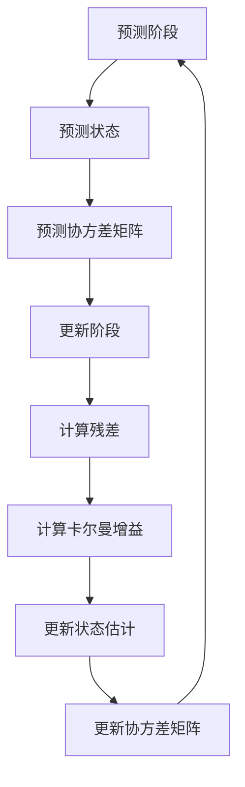

## 什么是卡尔曼滤波器

卡尔曼滤波是一种**递归**的估计，即只要获知上一时刻状态的估计值以及当前状态的观测值就可以计算出当前状态的估计值，因此不需要记录观测或者估计的历史信息。

卡尔曼增益 $\mathbf{K}$ 是把**预测/先验**和**观测/测量**按不确定性加权融合的矩阵权重：它根据预测的不确定性和测量噪声决定“该信任多少观测、该信任多少预测”，从而把测量残差（innovation）映射回状态空间来修正预测。

## 卡尔曼滤波器的数学模型

设离散线性系统模型有：
$$
\begin{aligned}
\text{状态传播模型:}\quad & \mathbf{x}_k = \mathbf{F}_k \mathbf{x}_{k-1} + \mathbf{B}_k \mathbf{u}_k + \mathbf{w}_k,\quad \mathbf{w}_k \sim \mathcal{N}(\mathbf{0}, \mathbf{Q}_k)\\
\text{观测模型:}\quad & \mathbf{z}_k = \mathbf{H}_k \mathbf{x}_k + \mathbf{v}_k,\quad \mathbf{v}_k \sim \mathcal{N}(\mathbf{0}, \mathbf{R}_k)
\end{aligned}
$$

+ 状态传播模型是客观存在的，永远准确的，但无法直接观测的。
+ 观测模型是通过测量手段得到的测量数据，包含噪声。

先验估计（状态预测）：$\hat{\mathbf{x}}_{k|k-1} = \mathbf{F}_k \hat{\mathbf{x}}_{k-1|k-1} + \mathbf{B}_k \mathbf{u}_k$

先验协方差矩阵（先验估计的精度描述）：$\mathbf{P}_{k|k-1} = \mathbf{F}_k \mathbf{P}_{k-1|k-1}\mathbf{F}_k^T + \mathbf{Q}_k$

>令：$\mathbf{S}_k = \mathbf{H}_k \mathbf{P}_{k|k-1} \mathbf{H}_k^\top + \mathbf{R}_k$

卡尔曼增益：
$\mathbf{K}_k = \mathbf{P}_{k|k-1} \mathbf{H}_k^\top \mathbf{S}_k^{-1}$

后验估计（对先验估计进行更新）：
$\hat{\mathbf{x}}_{k|k} = \hat{\mathbf{x}}_{k|k-1} + \mathbf{K}_k \mathbf{y}_k，\mathbf{y}_k＝\mathbf{z}_k - \mathbf{H}_k \hat{\mathbf{x}}_{k|k-1}$

后验协方差矩阵（后验估计的精度描述）$\mathbf{P}_{k|k} = (\mathbf{I} - \mathbf{K}_k \mathbf{H}_k)\mathbf{P}_{k|k-1}$

很好，这里五个公式里面有10个神秘字母，下面将一一介绍他们各自的含义。

## 符号说明

假设系统状态空间的维度为 $n$，测量（观测）空间的维度为 $m$

:::tip
所有带 $\hat{\,\;}$ 的值都是估计值,不带 $\hat{\,\;}$ 的都是真实值
:::

---

### 状态空间

#### 真实状态向量

$\mathbf{x}_k$：系统在时刻 $k$ 的真实状态，无法观测（受噪声影响）维度 $n\times1$。

#### 预测状态/先验估计

$\mathbf{\hat{x}}_{k|k-1}$：在 $k$ 时刻使用 $k-1$ 时刻的**后验估计**和**系统的状态转移矩阵**得到的预测，叫先验估计，维度 $n\times1$。

#### 更新状态/后验估计

$\hat{\mathbf{x}}_{k|k}$：在包含 $k$ 时刻观测后测量值的估计后验状态估计，维度 $n\times1$。

+ 下标 $k|k-1$ 表示“在时刻 $k$ 使用时刻 $k-1$ 的信息”，不用 $k$ 时刻的信息，**先验**意为**预测**。

+ 下标 $k|k$ 表示“在时刻 $k$ 使用时刻 $k$ 的信息”，**后验**意为**更新**。

---

### 测量（观测）空间

#### 测量噪声

$\mathbf{v}_k$：$m\times1$。测量噪声假设服从均值为0，协方差为 $\mathbf{R}_k$ 的高斯分布。

#### 观测矩阵

$\mathbf{H}_k$：把状态($\hat{\mathbf{x}}$和$\mathbf{x}$)映射到测量空间($\mathbf{z}$)，$m\times n$。观测矩阵**每一行**代表一个**测量值**，**每一列**代表一个**状态值**，矩阵中的**元素**代表状态对测量的**影响程度**。

#### 理想测量向量

$\mathbf{z}_k$：$m\times1$。观测矩阵作用于真实状态向量

#### 估计测量向量

$\mathbf{\hat{z}}_k$：$m\times1$。观测矩阵作用于先验估计（预测状态）

#### 估计状态向量

$\mathbf{\hat{x}}_k$：$n\times1$。由测量值映射回状态空间后的估计状态向量。

#### 测量残差

$\mathbf{y}_k$：理想测量和估计测量间的误差。
$$
\begin{align*}
  \mathbf{y}_k = \mathbf{z}_k -\mathbf{\hat{z}}_k\\
  =\mathbf{z}_k - \mathbf{H}_k \hat{\mathbf{x}}_{k|k-1},
\end{align*}
$$
大小 $m\times1$。 其中 $\mathbf{z}_k$ 是理想测量向量。

+ （理想的和估计的）测量向量的维度取决于观测矩阵的**行数**，即 $m$。

+ **测量**是存在误差的，有**噪声**
+ 观测矩阵作用于（$\mathbf{x}_k$）并加上测量噪声($\mathbf{v}_k$)，得到**理想**的测量空间（$\mathbf{z}_k$）
+ 观测矩阵作用于（$\hat{\mathbf{x}}_k$）并加上测量噪声($\mathbf{v}_k$)，得到**估计**的测量空间（$\mathbf{\hat{z}}_k$）
+ 理想测量向量 $\mathbf{z}_k$ 和估计测量向量 $\mathbb{\hat{z}}_k$ 由测量残差 $\mathbf{y}_k$ 关联

:::note
比如说对于一个运动的物体，有速度，位置，加速度三个状态，则 $k$ 时刻的 **真实状态空间** $\mathbf{x}_{k(3\times1,n=3)}=\begin{bmatrix}p\\ v\\ a\end{bmatrix}$ ,但是观测手段只允许测量位置和速度，那么观测矩阵 $\mathbf{H}_{k(2\times3,m=2,n=3)}=\begin{bmatrix}1&0&0\\0&1&0\end{bmatrix}$ ,则  $k$ 时刻得到的 **理想测量空间** $\mathbf{z}_{k(m=2,n=1)}$：

$$
\begin{align*}
z_k&=\mathbf{H}_k\cdot x_k+v_k\\
&=\begin{bmatrix}1&0&0\\0&1&0\end{bmatrix}\cdot\begin{bmatrix}p\\ v\\ a\end{bmatrix}+\mathbf{v}_k\\
&=\begin{bmatrix}
p\\ v
\end{bmatrix}+\mathbf{v}_k
\end{align*}
$$

:::

---

### 两个协方差矩阵

:::warning  
不要尝试用严格的协方差矩阵数学定义去看待卡尔曼滤波中所谓的协方差矩阵  
:::

概率论中的协方差矩阵：
$$
\Sigma = \mathrm{Cov}(X) = \mathbb{E}[(X-\mu)(X-\mu)^T]
$$
X减的是均值，描述的是随机向量相对于它的**真实均值**的离散程度和分量间相关性。

卡尔曼滤波中的协方差矩阵：(这里以先验协方差为例)
$$
\mathbf{P}_{k|k-1}= \mathbb{E}[(\mathbf{x}_k-\mathbf{\hat{x}}_{k|k-1})(\mathbf{x}_k-\mathbf{\hat{x}}_{k|k-1})^T]
$$
减的是估计值，描述的是真实状态$\mathbf{x}_k$(随机向量)相对于它的**先验估计（估计值）**$\mathbf{x}_{k|k-1}$的**估计精度**(离散程度)和分量间相关性。

:::tip
简而言之，卡尔曼滤波中的协方差矩阵就是估计精度。
:::

+ 为啥不用真实的均值呢？因为这玩意没法观测。
+ 这种做法是合理的，卡尔曼滤波器在**线性、高斯、无偏初始条件**下，保证了$\mathbf{E}[\mathbf{x}_k]=\mathbf{\hat{x}}_{k|k}$(证明过程略，可以参考[维基](https://en.wikipedia.org/wiki/Kalman_filter#Properties))，所以用估计值代替真实均值是合理的。

$\mathbf{e}_{k|k-1} = \mathbf{x}_k - \hat{\mathbf{x}}_{k|k-1}$：**先验估计误差**：真实状态与先验估计的误差。

$\mathbf{e}_{k|k} = \mathbf{x}_k - \hat{\mathbf{x}}_{k|k}$：**后验误差估计**：真实状态与后验估计的误差。

$\mathbf{P}_{k|k-1}$：**先验协方差矩阵（预测精度）**：$=\mathbb{E}\!\left[ \mathbf{e}_{k|k-1} \mathbf{e}_{k|k-1}^T\right]\;\;,n\times n$。

$\mathbf{P}_{k|k}$：**后验协方差矩阵（更新精度）**：$=\mathbb{E}\!\left[ \mathbf{e}_{k|k} \mathbf{e}_{k|k}^T \right]\;\;,n\times n$。  

从上文可知，估计分为先验估计 $\mathbf{\hat{x}}_{k|k-1}$ 和后验估计 $\mathbf{\hat{x}}_{k|k}$ ，这两个估计的"真实值"都是**真实状态向量** $\mathbf{x}_k$ 。$\mathbf{P}_{k|k-1}$ 先验协方差矩阵描述先验估计的精度（预测的精度），$\mathbf{P}_{k|k}$ 后验协方差矩阵描述后验估计的精度（更新的精度）。

:::note[两个协方差矩阵的推导]

$$
\begin{align*}
P_{k|k-1} &= \mathbb{E}\!\left[ \mathbf{e}_{k|k-1} \mathbf{e}_{k|k-1}^T\right]\\
P_{k|k} &= \mathbb{E}\!\left[ \mathbf{e}_{k|k} \mathbf{e}_{k|k}^T \right]
\end{align*}
$$

#### 1. 先验误差协方差 $P_{k|k-1}$

$$
\begin{aligned}
&\text{系统的状态转移方程（描述客观的状态转移）}:\\
\mathbf{x}_k &= F_k \mathbf{x}_{k-1} + B_k \mathbf{u}_k + \mathbf{w}_k&\dotsb(1)\\
&\text{先验估计方程}:\\
\mathbf{\hat{x}}_{k|k-1} &= F_k \hat{\mathbf{x}}_{k-1|k-1} + B_k \mathbf{u}_k&\dotsb(2)\\
&(2)-(1)\\
\mathbf{e}_{k|k-1} &= \mathbf{x}_k - \hat{\mathbf{x}}_{k|k-1}\\
&= (F_k \mathbf{x}_{k-1} + B_k \mathbf{u}_k + \mathbf{w}_k) - (F_k \hat{\mathbf{x}}_{k-1|k-1} + B_k \mathbf{u}_k)\\
&= F_k \mathbf{e}_{k-1|k-1} + \mathbf{w}_k\\
\mathbf{P}_{k|k-1} &= \mathbb{E}\!\left[ \mathbf{e}_{k|k-1}\mathbf{e}_{k|k-1}^\top \right]\\
&= \mathbb{E}\!\left[ \mathbf{F}_k\mathbf{e}_{k-1|k-1}\mathbf{e}_{k-1|k-1}^\top \mathbf{F}_k^\top \right]
+\mathbb{E}\!\left[\mathbf{F}_k\mathbf{e}_{k-1|k-1}\mathbf{w}_k^\top\right] 
+ \mathbb{E}\left[\mathbf{w}_k\mathbf{e}_{k-1|k-1}^\top\mathbf{F}_k^\top\right] \mathbb{E}\!\left[ \mathbf{w}_k \mathbf{w}_k^\top \right]\\
&\text{因为 $\mathbf{w}_k$ 独立，且零均值：}\mathbb{E}(\mathbf{w}_k)=0\\
\therefore &=\mathbf{F}_k \, \mathbb{E}\!\left[ \mathbf{e}_{k-1|k-1}\mathbf{e}_{k-1|k-1}^\top \right] \mathbf{F}_k^\top
+ \mathbb{E}\!\left[ \mathbf{w}_k \mathbf{w}_k^\top \right]\\
\mathbf{P}_{k|k-1} &= \mathbf{F}_k \mathbf{P}_{k-1|k-1}\mathbf{F}_k^\top + \mathbf{Q}_k\\
&\text{这里 $Q_k$ 是过程噪声的协方差。}
\end{aligned}\\
$$

#### 2. 后验误差协方差 $P_{k|k}$

$$
\begin{align*}
&\text{后验估计方程：}\\
\mathbf{\hat{x}}_{k|k} &= \hat{\mathbf{x}}_{k|k-1} + K_k (\mathbf{z}_k-\mathbf{H}_k\mathbf{\hat{x}}_{k|k-1})\dotsb(3)\\
&\text{观测方程：}\\
\mathbf{z}_k &= H_k \mathbf{x}_k + \mathbf{v}_k\dotsb(4)\\
&\text{后验误差：}\\
\mathbf{e}_{k|k} &= \mathbf{x}_k - \hat{\mathbf{x}}_{k|k}\\
&=(4)\to (3)\\
&=\mathbf{x}_k - \hat{\mathbf{x}}_{k|k-1} - \mathbf{K}_k(\mathbf{H}_k\mathbf{x}_k + \mathbf{v}_k - \mathbf{H}_k \hat{\mathbf{x}}_{k|k-1})\\
&=(\mathbf{I} - \mathbf{K}_k\mathbf{H}_k)(\mathbf{x}_k - \hat{\mathbf{x}}_{k|k-1}) - \mathbf{K}_k \mathbf{v}_k\\
&=(\mathbf{I} - \mathbf{K}_k\mathbf{H}_k)\mathbf{e}_{k|k-1} - \mathbf{K}_k \mathbf{v}_k\\
P_{k|k} &= \mathbb{E}\!\left[ \mathbf{e}_{k|k} \mathbf{e}_{k|k}^\top \right]\\
&= \mathbb{E}\!\left[ \big((\mathbf{I} - \mathbf{K}_k\mathbf{H}_k)\mathbf{e}_{k|k-1} - \mathbf{K}_k \mathbf{v}_k\big) \big((\mathbf{I} - \mathbf{K}_k\mathbf{H}_k)\mathbf{e}_{k|k-1} - \mathbf{K}_k \mathbf{v}_k\big)^\top \right]\\
&= (\mathbf{I} - \mathbf{K}_k\mathbf{H}_k) \mathbb{E}\!\left[ \mathbf{e}_{k|k-1} \mathbf{e}_{k|k-1}^\top \right] (\mathbf{I} - \mathbf{K}_k\mathbf{H}_k)^\top + \mathbf{K}_k \mathbb{E}\!\left[ \mathbf{v}_k \mathbf{v}_k^\top \right] \mathbf{K}_k^\top\\
&\text{上一步用了协方差矩阵的简化算法的思路，即}\Sigma=\mathbb{E}[XX^T]-\mu\mu^T\\
&= (\mathbf{I} - \mathbf{K}_k\mathbf{H}_k) \mathbf{P}_{k|k-1} (\mathbf{I} - \mathbf{K}_k\mathbf{H}_k)^\top + \mathbf{K}_k \mathbf{R}_k \mathbf{K}_k^\top\\
&\text{这里 }R_k\text{ 是测量噪声的协方差矩阵}\\
\end{align*}
$$

#### （可选）化简到常见简化式的完整代数步骤

常见简化形式为
$$
\mathbf{P}_{k|k} = (\mathbf{I}-\mathbf{K}_k\mathbf{H}_k)\,\mathbf{P}_{k|k-1}.
$$
下面给出它从 Joseph 形式代数化简的步骤，并说明何时成立。

从 Joseph 形式展开：
$$
\begin{aligned}
\mathbf{P}_{k|k}
&= \mathbf{P}_{k|k-1}-\mathbf{K}_k\mathbf{H}_k\mathbf{P}_{k|k-1}-\mathbf{P}_{k|k-1}\mathbf{H}_k^\top\mathbf{K}_k^\top \\
&\quad +\mathbf{K}_k\mathbf{H}_k\mathbf{P}_{k|k-1}\mathbf{H}_k^\top\mathbf{K}_k^\top+\mathbf{K}_k \mathbf{R}_k \mathbf{K}_k^\top.
\end{aligned}
$$

把最后两项合并：
$$
\mathbf{K}_k\mathbf{H}_k\mathbf{P}_{k|k-1}\mathbf{H}_k^\top\mathbf{K}_k^\top
+\mathbf{K}_k \mathbf{R}_k \mathbf{K}_k^\top
= \mathbf{K}_k\big(\mathbf{H}_k\mathbf{P}_{k|k-1}\mathbf{H}_k^\top + \mathbf{R}_k\big)\mathbf{K}_k^\top.
$$

记
$$
\mathbf{S}_k = \mathbf{H}_k\mathbf{P}_{k|k-1}\mathbf{H}_k^\top + \mathbf{R}_k.
$$

若使用标准卡尔曼增益
$$
\mathbf{K}_k = \mathbf{P}_{k|k-1}\mathbf{H}_k^\top \mathbf{S}_k^{-1},
$$
则
$$
\begin{aligned}
\mathbf{K}_k \mathbf{S}_k \mathbf{K}_k^\top
&= \big(\mathbf{P}_{k|k-1}\mathbf{H}_k^\top \mathbf{S}_k^{-1}\big)\mathbf{S}_k
  \big(\mathbf{S}_k^{-1}\mathbf{H}_k\mathbf{P}_{k|k-1}\big) \\
&= \mathbf{P}_{k|k-1}\mathbf{H}_k^\top \mathbf{S}_k^{-1}\mathbf{H}_k\mathbf{P}_{k|k-1}.
\end{aligned}
$$

注意到
$$
\mathbf{P}_{k|k-1}\mathbf{H}_k^\top \mathbf{S}_k^{-1}
= \mathbf{K}_k,
\quad\text{且}\quad
\mathbf{S}_k^{-1}\mathbf{H}_k\mathbf{P}_{k|k-1} = \mathbf{K}_k^\top.
$$

于是合并项退化为：
$$
\mathbf{K}_k\mathbf{S}_k\mathbf{K}_k^\top = \mathbf{P}_{k|k-1}\mathbf{H}_k^\top \mathbf{K}_k^\top.
$$

回代 Joseph 展开式：
$$
\begin{aligned}
\mathbf{P}_{k|k}
&= \mathbf{P}_{k|k-1}-\mathbf{K}_k\mathbf{H}_k\mathbf{P}_{k|k-1}-\mathbf{P}_{k|k-1}\mathbf{H}_k^\top\mathbf{K}_k^\top+\mathbf{P}_{k|k-1}\mathbf{H}_k^\top\mathbf{K}_k^\top \\
&= \mathbf{P}_{k|k-1} - \mathbf{K}_k\mathbf{H}_k\mathbf{P}_{k|k-1} \\
&= (\mathbf{I}-\mathbf{K}_k\mathbf{H}_k)\,\mathbf{P}_{k|k-1}.
\end{aligned}
$$

因此在**采用标准卡尔曼增益**并利用定义 $\mathbf{S}_k$ 后，Joseph 形式代数上会化简为常用的简化形式。但需注意：

+ 简化式 $\mathbf{P}_{k|k}=(\mathbf{I}-\mathbf{K}_k\mathbf{H}_k)\mathbf{P}_{k|k-1}$ 并**不显式**包含 $\mathbf{R}_k$，其成立依赖于上面用到的 $\mathbf{K}_k$ 的表达式（即利用了 $\mathbf{K}_k\mathbf{S}_k\mathbf{K}_k^\top$ 的代数关系）。  
+ 为了数值对称性与稳定性，工程上更常用 **Joseph 形式**带两个 $\mathbf{A}$ 的对称形式 $\mathbf{K}\mathbf{R}\mathbf{K}^\top$，因为它显式保证了 $\mathbf{P}_{k|k}$ 的对称正半定性。

这说明后验协方差是先验协方差经过“卡尔曼增益修正”后的结果。

:::

上面说卡尔曼矩阵描述了估计值的估计精度，所以也能决定卡尔曼增益 $\mathbf{K}_k$ 的大小。这个在卡尔曼增益的解析中给出推导

---

### 真实状态空间中的状态转移相关的矩阵

#### 状态转移矩阵

$\mathbf{F}_k$：系统动力学，$n\times n$。

这玩意描述真实系统的状态转移方式，即 $\mathbf{x}_{k-1}\overset{\mathbf{F}_k}{\longrightarrow}\mathbf{x_k}$。受其直接影响的量是**真实状态** $\mathbf{x}_k$ 和**先验协方差** $\mathbf{P}_{k|k-1}$。

#### 控制输入矩阵&控制向量

$\mathbf{B}_k$：$n\times p$。  

$\mathbf{u}_k$：$p\times1$。  

$\mathbf{B}_k$ 和 $\mathbf{u}_k$ 描述系统受到的外部控制输入对状态的影响，比如汽车的油门、刹车、方向盘等。

#### 过程噪声协方差

$\mathbf{Q}_k$：$n\times n$。

过程噪声协方差矩阵 $\mathbf{Q}_k$ 表示系统在状态转移过程中可能存在的随机扰动或不确定性。比如风吹、路面不平等因素都会影响物体的运动状态，这个在 $k$ 时刻对物体的不确定影响我们就用 $\mathbf{Q}_k$ 来表示

#### 测量噪声协方差

$\mathbf{R}_k$：$m\times m$。

测量噪声协方差矩阵 $\mathbf{R}_k$ 表示测量仪器本身存在的误差或不确定性，比如测量仪器的精度有限，可能会有一定的误差，这个误差我们就用 $\mathbf{R}_k$ 来表示。

#### 创新（残差）协方差

$\mathbf{S}_k$：也叫测量预测协方差。$m\times m$，它表示把预测的不确定性投影到测量空间后，与测量噪声合并得到的“测量不确定性”。

## 卡尔曼增益的直观意义

$\mathbf{K_k}$：**卡尔曼增益**，大小为 $n\times m$

用现代汉语描述一下卡尔曼增益在后验估计方程（状态更新）中的作用：

$$
 \underset{\text{当前的估计值(后验估计)}}{\hat{\mathbf{x}}_{k|k}} = \underset{\text{上一次的估计(先验估计)}}{\hat{\mathbf{x}}_{k|k-1}} + \underset{\text{系数（卡尔曼增益）}}{\mathbf{K}_k}\cdot\underset{\text{当前测量值－上一次估计值}}{(\mathbf{z}_k-\mathbf{H}_k\cdot\hat{\mathbf{x}}_{k|k-1})}\\
$$

卡尔曼滤波认为，后验估计 $\mathbf{\hat{x}}_{k|k}$ 是先验估计和测量值的**线性**组合，也就是进行数据融合，卡尔曼增益决定了”相信多少先验估计，相信多少测量值”

如果纯用数据融合的方式，那么公式的形式应该长这样
$$
\hat{\mathbf{x}}_{k|k} =  \hat{\mathbf{x}}_{k|k-1} + \mathbf{G}\cdot (\hat{\mathbf{x}}_{k}-\mathbf{\hat{x}}_{k|k-1})\\[5pt]
\text{其中}\hat{\mathbf{x}}_k = \mathbf{H}_k^-\mathbf{z}_k\\[5pt]
$$

$\hat{\mathbf{x}}_k$ 是根据测量值映射回状态空间后对客观状态的估计

$\mathbf{G}$ 是数据融合的系数矩阵,范围是 $[0,\mathbf{I}]$，当 $\mathbf{G}=\mathbf{0}$ 时，完全相信先验估计 $\hat{\mathbf{x}}_{k|k-1}$；当 $\mathbf{G}=\mathbf{I}$ 时，完全相信测量值 $\hat{\mathbf{x}}_k$。

对系数 $\mathbf{G}$ 稍微变形一下就得到了标准的卡尔曼滤波公式：

$$
\text{令}\mathbf{G} = \mathbf{K}_k\mathbf{H}_k\\[5pt]
\Rightarrow \hat{\mathbf{x}}_{k|k} =  \hat{\mathbf{x}}_{k|k-1} + \mathbf{K}_k\cdot (\mathbf{z}_k-\mathbf{H}_k\cdot\hat{\mathbf{x}}_{k|k-1})\\[5pt]
$$

这里的 $\mathbf{K}_k$ 就是卡尔曼增益。范围是 $[0,\mathbf{H}_k^{-1}]$，当 $\mathbf{K}_k=\mathbf{0}$ 时，完全相信先验估计 $\hat{\mathbf{x}}_{k|k-1}$；当 $\mathbf{K}_k=\mathbf{H}_k^{-1}$ 时，完全相信测量值 $\hat{\mathbf{x}}_k$。

:::warning[下面推导可能有误，谨慎参考]
:::

:::note[卡尔曼增益的推导]
这一坨东西的推导和后验协方差矩阵息息相关，后验协方差矩阵越“小”越好。对于这个“小”的标准，最常见的是后验协方差矩阵的迹（trace），也就是对角线各元素之和（对角线元素是后验误差的方差）

具体推导里面有矩阵求导bulabula之类的，主包的线性代数功底不好。

为了简化，记
$$
\mathbf{P}\equiv\mathbf{P}_{k|k-1},\mathbf{K}\equiv\mathbf{K}_k,\mathbf{H}=\mathbf{H}_k,\mathbf{R}=\mathbf{R}_k\\
$$

结合之前后验协方差矩阵的推导过程，Joshep展开:

$$
\begin{align*}
\mathbf{P}_{k|k}
&= (\mathbf{I}-\mathbf{K}\mathbf{H})\,\mathbf{P}\,(\mathbf{I}-\mathbf{K}\mathbf{H})^\top+\mathbf{K}\mathbf{R}\mathbf{K}^\top\\
&=(\mathbf{I}-\mathbf{K}\mathbf{H})\,\mathbf{P}\,(\mathbf{I}^\top-\mathbf{H}^\top\mathbf{K}^\top)+
\mathbf{K}\mathbf{R}\mathbf{K}^\top\\
&=\mathbf{P} - \mathbf{K}\mathbf{H}\mathbf{P} - \mathbf{P}\mathbf{H}^\top\mathbf{K}^\top + \mathbf{K}\mathbf{H}\mathbf{P}\mathbf{H}^\top\mathbf{K}^\top + \mathbf{K}\mathbf{R}\mathbf{K}^\top
\end{align*}
$$

其中 $\mathbf{P}$ 是已知的**先验协方差矩阵**，$\mathbf{H}$ 是已知的**观测矩阵**，$\mathbf{R}$ 是已知的**测量噪声协方差矩阵**，未知的是 $\mathbf{K}$。

以**迹**为代价函数,对角线元素之和越小，说明后验误差的方差越小，估计精度越高
$$
J(\mathbf{K}) \;=\; \mathrm{tr}\!\big(\mathbf{P}_{k|k}\big).
$$

用迹的性质展开，关于迹的性质，可以参考[这篇博客](https://www.cnblogs.com/hjd21/p/16619280.html)。

迹的循环不变性 $\mathrm{tr}(\mathbf{ABC})=\mathrm{tr}(\mathbf{BCA})$

转置不改变迹 $\mathrm{tr}(\mathbf{P}^\top)=\mathrm{tr}(\mathbf{P})$，当然，$\mathbf{P}$ 本来就是对称的。

$$
\begin{aligned}
J(\mathbf{K})
&= \mathrm{tr}\!\big( (\mathbf{I}-\mathbf{K}\mathbf{H})\,\mathbf{P}\,(\mathbf{I}-\mathbf{K}\mathbf{H})^\top \big)+\mathrm{tr}\!\big(\mathbf{K}\mathbf{R}\mathbf{K}^\top\big) \\
&= \mathrm{tr}(\mathbf{P})
   -2\,\mathrm{tr}(\mathbf{K}\mathbf{H}\mathbf{P})+\mathrm{tr}\!\big(\mathbf{K}\mathbf{H}\mathbf{P}\mathbf{H}^\top\mathbf{K}^\top\big)+\mathrm{tr}\!\big(\mathbf{K}\mathbf{R}\mathbf{K}^\top\big).
\end{aligned}
$$

为了处理后面两项，定义
$$
\mathbf{S} = \mathbf{H}\mathbf{P}\mathbf{H}^\top + \mathbf{R},
$$

则
$$
J(\mathbf{K})
= \mathrm{tr}(\mathbf{P}) \;-\; 2\,\mathrm{tr}(\mathbf{K}\mathbf{H}\mathbf{P})
\;+\; \mathrm{tr}\!\big(\mathbf{K}\mathbf{S}\mathbf{K}^\top\big)
$$

矩阵微分与梯度

对 $\mathbf{K}$ 求导。用到两个常用公式：

+ 若 $\mathbf{A}$ 为常矩阵$\displaystyle \frac{\partial}{\partial \mathbf{K}}\,\mathrm{tr}(\mathbf{K}\mathbf{A}) = \mathbf{A}^\top$。

+ 若 $\mathbf{A}$ 对称，$\displaystyle \frac{\partial}{\partial \mathbf{K}}\,\mathrm{tr}(\mathbf{K}\mathbf{A}\mathbf{K}^\top) = 2\,\mathbf{K}\mathbf{A}$。

于是
$$
\frac{\partial \mathbf{J}(\mathbf{K})}{\partial \mathbf{K}}
= -2\,(\mathbf{H}\mathbf{P})^\top + 2\,\mathbf{K}\mathbf{S}
= -2\,\mathbf{P}\mathbf{H}^\top + 2\,\mathbf{K}\mathbf{S}.
$$

optimality 条件与最优解,令梯度为零：
$$
-2\,\mathbf{P}\mathbf{H}^\top + 2\,\mathbf{K}\mathbf{S} = \mathbf{0}
\;\;\Longrightarrow\;\;
\mathbf{K}\mathbf{S} = \mathbf{P}\mathbf{H}^\top.
$$

$$
\boxed{\;
\mathbf{K} \;=\; \mathbf{P}\mathbf{H}^\top \mathbf{S}^{-1}
\;=\; \mathbf{P}\mathbf{H}^\top \big(\mathbf{H}\mathbf{P}\mathbf{H}^\top + \mathbf{R}\big)^{-1}=\frac{\mathbf{P}\mathbf{H}^\top}{\mathbf{H}\mathbf{P}\mathbf{H}^\top + \mathbf{R}}}
$$

这就是**卡尔曼增益**的标准形式。(写成分数形式是为了方便理解)

观察分母，当**测量噪声协方差** $\mathbf{R}$ 很大时，说明测量值不可靠，卡尔曼增益 $\mathbf{K}\to \mathbf{0}$ ，更相信先验估计；当 $\mathbf{R}$ 很小时，说明测量值比较可靠，卡尔曼增益 $\mathbf{K}\to \mathbf{H}^-$ ，更相信测量值。

:::

## 一个完整的卡尔曼滤波器迭代流程

### 1.预测阶段

#### 1.1 预测状态

求先验估计（预测状态）$\mathbf{\hat{x}}_{k|k-1}$，根据 $k-1$ 时刻的**后验估计**（更新状态） $\mathbf{\hat{x}}_{k-1|k-1}$ 和系统的**状态传播模型**来预测 $k$ 时刻的状态：
$$
\hat{\mathbf{x}}_{k|k-1} = \mathbf{F}_k \hat{\mathbf{x}}_{k-1|k-1} + \mathbf{B}_k \mathbf{u}_k
$$

#### 1.2 预测协方差矩阵

求 $\mathbf{P}_{k|k-1}$，根据 $k-1$ 时刻的**后验协方差矩阵** $\mathbf{P}_{k-1|k-1}$ 和系统的**过程噪声协方差** $\mathbf{Q}_k$ 来预测 $k$ 时刻的协方差：
$$
\mathbf{P}_{k|k-1} = \mathbf{F}_k \mathbf{P}_{k-1|k-1}\mathbf{F}_k^T + \mathbf{Q}_k
$$

### 2.更新阶段

#### 2.1 计算残差

计算测量残差 $\mathbf{y}_k$，即当前**测量值** $\mathbf{z}_k$ 与**估计测量值** $\hat{\mathbf{z}}_k$ 之间的差异：
$$
\mathbf{y}_k = \mathbf{z}_k - \hat{\mathbf{z}}_k = \mathbf{z}_k - \mathbf{H}_k \hat{\mathbf{x}}_{k|k-1}
$$

#### 2.2 计算卡尔曼增益

计算卡尔曼增益 $\mathbf{K}_k$，它决定了**先验估计**和**测量值**在更新中的权重：
$$
\begin{align*}
\mathbf{S}_k &= \mathbf{H}_k \mathbf{P}_{k|k-1} \mathbf{H}_k^\top + \mathbf{R}_k\\
\mathbf{K}_k &= \mathbf{P}_{k|k-1} \mathbf{H}_k^\top \mathbf{S}_k^{-1}\\
&=\mathbf{P}_{k|k-1} \mathbf{H}_k^\top (\mathbf{H}_k \mathbf{P}_{k|k-1} \mathbf{H}_k^\top + \mathbf{R}_k)^{-1}
\end{align*}
$$

#### 2.3 算后验估计

更新之前的**先验估计** $\mathbf{\hat{x}}_{k|k-1}$，得到**后验估计**（更新后的状态）$\mathbf{\hat{x}}_{k|k}$：
$$
\hat{\mathbf{x}}_{k|k} = \hat{\mathbf{x}}_{k|k-1} + \mathbf{K}_k \mathbf{y}_k
$$

#### 2.4 更新协方差矩阵

更新之前的**先验协方差矩阵** $\mathbf{P}_{k|k-1}$，得到**后验协方差矩阵**（更新后的估计精度）$\mathbf{P}_{k|k}$：
$$
\mathbf{P}_{k|k} = (\mathbf{I} - \mathbf{K}_k \mathbf{H}_k)\mathbf{P}_{k|k-1}
$$

### 3.迭代

重复步骤1，2，直到达到所需的估计精度或处理完所有测量数据。

恭喜你速通成功，快去看看卡尔曼滤波的代码实现吧!
