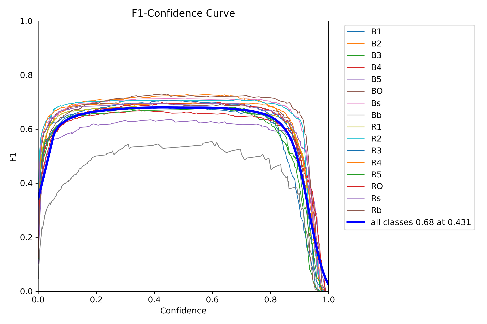
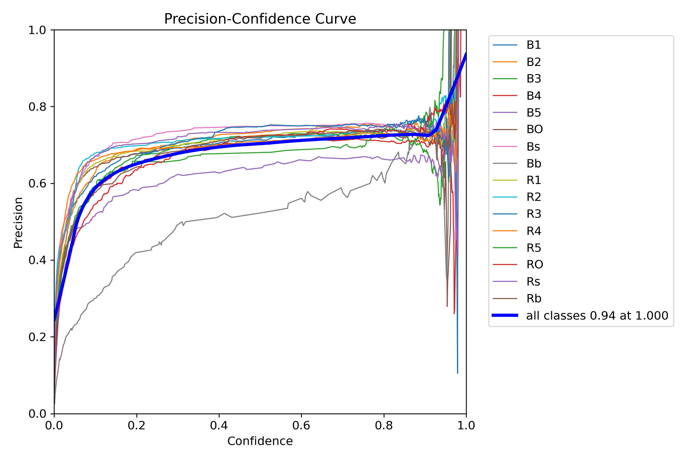
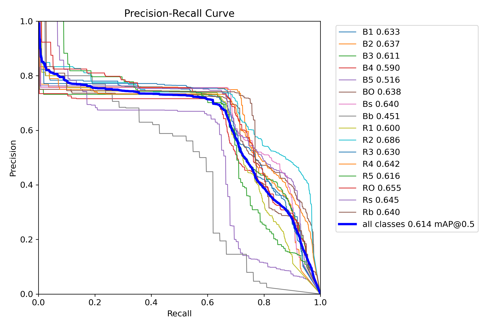
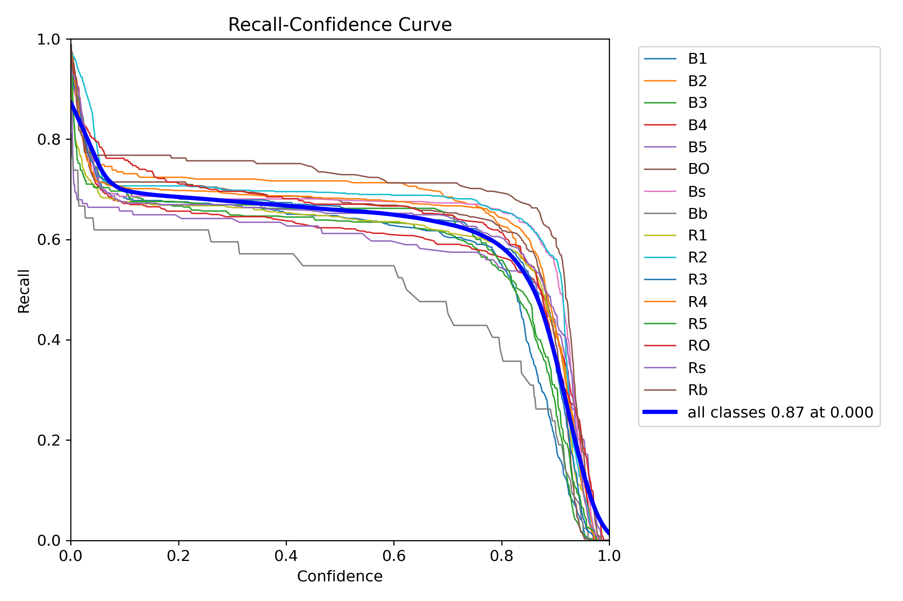
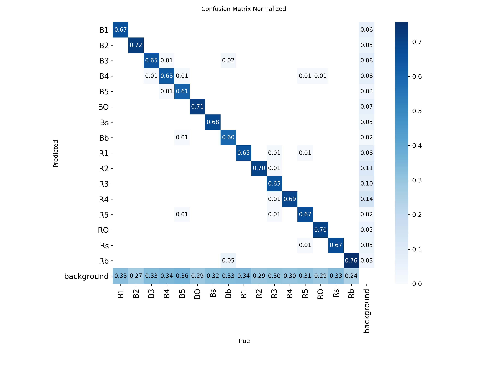

## yolo训练启动的参数

```python
from ultralytics import YOLO

if __name__ == "__main__":
# 1. 加载模型（可选用yolov8n.pt、yolov8s.pt等预训练权重）
    model = YOLO('yolo11s.pt')  # 你也可以用'yolov8n.pt'等

    # 2. 开始训练
    model.train(
        data='data.yaml',  # 数据集配置文件
        epochs=200,           # 训练轮数
        imgsz=640,            # 输入图片分辨率
        batch=32,             # 批次大小
        device=0,             # 用GPU 0训练，若无GPU可设为'cpu'
        workers=4,            # 数据加载线程数
        project='runs/train', # 训练结果保存目录
        name='exp',           # 实验名
        exist_ok=True,         # 若目录已存在则覆盖
        augment=True,         # 开启数据增强
                      # 自定义超参数
        flipud= 0,    # 上下翻转的概率
        fliplr= 0.5,    # 左右翻转的概率
        scale= 0.5,     # 随机缩放范围（缩放比例）
        shear= 10.0,    # 随机错切（倾斜）角度
        perspective= 0.0,  # 随机透视变换（0为关闭）
        hsv_h= 0.015,   # 色调增强范围（颜色变化）
        hsv_s= 0.7,     # 饱和度增强范围（颜色变化）
        hsv_v= 0.4,     # 亮度增强范围（颜色变化）
        degrees= 5.0,   # 随机旋转角度范围（度数）
        translate= 0.1, # 随机平移范围（比例）

   
)
```

前面的都是常用的参数，影响训练效果的，后面的是数据增强相关的参数，可以根据需要调整。

参考官方文档：[yolo train](https://docs.ultralytics.com/zh/modes/train/#train-settings)

## 训练结果

训练结果会保存在`runs/train/exp`目录下（如果`name`参数改了则是`runs/train/你的name`）。里面包含：

- `weights/`：保存训练好的模型权重文件（如`best.pt`和`last.pt`）
- `results.png`：训练过程中的损失曲线和mAP曲线图
- `train_batch0.jpg`：训练时的示例图片
- `hyp.yaml`：使用的超参数配置文件
- `labels/`：训练集的标签文件
- `val_batch0_labels.jpg`：验证集的标签图片
- `val_batch0_pred.jpg`：验证集的预测结果图片

## 几个曲线图

### F1-confidence


横轴（Confidence）：预测框的**置信度阈值**，从 0 到 1。

纵轴（F1 Score）：F1 分数是**精度**（Precision）和**召回率**（Recall）的调和平均，衡量模型在该置信度下的整体表现。

每条曲线：代表一个**类别**在不同置信度下的 F1 分数变化。

曲线的峰值点表示该类别的**最佳置信度阈值**，此时 F1 分数最高。

如果某条曲线整体偏低，说明该类别识别效果较差。

“all classes 0.68 at 0.431”
表示在置信度为 0.431 时，所有类别的平均 F1 分数为 0.68。

这个值通常被用作默认的置信度阈值，用于推理阶段的过滤。

### P-C curve



横轴（Confidence）：**置信度**，表示模型对正样本的预测置信程度。

纵轴（Precision）：**精度**，表示模型预测为正样本中实际为正样本的比例。

每条曲线：代表一个**类别**在不同置信度下的精度变化。

“all classes 0.94 at 1.000”
表示在置信度为 1.000 时，所有类别的平均精度为 0.94。

说明在只保留置信度为 1 的预测框时，模型非常“保守但准确”。

:::note
当置信度阈值接近 1.0 时，模型只保留置信度非常高的预测框，这会导致：

- 预测框数量变少

- 参与计算精度的样本变少

这时候，少量预测框的表现会对精度造成巨大影响，比如：

如果只剩 3 个预测框，其中 2 个是正确的 → 精度 = 66%

如果其中 1 个是错误的 → 精度 = 33%

这种小样本下的波动是统计学上的自然现象。
:::

### P-R curve



横轴（Recall）：**召回率**，表示实际为正样本中被正确预测为正样本的比例。

纵轴（Precision）：**精度**，表示模型预测为正样本中实际为正样本的比例。

每条曲线：代表一个**类别**在不同召回率下的精度变化。

曲线下的面积AP越大，表示模型在该类别上的整体表现越好。

图中标注：all classes 0.614 mAP@0.5

表示在 IoU 阈值为 0.5 时，所有类别的平均 AP 为 0.614

:::note
IOU（Intersection over Union）是衡量预测框与真实框重叠程度的指标。

IOU = $\frac{\text{预测框与真实框的交集面积}}{\text{预测框与真实框的并集面积}}$
IOU 阈值为 0.5 意味着只有当预测框与真实框的重叠面积至少达到 50% 时，才被认为是正确的检测。
:::

### R-Curve



横轴（Confidence）：**置信度**，表示模型对正样本的预测置信程度。

纵轴（Recall）：**召回率**，表示实际为正样本中被正确预测为正样本的比例。

R = $\frac{TP}{TP + FN}$，其中 TP（True Positives）是真正例，FN（False Negatives）是假负例。

每条曲线：代表一个类别在不同置信度下的召回率变化。

“all classes 0.87 at 0.000”
表示在置信度为 0.000（即不做任何过滤）时，模型能识别出 87% 的真实目标。

这是模型的最大召回率，但此时也可能包含大量误检（精度低）。

曲线通常是**单调下降**的：置信度越**高**，保留的预测框越少 → 召回率越低。

如果某条曲线下降得特别快，说明该类别的预测框置信度普遍偏低，容易被过滤掉。

### 归一化混淆矩阵



横轴：真实的类别标签。

纵轴：模型预测的类别标签。

元素值：某个真实类别被预测为某个类别的比例。

对角线上的值：表示正确分类的比例，值越大越好。

非对角线上的值：表示误分类的比例，值越小越好。
