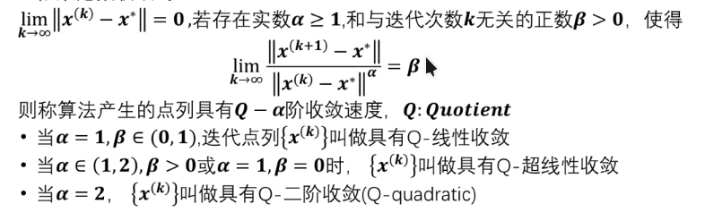

## 计算的终止条件（Termination Criteria）

- TC1: 梯度范数小于某个阈值 $\epsilon$，即 $||\nabla f(x)|| < \epsilon$ 。这表明我们已经接近一个局部最优点。

- TC2: 相邻迭代点之间的距离小于某个阈值 $\delta$ ，即 $||x^{(k+1)} - x^{(k)}|| < \delta$ 。这表明迭代已经收敛。或者 $\dfrac{||x^{(k+1)} - x^{(k)}||}{||x^{(k)}||} < \delta$ ，相对距离小于某个阈值。
- TC3: 目标函数值的变化小于某个阈值 $\gamma$，即 $|f(x^{(k+1)}) - f(x^{(k)})| < \gamma$ 。这表明目标函数值已经趋于稳定。或者 $\dfrac{|f(x^{(k+1)}) - f(x^{(k)})|}{|f(x^{(k)})|} < \gamma$ ，相对变化小于某个阈值。

- TC4: 当 $||x^{(k)}|| >\gamma$ 和 $||f(x^{(k)})|| > \gamma$ 时，采用 TC2 和 TC3 的相对版本，即 $\dfrac{||x^{(k+1)} - x^{(k)}||}{||x^{(k)}||} < \gamma$ 和 $\dfrac{|f(x^{(k+1)}) - f(x^{(k)})|}{|f(x^{(k)})|} < \delta$ 否则采用绝对版本 ，即 $||x^{(k+1)} - x^{(k)}|| < \delta$ 和 $|f(x^{(k+1)}) - f(x^{(k)})| < \gamma$ 。

## 线性收敛

$$
\lim_{k \to \infty} \frac{||x^{(k+1)} - x^*||}{||x^{(k)} - x^*||} = C
$$

对于不同的C定义不同的收敛

- $C=0$：超线性收敛

- $0<C<1$：线性收敛

- $C=1$：次线性收敛

如果 $p>1$ 且

$$
\lim_{k \to \infty} \frac{||x^{(k+1)} - x^*||}{||x^{(k)} - x^*||^{p}} = C
$$

则称序列 $\{x^{(k)}\}$ 以阶数 $p$ 收敛于 $x^*$。当 $C=0$ 时，称为超线性收敛；当 $C>0$ 时，称为阶数 $p$ 收敛。

