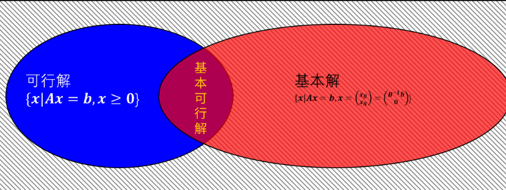
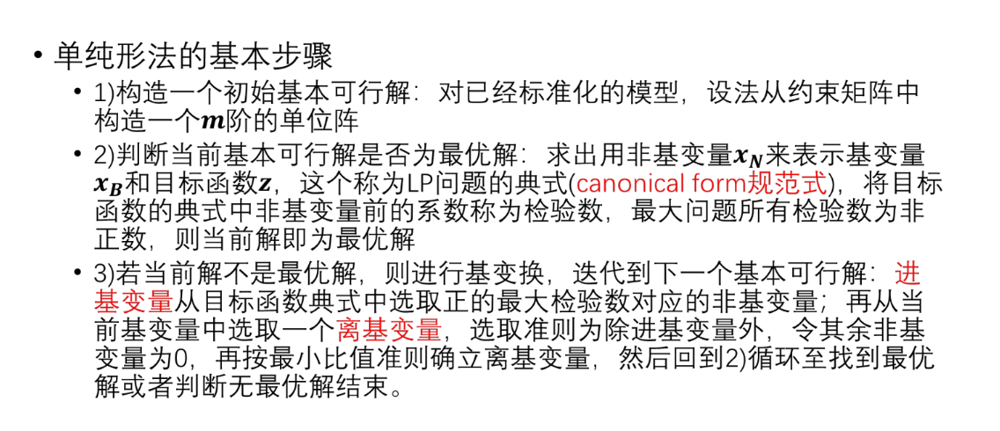
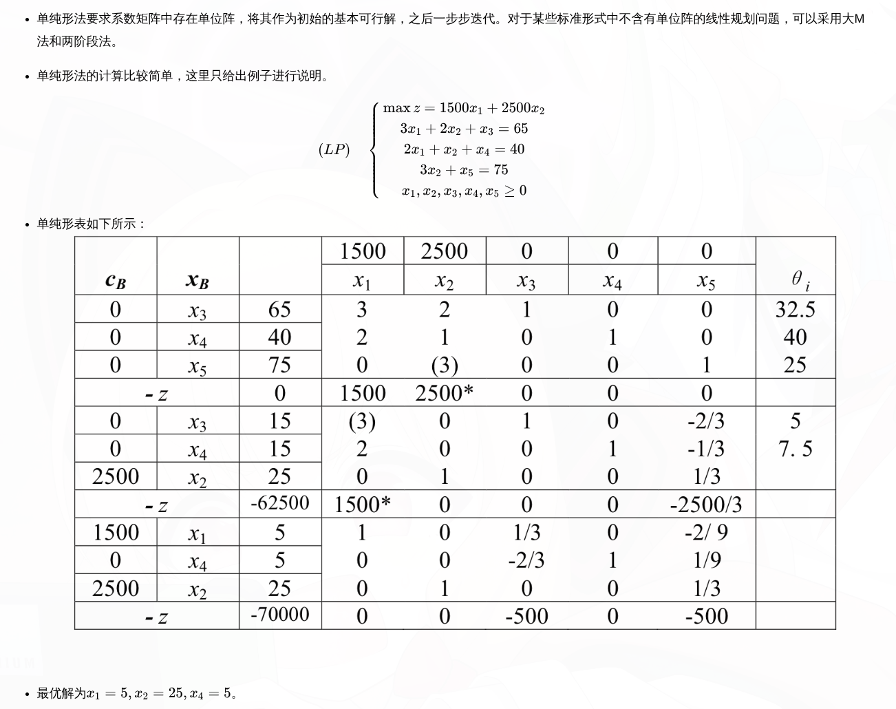

## 数学规划

数学规划是指在满足一定约束条件的前提下，寻找一个最优解的问题。根据目标函数和约束条件的不同，数学规划可以分为线性规划、整数规划、非线性规划等多种类型。

$$
max(min) f(x) \\
s.t. g_i(x) \leq 0, i=1,2,...,m \\
h_j(x) = 0, j=1,2,...,p
$$

- 有约束规划：存在 $g_i(x)$ 和 $h_j(x)$ 约束条件
- 无约束规划：没有约束条件，只有目标函数 $f(x)$
- 线性规划：目标函数和约束条件都是线性的
- 整数规划：决策变量必须是整数
- 非线性规划：目标函数或约束条件至少有一个是非线性的

### 可行解

满足**约束条件**的解称为可行解。可行解的集合称为可行域。

## 线性规划的一般形式与标准形式

### LP的一般形式

$$
\begin{aligned}
max(min) z&= \sum_{j=1}^n c_j x_j \\
s.t. \sum_{j=1}^n a_{ij} x_j &\leq (=, \geq) b_i, i=1,2,...,m \\
x_j &\geq 0, j=1,2,...,n
\end{aligned}

$$

或者矩阵形式：

$$
\begin{aligned}
max(min) z &= c^T x \\
s.t. Ax &\leq (=, \geq) b \\
x &\geq 0
\end{aligned}
$$

### LP的标准形式

任何线性规划都可以化成标准形式。满足

- 目标函数是最大化
- 决策变量($x_i$)非负
- 约束条件一律等式（除决策变量非负约束外）
- 约束条件右端（$b_i$）是非负数

$$
\begin{aligned}
\max z &= c^T x \\
s.t.Ax &= b\\
x &\geq 0
\end{aligned}
\mathbf{c}, \mathbf{x}\in \mathbb{R}^n, A\in \mathbb{R}^{m\times n}, b\in \mathbb{R}^m
$$

### 如何将一般形式转化为标准形式

目标函数：如果是最小化问题，可以通过取负号转化为最大化问题

加上松弛变量 $x_i'$ 和减去剩余变量 $x_i''$ ( **均非负** )

- 小于等于加松弛，大于等于减剩余。

自由变量（无约束）：拆成两个非负变量的差。

LP的可行解（域） $\iff$ 方程组 $A\mathbf{x} = b$ 的解集与 $\mathbf{x} \geq 0$ 的交集。这是一个凸多面体（polytope）里的所有点。在可行域里面找特殊结构，就是下文提到的基本可行解。

## 线性规划的解空间

### 基变量和非基变量

一般假设 $rank(A) = m$，可以解出 $m$ 个变量，称作 **基变量** ，即 $\mathbf{x_B}={x_{1}, x_{2}, ..., x_{m}}$ 里面的分量，剩下的 $n-m$ 个变量为 **自由变量** ($\mathbf{x_N}$ 里面的分量)，或者 **非基变量** 。

这俩的关系可以用**矩阵分块**来表示：

$$
A = [B | N], \mathbf{x} = \begin{bmatrix} \mathbf{x_B} \\ \mathbf{x_N} \end{bmatrix}
$$  

从 $A$ 中选出 $rank(A)$ 列线性无关的列向量，他们对应的变量是基变量（系数构成单位矩阵的变量），剩下的列向量对应的变量是非基变量。

:::tip
这也解释了为啥基变量的数量等于约束条件的数量 $m$，非基变量的数量等于决策变量的总数减去基变量的数量 $n-m$。
:::

然后令非基变量 $\mathbf{x_N} = 0$，解出基变量 $\mathbf{x_B}$ 的值，这样就得到了一个基本解。基本解可能不满足非负约束 $x_B \geq 0$，如果满足则称为基本可行解。

### 基本解和基本可行解

非基变量组成 $\mathbf{x_N}$ ，基变量组成 $\mathbf{x_B}$ ，当 $\mathbf{x_N} = 0$ 时，$\mathbf{x}=\begin{bmatrix} \mathbf{x_B} \\ \mathbf{x_N} \end{bmatrix}$  称为 **基本解** 。

- 基本解可能不满足非负约束 $\mathbf{x}_B \geq 0$，即有可能不可行；如果满足则称为 **基本可行解** 。
- 基本解的数量最多为 $C_n^m$ 个。

当基本解的各个分量都非负时，基本解就是**基本可行解**。（BFS）

- 基本可行解满足 $\mathbf{x}_B\geq 0$
- 基本可行解的数量最多为 $C_n^m$ 个。
- 基本可行解 = 可行域的顶点（极点）这是单纯形法的核心理论基础。

基本可行解的最优解叫做 **最优基本可行解** 。

:::warning

存在一个基本可行解是最优解，但**不意味着**每个最优解都是基本可行解。

线性规划的最优解可能出现在整个边或面上（无穷多最优解），其中非基本可行解（非顶点）也可能取到最优值。

例如：

$$
max z = x_1 + x_2 \\
s.t. x_1 + x_2 \leq 1 \\
x_1, x_2 \geq 0
$$

在这个例子中，所有满足 $x_1 + x_2 = 1$ 的点都是最优解，其中只有两个基本可行解（顶点）$(1,0)$ 和 $(0,1)$，其他点都是非基本可行解。

:::

依旧用矩阵分块来表示：

$$
\begin{aligned}
A\mathbf{x} &= b \\
B\mathbf{x_B} + N\mathbf{x_N} &= b \\
B\mathbf{x_B} &= b-N\mathbf{x_N} \\
\mathbf{x_B} &= B^{-1}(b-N\mathbf{x_N})\\
\text{当} \mathbf{x_N} &= 0 \text{时}, \mathbf{x_B} = B^{-1}b\\
\end{aligned}
$$

所以基本解是 $\mathbf{x} = \begin{bmatrix} B^{-1}b \\ 0 \end{bmatrix}$ ，如果满足 $\mathbf{x_B} = B^{-1}b \geq 0$ 则是基本可行解。

## LP的基本理论(5条)

- 解的存在性：若可行域非空，则可行域是一个凸集，一定存在有限最优解或者无界最优解。

- 解在顶点的可达性：若存在最优解，则最优解可在某个顶点处达到。

- 顶点与基本可行解的关系：点 $\mathbf{x}$ 是可行域的一个顶点 $\iff$ $\mathbf{x}$ 是一个基本可行解。

1. LP问题中可行解 $\mathbf{x}$ 是一个基本可行解 $\iff$ $\mathbf{x}$ 中正分量对应的系数矩阵列向量线性无关。

2. LP问题的每一个基本可行解 $\mathbf{x}$ 对应可行域（约束多面体）的一个极点
3. 有界凸集S上的任意一点都可以表示成S的极点的凸组合。如果是无界凸集则可以表示成S的极点的凸组合加上极方向的正组合表示
4. LP问题若可行域有界，且存在最优解，则目标函数必可在其可行域的某个定点达到
5. LP问题，若存在可行性，则必存在一个基本可行解；若存在最优解，则必存在一个基本可行解是最优解。

证明略

## 单纯形法求解最优解

例题：参考博客：[单纯形法求解线性规划](https://www.cnblogs.com/szxspark/p/10262153.html)

符号含义：

- $C_B$ : 基变量在目标函数中的系数向量，按列排
- $x_B$ : 当前选择的基变量名称
- $x_B$ 右边的列：基变量的值
- $x_1, x_2, \ldots$ 上面的行：主要关注目标函数中非基变量的系数，作为一开始的检验数（检验数是目标函数中非基变量的系数，表示如果将该非基变量入基，目标函数值会增加多少）
- 中间一大白：当前的约束矩阵
- $\theta_i$ : 比值测试，**小的离基**
- 底部 $-z$ : 表示当前目标函数值的相反数
- 底部 $-z$ 右边的列：目标函数值的相反数，每次迭代更新，最后的目标函数值就是这个数的相反数。
- 底部 $-z$ 右边的列的右边：检验数（目标函数中非基变量的系数），**大的入基**（一开始和$x_1, x_2, \ldots$ 上面的行是一样的）

初始化：检验数初始化成目标函数中非基变量的系数。

1. 先选入基变量：从检验数中选出最大的，入基。
2. 找到入基变量一列，用**基变量的值**/**入基列向量的对应分量**进行比值测试，选出最小的，离基。
3. 这样入基变量所在的列和离基变量的行的交叉点(就是图中`()`括起来的元素。)，更新成1,这一列的其他地方置0（包括检验数）。具体方法是把中间一大白+检验数部分当作一大坨矩阵，用**出基变量**所在的行把这一列的其他元素消掉。（这一步同时更新了出基变量的检验数）
4. 一次迭代结束，往下新增表格。

一直到检验数都不大于0，迭代结束，此时的目标函数值就是最优解。
