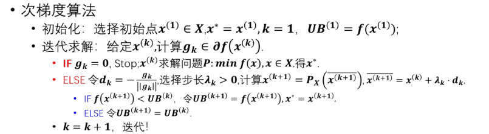

## 次梯度和次微分

对于一个凸函数 $f$，如果在某点 $x$ 处不可微分，我们可以定义一个次梯度（subgradient）来代替梯度。次梯度是一个向量，满足以下条件：

$$
f(y) \geq f(x) + g^T (y - x), \forall y
$$

其中 $g$ 是 $f$ 在 $x$ 处的一个次梯度。次梯度的集合称为次微分（subdifferential），记为 $\partial f(x)$。次微分是凸的，非空的，和紧的

次梯度和可微的关系：

- 如果 $f$ 在 $x$ 处可微分，那么次微分 $\partial f(x)$ 只有一个元素，即梯度 $\nabla f(x)$。
- 如果 $f$ 在 $x$ 处不可微分，那么次微分 $\partial f(x)$ 包含多个次梯度。

有如下两个等价：

- 凸集上的可微函数 $f$ 为凸函数 $\iff$ 对于任意 $x,y$，都有 $f(y) \geq f(x) + \nabla f(x)^T (y - x)$。
- 可微函数是凸函数 $\iff$ 定义与是凸集，且其梯度是单调的，即 $\forall x,y$，都有 $(\nabla f(x) - \nabla f(y))^T (x - y) \geq 0$。

## 次梯度优化

关键在于如何更新。不能用传统的 $\overline{x^{(k+1)}} = x^{(k)} - \lambda^{(k)} \frac{g^{(k)}}{||g^{(k)}||}$ 因为次梯度是随便选的，有可能是上升方向。

需要用投影法：

$$
\overline{x^{(k+1)}} = x^{(k)} - \lambda^{(k)} \frac{g^{(k)}}{||g^{(k)}||}\\[1ex]

x^{(k+1)} = P_{X}(\overline{x^{(k+1)}})
$$

也就是把 $\overline{x^{(k+1)}}$ 投影到可行域 $X$ 上，得到 $x^{(k+1)}$。

算法流程

关于步长的定理：

- 如果 $\lambda^{(k)}$ 满足 $\sum_{k=1}^{\infty} \lambda^{(k)} = \infty$ 和 $\lim_{k \to \infty} \lambda^{(k)} = 0$，则次梯度方法要么有限步数内找到最优解，要么生成一个收敛于最优解的序列。