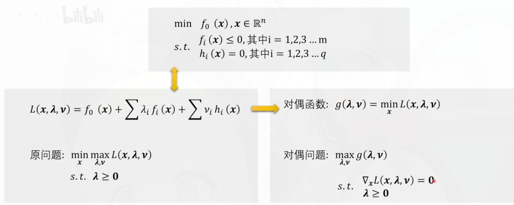
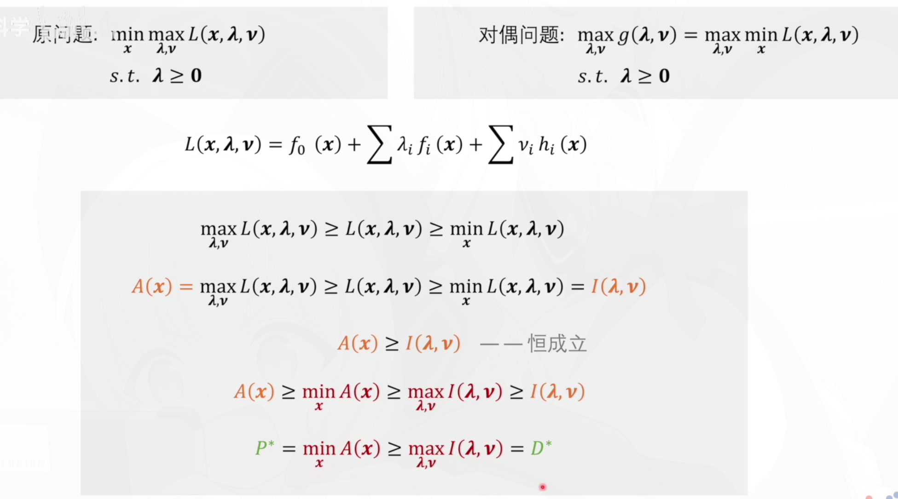

## 仿射集合与相关概念 (Affine Sets)

在讨论“凸”之前，我们需要先理解“线性”的更广义形式。

- 仿射组合 (Affine Combination)：对于点 $x_1, x_2, \dots, x_k$，其线性组合 $\sum \theta_i x_i$ 满足 $\sum \theta_i = 1$。

- 仿射集 (Affine Set)：如果一个集合中任意两点的整条直线都在集合内，则该集为仿射集。
  - 例子：线性方程组的解集 $A\mathbf{x} = \mathbf{b}$。
- 仿射变换 (Affine Transformation)：形式为 $f(x) = Ax + b$ 的变换。它保持了空间的“平直性”。

## 凸集 (Convex Sets)

凸集是凸优化的空间基础，其核心直觉是：集合内任意两点间的线段也必须在集合内。

定义：集合 $C$ 为凸集，若对于任意 $x, y \in C$ 及任意 $\theta \in [0, 1]$，有：

$$
\theta x + (1-\theta)y \in C
$$

常见的凸集：

- 超平面 (Hyperplane)：$\{x \mid a^T x = b\}$

- 半空间 (Halfspace)：$\{x \mid a^T x \le b\}$

- 欧几里得球 (Norm Ball)：$\{x \mid \|x - x_c\| \le r\}$

- 多面体 (Polyhedron)：有限个超平面和半空间的交集，$A\mathbf{x} \preceq \mathbf{b}, C\mathbf{x} = \mathbf{d}$。

- 正定锥 (Positive Semidefinite Cone)：所有对称半正定矩阵组成的集合。

## 凸函数 (Convex Functions)

:::note
凸函数保证了“局部最优即是全局最优”。
:::

定义：函数 $f: \mathbb{R}^n \to \mathbb{R}$ 的**定义域为凸集**，且对于其定义域内任意 $x, y$ 和 $\theta \in [0, 1]$，满足：

$$
f(\theta x + (1-\theta)y) \le \theta f(x) + (1-\theta)f(y)
$$

直观理解：函数图像上的弦总是在图像的上方。

判别准则，**一阶导和二阶导**：

- 一阶条件：$f(y) \ge f(x) + \nabla f(x)^T(y - x)$（切线始终在函数下方）。

- 二阶条件：Hessian 矩阵 $\nabla^2 f(x) \succeq 0$（半正定）。

常见的凸函数：

- 指数函数 $e^{ax}$

- 负对数函数 $-\log x$

- 范数函数 $\|x\|_p$

- 凸函数的非负加权和仍是凸函数。

## 凸优化问题 (Convex Optimization Problems)

一个标准的凸优化问题通常写成如下形式，包含等式约束和不等式约束：

$$
\begin{aligned}
\min \quad & f_0(x) \\
\text{s.t.} \quad & g_i(x) \le 0, \quad i = 1, \dots, m \\
\quad & h_j(x) = 0, \quad j = 1, \dots, p\\
&\text{或}\\
& a_j^T x = b_j, \quad j = 1, \dots, p
\end{aligned}
$$

必须满足的三大要素：

1. 目标函数 $f_0(x)$ 必须是凸函数。
2. 不等式约束 $g_i(x)$ 必须是凸函数（使得可行域 $\{x \mid g_i(x) \le 0\}$ 是凸集）。
3. 等式约束 $h_j(x) = 0$ 必须是仿射函数（即 $Ax=b$ 的形式）。

关于凸优化的一个重要结论：**如果一个优化问题满足上述条件，那么任何局部最优解也是全局最优解**。这使得凸优化问题在理论和实践中都非常重要，因为它们可以通过高效的算法（如梯度下降、内点法等）来求解，并且保证了求解结果的全局最优性。

## 拉格朗日乘子法与KKT条件

参考：[拉格朗日乘子法与KKT条件](./KKT-condition.md)

这里给出拉格朗日函数

$$
L(x, \lambda, \mu) = f(x) + \sum_{i=1}^m \lambda_i g_i(x) + \sum_{j=1}^p \mu_j h_j(x),\quad \lambda_i \ge 0
$$

## 拉格朗日对偶问题与强对偶性

对偶问题 = 对拉格朗日函数先对 $x$ 取下确界，再对乘子做最大化

拉格朗日**对偶函数**（上文的拉格朗日函数的对偶）定义为：

$$
g(\lambda, \mu) = \inf_x L(x, \lambda, \mu)
$$

取拉格朗日函数最紧的下界

这时候再对对偶函数取最大值。在强对偶的情况下，原问题的最优值等于对偶问题的最优值。

所以形式化拉格朗日函数的**对偶问题**：

$$
\begin{aligned}
\max_{\lambda, \mu} \quad & g(\lambda, \mu),\quad g(\lambda.\mu)= \inf_x L(x, \lambda, \mu) \\
\text{s.t.} \quad & \lambda_i \ge 0, \quad i = 1, \dots, m
\end{aligned}
$$

一个问题能是非凸优化问题，可以通过**对偶问题**转化成凹函数，也是一个凸优化问题

原问题和对偶问题是相关的，但是并不总是等价，对偶问题的最优值是原问题的一个下界（对于最小化问题）。如果原问题满足某些条件（如 Slater 条件），则**强对偶**性成立，即原问题和对偶问题的最优值相等。

slater条件是凸优化和对偶问题是强对偶的充分条件，但不是必要条件。

一个强对偶关系的凸优化问题一定满足KKT条件，但满足KKT条件的凸优化问题不一定是强对偶的。
