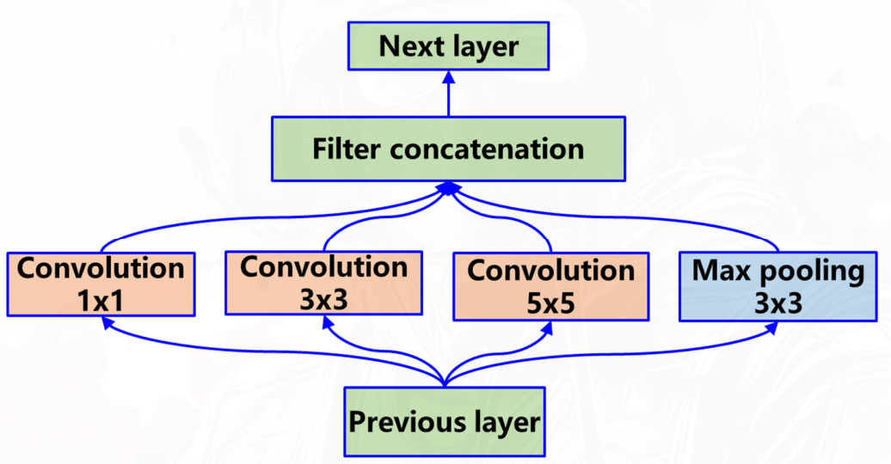
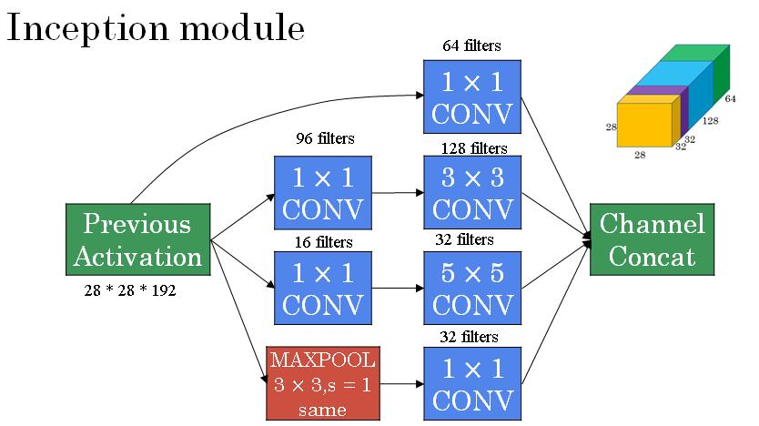

GoogLeNet 的核心理念就是 “更宽、更高效”。它是为了解决 VGG 最大的痛点——参数量过大、计算成本极高——而生的。

GoogleNet参数约为 500万个，约为AlexNet参数个数的1/12、VGGNet参数个数的1/36。

核心操作是分治+因式分解

## Inception 卷积模块的分治

GoogLeNet的灵魂在于其独创的Inception模块。在传统的卷积网络中，往往面临一个难题：该用多大的卷积核？ 3x3的感受野太小，5x5的又太贵。

Inception给出的答案是：小孩子才做选择，我全都要！

在一个Inception模块中，输入特征图会并行地经过四条不同的路径：

但如果直接堆叠这么多卷积（尤其是昂贵的5x5），计算量会非常大。CNN的计算量主要来源于特征维数（$C_{in}$,输入图像的 **通道数**）。为了解决这个问题，GoogLeNet引入了革命性的 “瓶颈层（Bottleneck）”。具体做法是：在3x3和5x5的卷积操作之前，先加一个 **1x1的卷积层** :

于是四条 **并行** 分支的计算过程变为：

- 分支 1：1x1卷积

- 分支 2：**1x1卷积** + 3x3卷积

- 分支 3：**1x1卷积** + 5x5卷积

- 分支 4：最大池化 + **1x1卷积**

最后，将这四条路径的输出在 **通道维度** 上拼接（Concatenate） 在一起，作为下一层的输入。

这种设计被称为 **“分治”** 思想——让网络自己决定在这一层关注哪些特征（哪些channels）

### 关于 1x1 卷积的作用

- 这里分支2,3，以及池化后的1x1卷积层起到了 **降低通道维度** 的作用，输出特征图的尺寸不变，但是**通道数**大幅下降，从而显著降低了计算量。(池化操作作用在空间维度（H×W），不改变通道数，如果不降维，pooling 分支会带着一大坨通道冲进下一层。)
- 增加非线性：1x1卷积后接ReLU激活函数，增加了网络的非线性表达能力。
- 融合跨通道信息：1x1卷积可以看作是对不同通道$C_{in}$的同位置像素点进行线性组合，从而实现跨通道的信息融合。（对于原图和池化后的特征图）
- 池化本身不可学习，1x1卷积可以让池化后的特征图也能参与学习。

## Inception 卷积模块的因式分解

后来（v2 / v3）的改动

大卷积核贵，我们就用小卷积核堆叠凑出同等的感受野

### 1.将大卷积拆成多个小卷积（如 5×5 → 2×3×3）

用 2个堆叠的3x3卷积 替代1个5x5。感受野相同（都是5x5），但参数量从25降到了18（3×3+3×3=18<25）,计算量也大幅降低。

对于一个输入$H×W$的图像，通道数为 $C_{in}$，输出通道数为 $C_{out}$ 的5x5卷积层：

- 参数量：$5 \times 5 \times C_{in} \times C_{out} + C_{out}$

- 计算量FLOPs：$H \times W \times C_{in} \times C_{out} \times 5 \times 5$

对于两个堆叠的3x3卷积层：假设第一个3x3卷积层输出通道数为 $C_{mid}$，第二个3x3卷积层输出通道数为 $C_{out}$：

- 参数量：$3 \times 3 \times C_{in} \times C_{mid} + 3 \times 3 \times C_{mid} \times C_{out} + C_{mid} + C_{out}$

- 计算量FLOPs：$H \times W \times C_{in} \times C_{mid} \times 3 \times 3 + H \times W \times C_{mid} \times C_{out} \times 3 \times 3$

此外，Conv3x3 → ReLU → Conv3x3 → ReLU 比单纯的Conv5x5 → ReLU 多了一层非线性映射，提升了模型的表达能力。

### 2.将卷积分解为非对称形式（3×3 → 1×3 + 3×1）

用一个1x3卷积 + 一个3x1卷积 替代一个3x3卷积。感受野相同（都是3x3），但参数量从9降到了6（1×3+3×1=6<9）。而且中间的1x3卷积和3x1卷积之间加了一层ReLU，增加了网络的非线性表达能力。
