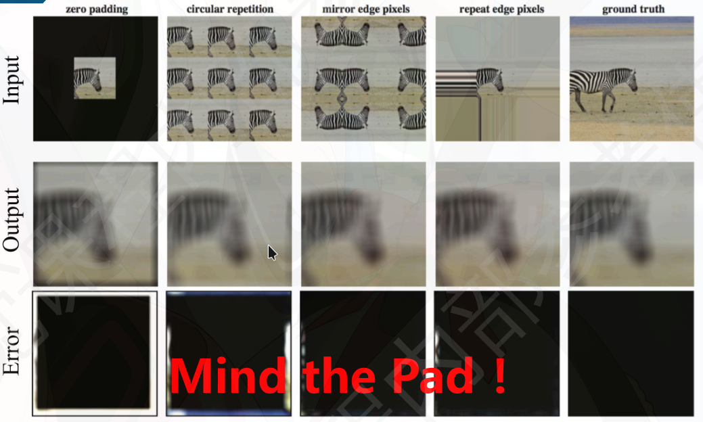
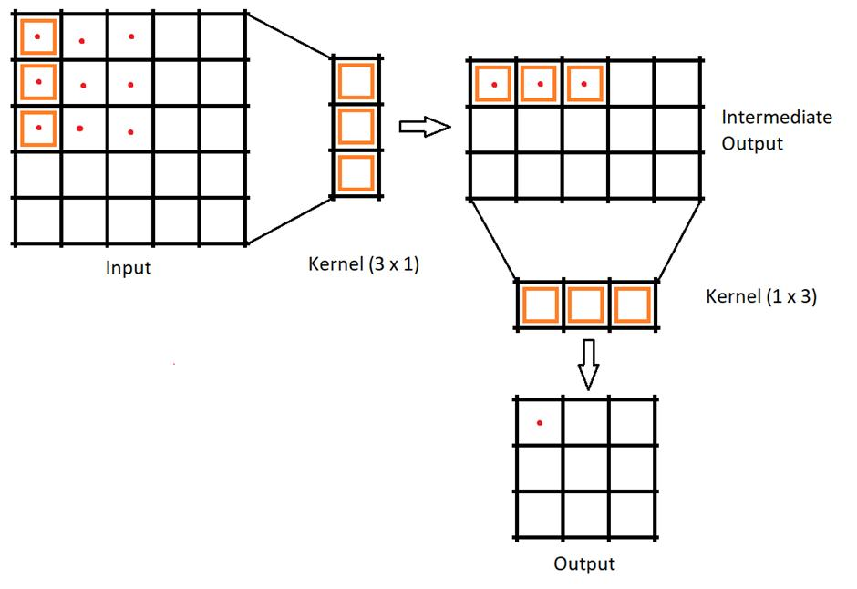

:::tip

上一篇介绍了点运算（灰度变换、直方图均衡化），它们仅操作单一像素，不关心邻域。这一篇开始进入**邻域运算**——一个像素的输出由其周围邻域共同决定。邻域内的像素关系决定了图像的纹理、边缘和结构，这是空间域滤波的核心。

:::

## 滤波

滤波的核心思想是：

使用一个小的模板（filter / kernel）在图像上滑动，局部区域内元素相乘并相加

$$
g(x,y) = T[f(x,y)]
$$

其中 $T$ 是一个线性或非线性变换，$f(x,y)$ 是输入图像，$g(x,y)$ 是输出图像。

有两种符号定义：

1. 当前正在计算的**输出像素/输入像素**的坐标。

    $i$：输出图像（或输入图像）的水平方向坐标（列索引）。通常从左到右增加。

    $j$：输出图像（或输入图像）的垂直方向坐标（行索引）。通常从上到下增加。

2. 卷积核（filter/kernel）内的局部偏移坐标，表示相对于当前输出像素 $(i,j)$ 的偏移量。

   通常 $k$ 和 $l$ 的范围是 $[-a, a]$，其中 $a$ 是卷积核的一半大小。

## 滤波的两种符号定义

互相关形式的定义：

$$
h[i,j] = \sum_{k,l} g[k,l] f[i+k, j+l]
$$

卷积形式的定义，二维卷积要求核在参与计算前进行水平和垂直翻转：

$$
h[i,j] = g*f[i,j] \\
h[i,j] = \sum_{k,l} g[k,l] f[i-k, j-l]
$$

- 在深度学习中通常使用互相关，但由于很多滤波器是对称的（如高斯、盒式），两者等价。

## Padding-卷积的边界问题

如果不用padding,会越卷越小。对于补边P个像素，经过卷积后输出尺寸为：
$$
O=\frac{N+2P-K}{S}+1
$$

其中 $N$ 是输入图像尺寸，$K$ 是卷积核尺寸，$S$ 是步长，$P=\frac{K-1}{2}$ (适用于 stride = 1 且 K 为奇数)是填充大小。

padding常见类型

- **Zero Padding**：在图像边界添加零值像素。
- **Replicate Padding**：复制边界像素值进行填充。
- **Reflect Padding**：以边界像素为中心进行镜像反射填充。
- **Circular Padding**：将图像视为周期性，边界像素与对面边界像素相连。

## 可分离卷积核

如果一个卷积核可以表示为两个一维卷积核的外积，那么它就是可分离的。

可分离：分解成两个一维卷积操作

复杂度分析：图片大小 $M\times N$，卷积核大小 $K\times K$，直接卷积复杂度为 $O(MN\times K^2)$，可分离卷积复杂度为 $O(MN\times 2K)$。

## 卷积从连续积分变成离散累加乘法的过程

卷积公式通常先写作连续形式：

$$
(K * I)(x, y) = \int_{-\infty}^{\infty} \int_{-\infty}^{\infty} K(u, v) \cdot I(x-u, y-v) \, du \, dv
$$

但在计算机图像处理中，图像和核都是**离散的**（像素点），因此积分就变成了**求和（累加乘法）**。

### 连续卷积的定义

对于两个连续函数 $f(t)$ 和 $g(t)$，一维卷积：

$$
(f * g)(x) = \int_{-\infty}^{\infty} f(\tau) \, g(x-\tau) \, d\tau
$$

二维类似。这个积分可以理解为：在每个位置 $\tau$ 取 $f(\tau)$，乘以平移后的 $g(x-\tau)$，然后对所有 $\tau$ 求和（积分）。

### 离散化

一维离散卷积

$$
(f * g)[n] = \sum_{m=-\infty}^{\infty} f[m] \cdot g[n-m]
$$

二维：

$$
(I * h)[i, j] = \sum_{u=-a}^{a} \sum_{v=-b}^{b} I[i-u, \, j-v] \cdot h[u, v]
$$

### 卷积与互相关的关系

以二维为例，标准离散卷积：

$$
O[i, j] = \sum_{u=-a}^{a} \sum_{v=-b}^{b} I[i-u, \, j-v] \cdot h[u, v]
$$

- **核 $h$** 的大小为 $(2a+1)\times(2b+1)$，定义在偏移坐标 $(u,v)$ 上。
- 对于输出像素位置 $(i, j)$，我们将核中心对齐到输入图像中的 $(i, j)$，然后：
  - 取出输入图像中相对偏移为 $(-u, -v)$ 的像素值（因为卷积需要翻转核）。
  - 与核的原始权重 $h[u, v]$ 相乘。
  - 对所有偏移求和。

**如果核对称**（如高斯核），则翻转不影响，公式简化为：

$$
O[i, j] = \sum_{u=-a}^{a} \sum_{v=-b}^{b} I[i+u, \, j+v] \cdot h[u, v]
$$

:::tip 为什么要翻转核

卷积的翻转要求来自它的连续定义：$(f * g)(x) = \int f(\tau) g(x-\tau) d\tau$，其中 $g(x-\tau)$ 相对于 $g(\tau)$ 发生了左右翻转。直觉上，如果把 $g$ 视为一个"探测器"，翻转保证它在滑过信号时不会倒着响应——核的"最左边"先触碰到信号的"最右边"。在图像处理中，对称核（高斯、Sobel 的平滑方向）使得翻转无感知差异，但非对称核（如方向滤波器）翻转和不翻转会产生完全不同的结果。

:::
