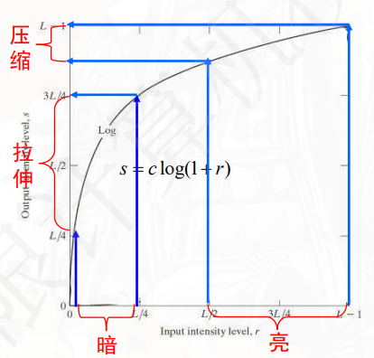
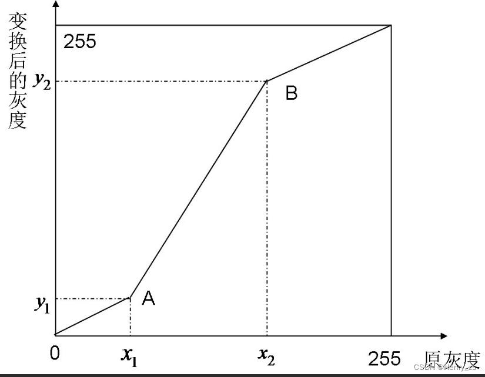
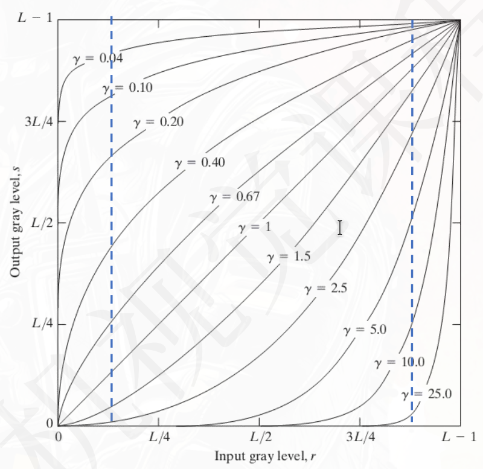

## 颜色空间

### 灰度图

彩色图像转灰度是视觉处理中最常见的预处理步骤之一。传感器捕捉到的 RGB 三通道数据可以通过加权求和合并为单通道灰度图，人眼对绿色最敏感、对蓝色最不敏感，因此标准转换权重为：

$$
\text{Gray} = 0.299 \cdot R + 0.587 \cdot G + 0.114 \cdot B
$$

这三个系数源自 ITU-R BT.601 标准，对应显像管荧光粉的发光效率曲线。严格来说不同的色彩标准（如 BT.709、BT.2020）使用的系数略有差异，但日常处理中上述公式已足够。

### HSV 颜色空间

RGB 用三原色混合来描述颜色，直观上不易理解"这是什么颜色、有多鲜艳、有多亮"。HSV 将颜色分解为三个更接近人类感知的维度：

- **色相（Hue，$H$）**：0°–360° 的颜色类型（红=0°，绿=120°，蓝=240°）。
- **饱和度（Saturation，$S$）**：0–1 的颜色纯度（0=灰色，1=纯色）。
- **明度（Value，$V$）**：0–1 的亮度（0=黑色，1=最亮）。

RGB 到 HSV 的转换公式以通道极值 $M=\max(R,G,B)$、$m=\min(R,G,B)$、$C=M-m$ 为中间量：

$$
V = M,\quad S = \frac{C}{V}
$$

$$
H = \begin{cases}
0^\circ, & C = 0 \\
60^\circ \times \left( \frac{G-B}{C} \mod 6 \right), & M = R \\
60^\circ \times \left( \frac{B-R}{C} + 2 \right), & M = G \\
60^\circ \times \left( \frac{R-G}{C} + 4 \right), & M = B
\end{cases}
$$

HSV 在图像处理中很实用：若只想调亮度不动颜色，只动 $V$ 通道即可；若要去除光照影响，可以在 $V$ 通道上做直方图均衡化再转回 RGB，避免色相偏移。

## 动态范围（Dynamic Range）

动态范围定义为图像中最亮与最暗可分辨像素的比值，一般用分贝（dB）表示：

$$
DR = 20 \log_{10} \left(\frac{I_{\max}}{I_{\min}}\right)
$$

对 8 位图像 $I_{\min}=1, I_{\max}=255$，代入得到 $DR = 20 \log_{10}(255) \approx 48\text{dB}$。16 位图像可达到 $20 \log_{10}(65535) \approx 96\text{dB}$。更大的动态范围意味着同时保留亮区和暗区的细节。

动态范围与灰度级是两个不同的概念。灰度级量化精度，动态范围量化可记录的亮度跨度。一张 8 位图像即使有 256 级灰度，其物理动态范围仍然受限于传感器的能力。

:::tip

这里只引入了动态范围的定义。真实场景的动态范围可超过 100dB，远超普通显示器和 8 位图像的承载能力。如何从多张不同曝光量的照片中恢复出完整的 HDR 图像、再压缩到显示器可显示的范围——这是高动态范围成像（HDR）的主题，将在本系列的下一篇文章中展开。

:::

## 灰度变换

灰度变换是图像增强中最直接的手段。它只改变每个像素的灰度值，不涉及邻域信息，因此也被称为**点运算**。设输入灰度为 $r$，输出灰度为 $s$，变换函数 $s = T(r)$ 映射到 $[0, L-1]$ 范围内的整数灰度级。

### 图像反转

$$
s = L - 1 - r
$$

将黑变白、白变黑，适用于增强嵌入暗色区域的白色或灰色细节，比如从 X 光片中观察细微结构。

### 对数变换

当原始图像的动态范围过大，超过某些显示设备所支持的范围时使用。直接显示此类图像可能会导致细节丢失。

- 傅里叶频谱的动态范围经常达到 $10^6$ 量级，直接用 8 位显示只能看到最亮的一小部分；取对数后低频峰值被压缩，高频细节变得可见。

$$
s = c \cdot \log(1 + r)\\[1em]
c = \frac{L-1}{\log(1 + r_{max})}
$$

对数曲线分析一下导数即可：

$$
\frac{ds}{dr} = \frac{c}{1+r}\begin{cases}
    \approx c \quad r \to 0\\
    \approx 0 \quad r \to L-1
\end{cases}
$$

- 将较窄范围的低灰度级映射到较宽范围的灰度级，从而增强低灰度区域，$r$ 较小时导数较大（拉伸暗部）
- 将较宽范围的高灰度级映射到较窄范围，从而抑制高灰度区域，$r$ 较大时导数较小（压缩亮部）.

### 幂律变换（伽马校正）

$$
s = c \cdot r^\gamma
$$

参考下文伽马矫正那一章

### 分段线性变换

动态范围过窄的采集设备，长曝光时牺牲亮部保留暗部细节，短曝光时牺牲暗部保留亮部细节。

分段线性函数通过定义若干个控制点 $(r_k, s_k)$ 来指定不同灰度区间的映射斜率：

- 线性地扩展（增强）感兴趣的灰度范围，并相对压缩（抑制）不感兴趣的灰度区域

$$
s = \begin{cases}
\dfrac{s_1}{r_1} r, & 0 \leq r < r_1 \\[10pt]
\dfrac{s_2 - s_1}{r_2 - r_1} (r - r_1) + s_1, & r_1 \leq r < r_2 \\[10pt]
\dfrac{L-1 - s_2}{L-1 - r_2} (r - r_2) + s_2, & r_2 \leq r \leq L-1
\end{cases}
$$

调整控制点可以实现多种效果：

- **对比度拉伸**：将 $[r_1, r_2]$ 区间对应的斜率设为 $>1$，其余区间压缩。原本集中在狭窄区间的灰度被展开，对比度提高。
- **灰度切片**：将目标灰度区间映射到白（$s = L-1$），其余压黑。用于突出特定灰度范围的结构，如血管造影。

### 位平面切片

将每个像素的二进制表示拆开，$L=256$ 时每个像素占 8 bit，最高位（bit 7）包含图像的轮廓信息，最低位（bit 0）包含噪声和精细纹理。通过提取特定位平面，可以分析图像在不同比特层上的信息分布，也是图像压缩的基础思路之一。

### 灰度变换与直方图的关系

点运算操作的是单个像素，直方图反映的是全体像素的灰度分布。对数变换、幂律变换在暗部区域拉伸时，该区域的灰度级从集中变得稀疏，对应的直方图分布也会随之展宽——这是理解后面直方图均衡化的一个前置视角。

## 直方图

### 定义

图像的直方图是一个**离散函数**，统计每个**灰度级**上出现的像素**个数**。对一张 $L$ 级灰度图（通常 $L=256$），记 $r_k$ 为第 $k$ 个灰度级（$k=0,\dots,L-1$），$n_k$ 为该灰度级的像素总数：

$$
h(r_k) = n_k
$$

归一化直方图将纵轴转为概率密度（离散）：

$$
p(r_k) = \frac{n_k}{MN}, \quad \sum_{k=0}^{L-1} p(r_k) = 1
$$

其中 $M \times N$ 为图像总像素数。

### 直方图能告诉我们什么

直方图反映了图像的全局亮度分布。

- 一张曝光不足的照片，像素集中在暗区（直方图左侧聚集）；
- 曝光过度则集中在亮区（右侧饱和）。
- 对比度低的图像直方图集中在一个狭窄区间
- 对比度高的图像直方图分布较均匀。

## 直方图均衡化（HE）

直方图均衡化的目标是把原始图像的灰度分布映射到近似均匀分布，从而增加像素灰度值的动态范围、增强图像的整体对比度。

### 连续情况下的理论推导

将图像的灰度视为取值在 $[0,1]$ 上的连续随机变量 $r$，其概率密度函数为 $p_r(r)$。考虑变换函数 $s = T(r)$，满足：

- $T(r)$ 在 $0 \leq r \leq 1$ 上严格单调递增（保证输出灰度次序不反转），
- $0 \leq T(r) \leq 1$（保证输出范围与输入一致）。

记 $p_s(s)$ 为输出灰度的概率密度。由概率论中随机变量函数的分布公式：

$$
p_s(s) = p_r(r) \left| \frac{dr}{ds} \right|
$$

现在取变换函数 $T$ 为 $r$ 的累积分布函数（CDF）：

$$
s = T(r) = \int_0^r p_r(w) \, dw, \quad 0 \leq r \leq 1
$$

对 $s$ 求导得到 $\frac{ds}{dr} = p_r(r)$，代入上式：

$$
p_s(s) = p_r(r) \left| \frac{1}{p_r(r)} \right| = 1, \quad 0 \leq s \leq 1
$$

结论是：**用 CDF 作为变换函数，输出灰度的概率密度 $p_s(s)$ 在 $[0,1]$ 上恒等于 1**，即均匀分布。这就是直方图均衡化的理论根基——CDF 是把任意分布映射到均匀分布的通用变换。

### 离散实现

离散灰度级不能直接套用连续推导的积分结果，但思路完全相同。对 $L$ 级灰度图$I=M \times N$，记 $k$ 为灰度级索引，第 $k$ 个灰度级 $r_k$ 的概率（归一化直方图）为：

$$
p_r(r_k) = \frac{n_k}{MN}, \quad k = 0, 1, \dots, L-1
$$

变换函数取 CDF 的离散形式：

$$
s_k = T(r_k) = \sum_{j=0}^{k} p_r(r_j) = \sum_{j=0}^{k} \frac{n_j}{MN}
$$

$s_k\in [0,1]$ 是灰度级 $r_k$ 的累积分布函数（CDF）。要将它映射回 $L$ 级离散灰度 $\{0, 1, \dots, L-1\}$，取邻近整数：

$$
r'_k = \text{round}\left( s_k \cdot (L-1) \right) = \text{round}\left( (L-1) \sum_{j=0}^{k} \frac{n_j}{MN} \right)
$$

这是 HE 的实际计算步骤。离散化带来的结果是：输出直方图只能近似均匀，不会完全平坦——因为多个输入灰度级可能被映射到同一个整数输出灰度级（取整合并），实际得到的直方图是分段的近似均匀分布。

### 一个例子

假设一张 3 级图 ($L=3$)，像素总数为 $MN=100$，原始三个灰度级$r_0, r_1, r_2$的频数分别为 $50, 30, 20$。$p_r(r_0)=0.5,p_r(r_1)=0.3,p_r(r_2)=0.2$ ， CDF 值依次为 $0.5, 0.8, 1.0$，乘以 $(L-1)=2$ 后取整：

- $r_0 \rightarrow \text{round}(0.5 \times 2) = \text{round}(1.0) = 1\rightarrow s_0$
- $r_1 \rightarrow \text{round}(0.8 \times 2) = \text{round}(1.6) = 2\rightarrow s_1$
- $r_2 \rightarrow \text{round}(1.0 \times 2) = \text{round}(2.0) = 2\rightarrow s_1$

结果新的灰度级 $s_1$ 分到了 50 个像素，灰度级 $s_2$ 分到了 50 个像素——从集中分布变成了近似均匀的分布。

## CLAHE（自适应直方图均衡化）

全局 HE 有一个突出问题：一张图中暗区和亮区同时存在时，HE 的 CDF 受大面积暗区主导，会将大部分灰度级分配给暗区中的微小噪声，亮区对比度不升反降——图像整体变亮但细节丢失。

CLAHE（Contrast Limited Adaptive Histogram Equalization）在两个方面改进了全局 HE。

### 1. 分块

将图像 $I$ 划分成 $T_x\times T_y$ 个 tile（小块），单个块的宽高：$M_B = M/T_x, N_B = N/T_y$，用$i,j\in [0, T_x-1] \times [0, T_y-1]$表示 tile 的索引(网格索引)，用$r_k\in [0,L-1]$表示灰度级的索引。

- $n^{ij}_{k}$ 为 tile $(i,j)$ 内灰度级 $r_k$ 的像素数。

### 2. 对比度限制:裁剪限幅（CLAHE 的核心）

分块策略引入了一个新问题：如果某个 tile 恰好覆盖了大面积均匀区域（如一堵白墙），该 tile 的直方图会在某一灰度级上形成尖锐峰值。对此峰值做 HE 会将相邻灰度级暴力拉开，均匀区域中的微小传感器噪声被放大成肉眼可见的斑块。

解决方法是在计算 CDF 之前先对直方图做裁剪。设定 $ClipLimit=\beta$，其取值与 tile 内的平均像素计数相关：

$$
\beta = \frac{N_{\text{tile}}}{L} \cdot \alpha
$$

- $N_{\text{tile}}=M_B \cdot N_B$：单个 tile 的总像素数，
- $L$：灰度级数（通常 256），
- $\alpha$：clip factor，取值范围 $[0, 100]$ 或按百分比。$\alpha=0$ 不做限制（完全 HE），$\alpha$ 越大限制越强，$\alpha \to \infty$ 时输出近似原图。

$\beta$ 的物理含义：若每个灰度级恰好分到 $N_{\text{tile}}/L$ 个像素，直方图本身就是均匀的。clip limit 以这个均匀水平为基准，将超出 $\beta$ 的部分裁剪下来：

1. 遍历该块的所有灰度级 $k$，计算超出 $\beta$ 的像素总数
    $$
    N^{ij}_{\text{excess}} = \sum_{k=0}^{L-1} \max(0,\ n^{ij}_{k} - \beta)
    $$

2. 将 $N^{ij}_{\text{excess}}$ 平均分配给所有 $L$ 个灰度级，每个灰度级增加 $N^{ij}_{\text{excess}} / L$ 。直观来看，clip limit 相当于一条水平的"天花板"，超出部分削平后均摊到全部分箱。
    $$
    n^{ij}_{k} \leftarrow \min(n^{ij}_{k}, \beta) + \frac{N^{ij}_{\text{excess}}}{L}
    $$

3. 分配后某些灰度级可能再次超过 $\beta$，重复上述步骤直至收敛。实践中 1–2 轮即可达到平衡，更高效的实现按比例一步分配到位。

4. 重新归一化，得到归一化直方图
    $$
    p_{ij}(r_k) \leftarrow \frac{n^{ij}_{k}}{M_B \cdot N_B}
    $$

5. 裁剪后的直方图峰值被大幅压低，计算 CDF 时灰度级间的累积增量变得均匀，从而抑制了均匀区域的噪声放大。这时候重新计算每个tile的累计分布函数 $s_k^{ij} = T_{ij}(r_k)$：
    $$
    s_k^{ij} = T_{ij}(r_k) = \sum_{x=0}^{k} p_{ij}(r_x)
    $$

6. 最终得到每个tile映射到整数级灰度：
   $$
       r_k^{ij} = \text{round}\left( (L-1) \cdot s_k^{ij} \right)
    $$

:::tip

在实际计算中，只需要保留每个tile的CDF表 $T_{ij}(r_k)$ 即可，后续插值时直接查表再乘 $(L-1)$ 得到映射值。

:::

### 3. 块间插值

每个 tile 拥有独立的 CDF 变换函数。若逐像素直接套用所属 tile 的变换，tile 边界处会形成明显接缝。CLAHE 用双线性插值消除接缝。

对图像中任意像素 $I(x,y)=r_k\in [0,L-1]$:

1. 定位tile: 左上$(i,j)$，右上$(i,j+1)$、左下$(i+1,j)$、右下$(i+1,j+1)$。
2. 计算插值权重：
   - 水平权重$w_x$：像素到左侧块中心的水平距离与块宽度的比值
   - 垂直权重$w_y$：像素到上方块中心的垂直距离与块高度的比值
   - 范围：$0 \leq w_x, w_y \leq 1$，越靠近某个 tile，该 tile 的权重越大。

3. 查表得到四个 tile 的CDF $T_{tl}=T_{ij}(r_k)$，$T_{tr}=T_{ij+1}(r_k)$，$T_{bl}=T_{i+1j}(r_k)$，$T_{br}=T_{i+1,j+1}(r_k)$，结合插值权重进行加权求和，得到中间量 $middle\in [0,1]$，然后映射回整数灰度级：

    $$
    middle = (1-w_x)(1-w_y)T_{tl} + w_x(1-w_y)T_{tr} + (1-w_x)w_yT_{bl} + w_xw_yT_{br}\\[1em]
    r'_k = \text{round}\left( (L-1) \cdot middle \right)
    $$

离哪个 tile 中心更近，该 tile 的变换权重越大。图像边缘的像素只有两个或一个相邻 tile，相应退化为线性插值或直接取单 tile 变换。

$$
\boxed{\text{分块} \rightarrow \text{clip 限幅} \rightarrow HE\rightarrow \text{双线性插值}}
$$

### 参数选取参考

- **Tile size**：$8 \times 8$ 适用于细节密集的图像（如细胞显微图），$16 \times 16$ 适用于大尺度结构为主的图像（如胸部 X 光片）。tile 过小会导致局部纹理被过度增强，产生伪影。
- **Clip limit（$\alpha$）**：$2$–$4$ 是常规范围，$\alpha > 10$ 接近全局 HE，失去限制意义；$\alpha \to 0$ 图像几乎不变。
- **Number of bins**：通常与灰度级数一致（256）。使用更少的分箱（如 128）可以进一步约束对比度，降为 64 则趋向轮廓化效果。

## 伽马校正

### 为什么要做伽马校正

显示器的亮度输出与输入电压之间并非线性关系，而是幂律关系：

$$
L \propto V^\gamma
$$

相当于显示器已经对输入信号做了幂律变换。若不做校正，图像在显示器上会偏暗或偏亮。

标准 $\gamma = 1/2.2 \approx 0.45$ 用于编码端（将线性光转为 sRGB 存储，输入到显示器），$\gamma = 2.2$ 用于显示端（sRGB 转回线性光驱动显示器）。两个过程串联后最终 $\gamma=1$，即人眼看到的与场景一致。

### 伽马变化

伽马校正改变的是灰度的分布方式：

- $\gamma < 1$ 灰度级被提升，使图像变亮。此时变换函数位于比例直线之上，且 $\gamma$ 越小，图像越亮

- $\gamma > 1$ 灰度级被压低，使图像变暗。此时变换函数位于比例直线之下，且γ 越大，图像越暗
