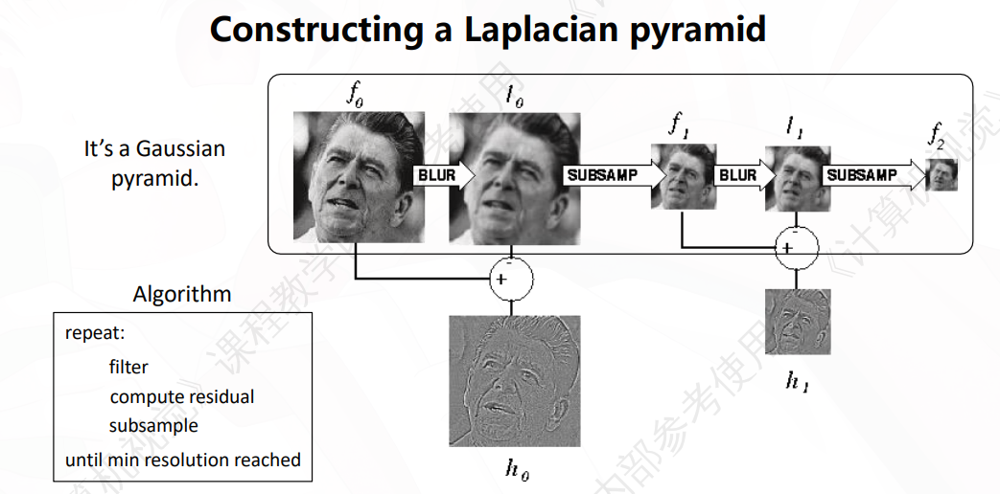

## 下采样

### 朴素下采样

- 直接丢弃一半的行和列来缩小图像。
- 问题：会产生锯齿和混叠（aliasing）现象，图像质量下降。

### 高斯下采样

- 先对图像进行高斯模糊，去除高频信息，然后再丢弃一半的行和列。
- 优点：减少锯齿和混叠现象，图像质量更好。

## 上采样

高斯上采样：

先对图像进行插值到目标尺寸，然后再进行高斯模糊来平滑插值结果，减少锯齿和混叠现象。

## 高斯金字塔

### 高斯金字塔构建

每一层存的是上一层的高斯模糊和下采样结果：

- $G^{(0)}$ = 原始图像
- $G^{(1)}$ = downsample(GaussianBlur($G^{(0)}$))
- $G^{(2)}$ = downsample(GaussianBlur($G^{(1)}$))
- ...

$G^{(i)}$ 是原图经过 $i$ 次高斯模糊和下采样得到的低频近似。

### 高斯金字塔的特性

- 每一层相比于上一层都丢弃了一半的行和列，因此每层的存储大小是上一层的四分之一。整个金字塔的存储大小是原始图像的4/3。

- 细节信息随着层数增加而逐渐丢失。

- 高层主要保留大范围的均匀区域。

- **无法**从高层图像完整重建原始图像（因为模糊是有损的）

## 拉普拉斯金字塔（pyramid that is lossless）

### 拉普拉斯金字塔构建

拉普拉斯金字塔不是直接生成的，而是从高斯金字塔“算出来的”

先构造高斯金字塔:

- $G^{(0)}$ = 原始图像
- $G^{(1)}$ = downsample(GaussianBlur($G^{(0)}$))
- $G^{(2)}$ = downsample(GaussianBlur($G^{(1)}$))
- ...

拉普拉斯金字塔的第 $i$ 层定义为：

$$
L^{(i)} = G^{(i)} - upsample(G^{(i+1)})
$$

其中 $upsample(G^{(i+1)})$ 是对 $G^{(i+1)}$ 进行上采样（插值+高斯模糊）得到的图像.

### 拉普拉斯金字塔的特性

- 拉普拉斯金字塔是可逆的，可以无损重建原始图像。

- 需要存储每一层的残差和最高层的高斯图像。

- 拉普拉斯金字塔实际上是对高斯金字塔的差分操作.

- 高斯差分（Difference of Gaussians, DoG）可以近似拉普拉斯算子，用于边缘检测。

## 高斯差分金字塔（Difference of Gaussians Pyramid,DoG）

高斯差分金字塔是通过对高斯金字塔的相邻层进行差分得到的，是用于近似LoG算子和NLoG算子的，这里以sift为例：

先简单回顾一下尺度空间的构建：

- 选择一组离散的尺度 $\sigma_0, \sigma_1, \dots, \sigma_k,\sigma_{i+1}=k\sigma_i$。
- 对于每个尺度 $\sigma_i$，对原始图像进行高斯模糊，得到尺度空间图像 $S(x,y,\sigma_i) =  I*G_{\sigma_i}(x,y)$。
- 构建高斯金字塔，每组（octave）有若干层（intervals），相邻层的尺度成等比关系。

标准的NLoG方法是直接对尺度空间图像进行二阶导数计算然后归一化：(这里的 $G_\sigma$ 是高斯核函数，因为和坐标无关，所以直接写成 $G_\sigma$)

$$
\text{NLoG}(x,y,\sigma) = \sigma^2 \nabla^2 S(x,y,\sigma) = \sigma^2 \nabla^2 G_\sigma * I(x,y)
$$

补充高斯核函数的导数性质，对尺度 $\sigma$ 求导：

$$
\frac{\partial}{\partial \sigma} G_\sigma = \sigma \nabla^2 G_\sigma
$$

对于高斯核的差分：

$$
\frac{\partial}{\partial \sigma} G_\sigma \approx \frac{G_{k\sigma} - G_\sigma}{(k-1)\sigma}
$$

代入上式：

$$
\sigma \nabla^2 G_\sigma \approx \frac{G_{k\sigma} - G_\sigma}{(k-1)\sigma}
$$

可以得到LoG的近似：

$$
\text{LoG}(x,y,\sigma) = \nabla^2 G_\sigma  \approx \frac{G_{k\sigma}  - G_\sigma(\sigma) }{(k-1)\sigma^2}
$$

进而得到NLoG的近似,发现比例系数 $(k-1)$ 是常数，可以忽略：

$$
\text{NLoG}(x,y,\sigma) = \sigma^2 \nabla^2 G_\sigma \approx \frac{G_{k\sigma} - G_\sigma}{k-1}
$$

分子 $G_{k\sigma} - G_\sigma$ 就是高斯差分金字塔的卷积核定义，因此高斯差分金字塔可以近似实现NLoG方法：

$$
\begin{aligned}
D(x,y,\sigma) &= S(x,y,k\sigma) - S(x,y,\sigma) \\
&= \left(G_{k\sigma}  - G_\sigma\right) * I(x,y)\\
&\approx (k-1) \sigma^2 \nabla^2 G_\sigma * I(x,y)\\
& = (k-1) \text{NLoG}(x,y,\sigma)
\end{aligned}
$$

检测 DoG 的极值等价于检测 NLoG 的极值。

SIFT 的高斯金字塔中，每组（octave）有若干层（intervals），相邻层相减得到 DoG 金字塔。然后在 DoG 的三维空间（x,y,σ）中找局部极值，作为候选关键点。

:::tip 金字塔速查

| 类型 | 构建方式 | 存储量 | 可逆性 | 用途 |
|------|---------|-------|-------|------|
| 高斯金字塔 | 高斯模糊 → 下采样（逐层迭代） | $\approx \frac{4}{3}$ 原图 | ❌ 不可逆（有损） | 多尺度表示、预处理 |
| 拉普拉斯金字塔 | $G^{(i)} - \text{upsample}(G^{(i+1)})$ | 略大于原图 | ✅ 无损重建 | 图像压缩、融合 |
| DoG 金字塔 | 相邻高斯层相减 | 额外存储（少1层） | ❌ | LoG近似、SIFT关键点检测 |

:::
