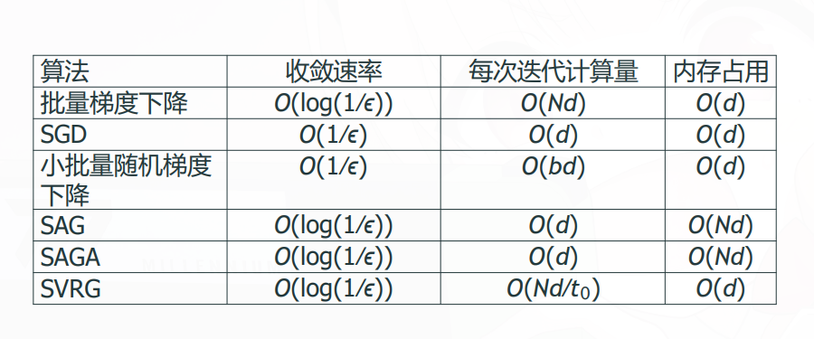

## 考虑线性回归的例子

输入 $\mathbf{x}\in\mathbb{R}^n$ 输出 $y\in\mathbb{R}$ 模型参数 $\mathbf{w}\in\mathbb{R}^n$ 训练数据 $\{(\mathbf{x}_i,y_i)\}_{i=1}^m$ 目标函数（损失函数）：

$$
L(\mathbf{w}) = \frac{1}{m}\sum_{i=1}^m (y_i - \mathbf{w}^T\mathbf{x}_i)^2=\frac{1}{m}||\mathbf{X}\mathbf{w}-\mathbf{y}||^2
$$

$N$ 为样本数量,$D$ 为特征维度(包含偏置就是$D=n+1$)。对于大规模数据，$N$ 和 $D$ 都很大。

### 三种复杂度

如果解正规方程，$\mathbf{w}=(\mathbf{X}^T\mathbf{X})^{-1}\mathbf{X}^T\mathbf{y}$ 计算复杂度 $O(ND^2)+O(D^3)$ 不适合大规模数据。更不用考虑不可逆的情况了。

如果用梯度下降，计算复杂度 $O(ND)$表示遍历一次全部样本并计算所有特征所需的浮点运算次数，每次迭代需要遍历所有数据。小数据量时可以接受，但对于大规模数据，迭代一次就很慢了。

如果用随机梯度下降（SGD），每次迭代只需要计算一个样本的梯度，计算复杂度 $O(D)$ 适合大规模数据。

- SGD把复杂度降下来了，但梯度的方差（噪声）上去了，收敛速度慢了。后续会介绍一些改进SGD的方法，如动量、Adam等。

## 随机梯度下降（SGD）和mini-batch SGD

把梯度下降的参数更新公式统一成：

$$
\mathbf{w^{(t+1)}} \leftarrow \mathbf{w}^{(t)} - \eta \frac{1}{|S|}\sum_{i \in S} \nabla F_i(\mathbf{w}^{(t)})
$$

其中 $F_i(\mathbf{w})$ 是第 $i$ 个样本的损失函数（如线性回归中的 $(y_i - \mathbf{w}^T\mathbf{x}_i)^2$）.

$S$ 是一个样本子集（mini-batch），大小为 $|S|$，通常远小于总样本数 $N$.

$\eta$ 是学习率，控制每次更新的步长。

$|S|=b$, $b$ 体现了gd,sgd,mini-batch sgd的区别：

- GD（Gradient Descent）：$|S|=N$，每次迭代使用全部样本计算梯度。
- SGD（Stochastic Gradient Descent）：$|S|=1$，每次迭代随机选择一个样本计算梯度。
- Mini-batch SGD：$1 < |S| < N$，每次迭代使用一个小批量的样本计算梯度，常见的 $|S|$ 取值有 32、64、128 等。

$b$ 的性能影响：

- 较小的 $b$ 节省单次迭代计算成本，但会增加梯度噪声，导致误差表现更差

- 较大的批次大小能降低梯度噪声并提供更优的误差收敛性，但会提高计算成本每次迭代的开销

## 其他SGD的变体

方便起见，记$\nabla E(\mathbf{w}^{(t)}) =\frac{1}{|S|}\sum_{i \in S} \nabla F_i(\mathbf{w}^{(t)})$，当前迭代所用的样本集合（一个样本或一个小批量）的**平均梯度**。

### Momentum（动量）

普通sgd:梯度噪声大，更新方向震荡，在梯度很小或平坦区域，收敛极慢

动量方法在更新参数时引入了一个额外的变量 $v$ 和动量系数 $\gamma(=0.9)$ 来积累之前的梯度信息：

$$
\begin{aligned}
v^{(t+1)} &= \gamma v^{(t)} + \eta \nabla E(\mathbf{w}^{(t)}) \\
\mathbf{w}^{(t+1)} &= \mathbf{w}^{(t)} - v^{(t+1)}
\end{aligned}
$$

效果：

- 在梯度方向一致时加速收敛

- 在梯度方向频繁改变时减少震荡

### NAG涅斯捷罗夫加速梯度

问题：动量法在某些情况下可能会过度积累之前的梯度信息，导致更新过头（overshooting），尤其是在接近最优解时。

NAG计算梯度的点不是当前点（E的括号里），而是**将要更新到的点**：

$$
\begin{aligned}
v^{(t+1)} &= \gamma v^{(t)} + \eta \nabla E(\mathbf{w}^{(t)} - \gamma v^{(t)}) \\
\mathbf{w}^{(t+1)} &= \mathbf{w}^{(t)} - v^{(t+1)}
\end{aligned}
$$

### 自适应学习率方法-AdaGrad

公式：

$$
\begin{aligned}
g_i^{(t)} &= \sum_{j=1}^t (\nabla E(\mathbf{w}^{(j)}))_i^2 \\
\mathbf{w}_i^{(t+1)} &= \mathbf{w}_i^{(t)} - \frac{\eta}{\sqrt{g_i^{(t)} + \epsilon}} (\nabla E(\mathbf{w}^{(t)}))_i
\end{aligned}
$$

每个参数有自己的学习率：经常更新的参数学习率变小，稀疏参数学习率较大

学习率，自动递减

缺点：累积梯度平方和会越来越大，导致学习率最终趋近于 0，训练过早停止

### 自适应学习率方法-Adam

同时利用一阶矩（均值） 和二阶矩（未中心化的方差） 自适应调整学习率

相当于 RMSprop + 动量

$$
\begin{aligned}
m^{(t+1)} &= \beta_1 m^{(t)} + (1 - \beta_1) \nabla E(\mathbf{w}^{(t)}) \\
v^{(t+1)} &= \beta_2 v^{(t)} + (1 - \beta_2) (\nabla E(\mathbf{w}^{(t)}))^2 \\
\hat{m}^{(t+1)} &= \frac{m^{(t+1)}}{1 - \beta_1^{t+1}} \\
\hat{v}^{(t+1)} &= \frac{v^{(t+1)}}{1 - \beta_2^{t+1}} \\
\mathbf{w}^{(t+1)} &= \mathbf{w}^{(t)} - \frac{\eta}{\sqrt{\hat{v}^{(t+1)} + \epsilon}} \hat{m}^{(t+1)}
\end{aligned}
$$

优点

- 对超参数鲁棒，收敛快

- 适用于稀疏梯度、非平稳目标

- 通常比纯 SGD 或动量法表现更好
