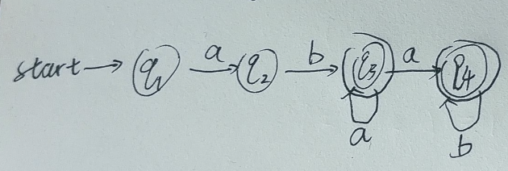

### Homework 1

**班号：24Q0304** **学号：2024112353** **姓名：邴海诺**

**1.** 设 $\Sigma=\{0,1\}$ 设计 DFA 接受“至少含有一个 0 且仅含有两个 1”的所有字符串。

(The set of all strings with at least one 0 and exactly two 1's.)

$(0+ 1 0^* 1 0^*) + (0^* 1 0+ 1 0^*) + (0^* 1 0^* 1 0+)$

**2.** 设 $\Sigma=\{0,1\}$，设计 DFA 接受那些字符 0 的个数能被 3 整除，且 1 的个数能被 2 整除的所有字符串。

(The set of strings such that the number of 0's is divisible by three, and the number of 1's is divisible by two.)

0的个数mod3=0,1,2;1的个数mod2=0,1

状态是 二元组(0数量mod3,1数量mod2)

| 状态 | 含义  | 状态 | 含义  |
| ---- | ----- | ---- | ----- |
| q₁   | (0,0) | q₂   | (1,0) |
| q₃   | (2,0) | q₄   | (0,1) |
| q₅   | (1,1) | q₆   | (2,1) |

**3.** 请设计不超过 5 个状态的 NFA，接受语言 $\{abab^{n}:n\ge0\}\cup\{aba^{n}:n\ge0\}$。

(Design an NFA with no more than five states for the set $\{abab^{n}:n\ge0\}\cup\{aba^{n}:n\ge0\}$)

**4.** 设计 $\Sigma=\{a,b\}$ 上的正则表达式：

- **(a)** 最多出现两次 aa 子串的所有字符串。
- **(b)** 以 $bb$ 开头且长度是 4 的倍数的所有字符串。

$$
(b+ab)^*(ε+a + aa + aaa)(b+ab)^*\\

bb(a+b)^2((a+b)^4)^*
$$

**5.** 使用子集构造法，将如下 NFA 转换为等价的 DFA：

| 状态            | 0          | 1       |
| --------------- | ---------- | ------- |
| $\rightarrow p$ | $\{p, q\}$ | $\{p\}$ |
| $q$             | $\{r\}$    | $\{r\}$ |
| $r$             | $\{s\}$    | $\Phi$  |
| $*s$            | $\{s\}$    | $\{s\}$ |

DFA状态转移表

| 状态       | 0         | 1       |
| ---------- | --------- | ------- |
| {p}        | {p,q}     | {p}     |
| {p,q}      | {p,q,r}   | {p,r}   |
| {p,q,r}    | {p,q,r,s} | {p,r}   |
| {p,r}      | {p,q,s}   | {p}     |
| *{p,q,r,s} | {p,q,r,s} | {p,r,s} |
| *{p,q,s}   | {p,q,r,s} | {p,r,s} |
| *{p,r,s}   | {p,q,s}   | {p,s}   |
| *{p,s}     | {p,q,s}   | {p,s}   |
