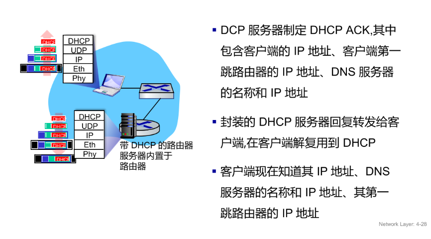

## ip的结构-CIDR

ip地址：与每个主机或路由器关联的32 位二进制数，为了方便给人看，用十进制+`.`来表示

接口：主机或路由器上的一个连接点，可以有多个接口，每个接口都有一个ip地址

:::tip

CIDR替代了传统的类A、B、C网络划分方法，提供了更灵活的IP地址分配方式，允许网络管理员根据实际需求划分子网，而不是被固定的类限制。

:::

CIDR（Classless Inter-Domain Routing）：一种表示IP地址和子网掩码的方法，格式为`IP地址/前缀长度`，例如`192.168.1.0/24`，其中前缀长度表示子网掩码中连续的1的数量，决定了网络部分和主机部分的划分

子网：无需通过路由器就能直接通信的主机集合，子网 = 由子网掩码划分出来的一组 IP 地址集合

:::tip
子网掩码的本质作用：划分ip的“网络部分”和“主机部分”
:::

具体逻辑如下：

1. 将ip地址和子网掩码进行按位与运算，得到网络地址

    ```hex
    IP:   192.168.1.10
    Mask: 255.255.255.0 (/24)
    子网 = 192.168.1.0/24
    ```

2. 确认主机部分：子网掩码中为0的部分就是主机部分，可以有 $2^n - 2$ 个主机（减去全0和全1的地址）广播地址就是主机部分全1的地址，网络地址就是主机部分全0的地址

    ```plaintext
    /24 → 主机位 = 8 位 → 可用主机数 = $2^8 - 2 = 254$ 个
    广播地址：子网内所有主机都能接收的特殊地址，192.168.1.255
    网络地址：子网的标识，192.168.1.0
    ```

3. 网络地址相同的主机在同一子网内，可以直接通信；网络地址不同的主机在不同子网内，需要通过路由器通信

## 主机如何获取ip-DHCP

DHCP 用来自动给主机分配 IP 地址和网络配置

IP分配：DHCP服务器维护一个IP地址池，当主机连接到网络时，DHCP服务器会从池中分配一个可用的IP地址给主机

ip池：DHCP服务器维护的可用IP地址集合，通常是一个连续的IP地址范围，例如网络`192.168.1.0/24` 的IP池可能是`192.168.1.100 – 192.168.1.200`

工作机制：DORA:`

- Discover（广播寻找DHCP服务器）
- Offer（DHCP服务器响应提供IP地址）
- Request（主机请求使用提供的IP地址）
- Ack（DHCP服务器确认分配）

DHCP 分配的 IP 不是永久的，而是“租的”。租期到期后，主机需要重新申请 IP 地址，或者续租当前 IP 地址。如果 DHCP 服务器无法续租，主机可能会被分配一个新的 IP 地址，这就是为什么有时会看到 IP 地址变化的原因。

除了IP地址，DHCP还可以分配其他网络配置参数，

- 子网掩码、

- 网关（默认路由）客户端第一跳路由器的地址

- DNS 服务器的名称和 IP 地址




## 路由聚合

路由聚合：将**特定数目**个**连续**的IP地址范围合并成一个更大的范围，以减少路由表的条目数量，提高路由效率，本质是合并“前缀相同”的网络

原理：

```plaintext
192.168.0.0/24 → 11000000.10101000.00000000.xxxxxxxx
192.168.1.0/24 → 11000000.10101000.00000001.xxxxxxxx
192.168.2.0/24 → 11000000.10101000.00000010.xxxxxxxx
192.168.3.0/24 → 11000000.10101000.00000011.xxxxxxxx
```

发现前22位相同，后两位不同，所以可以聚合成一个更大的网络：

```plaintext
192.168.0.0/22
```

路由器要聚合路由，必须满足以下条件：

1. 子网的个数是2的幂次方（例如2、4、8等），因为每次聚合都会将地址范围扩大一倍
2. 聚合的子网必须是连续的，即它们的网络地址必须在数值上连续
3. 子网起点必须是子网数量的倍数，例如要聚合4个子网，起点必须是4的倍数（0、4、8等）

关于计算前缀的小技巧：

新前缀 = 原前缀 - log₂(子网数量)

路由聚合的后，对于收到一个目的地址，路由器会先**匹配最长前缀**的路由条目（最长前缀匹配）

例如

```plaintext
路由表：
192.168.0.0/24 → 11000000.10101000.00000000.xxxxxxxx
192.168.1.0/24 → 11000000.10101000.00000001.xxxxxxxx
192.168.2.0/24 → 11000000.10101000.00000010.xxxxxxxx
192.168.3.0/24 → 11000000.10101000.00000011.xxxxxxxx
```

目的地址：

```plaintext
192.168.2.20
```

会匹配到`192.168.2.0/24`，因为它的匹配的前缀最长

分配到了子网192.168.2.0/24之后，再通过ARP协议找到主机的MAC地址，最终完成通信

