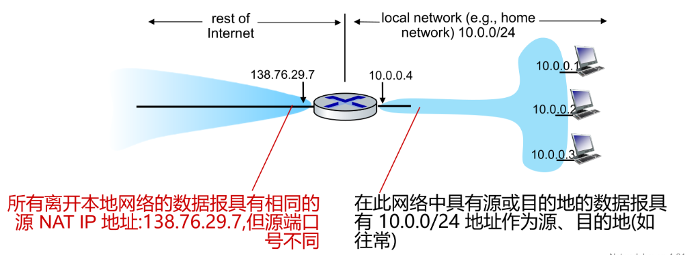
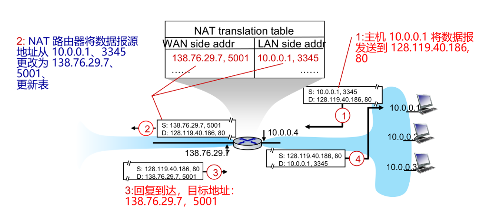

NAT 是在路由器上，把“私有 IP 地址”转换成“公网 IP 地址”的技术,维护一张“映射表” 内网IP:端口 ↔ 公网IP:端口

就外部网络来说，NAT 设备就像一个代理，所有来自内部网络的请求都通过 NAT 设备进行转发，并且外部网络只能看到 NAT 设备的公网 IP 地址，而看不到内部网络的私有 IP 地址。本地网络的所有设备相当于共享一个公网 IPv4 地址访问外部网络。

操作流程：

1. 传出数据包：当内部网络的设备（如计算机、手机等）向外部网络发送数据包时，NAT 设备会将数据包中的源 IP 地址（私有 IP 地址）替换为 NAT 设备的公网 IP 地址，并且记录下这个映射关系（私有 IP 地址和端口号 ↔ 公网 IP 地址和新端口号）。
    - 之后远程服务器/客户端将用公网 IP 地址和新端口号回复数据包，NAT 设备根据映射表将数据包转发到正确的内部设备。
2. 维护映射表：NAT 设备会维护一个映射表，记录内部设备的私有 IP 地址和端口号与 NAT 设备的公网 IP 地址和新端口号之间的映射关系。这个映射表允许 NAT 设备正确地将来自外部网络的数据包转发到内部网络的正确设备。
3. 传入数据包：当外部网络的设备向 NAT 设备发送数据包时，NAT 设备会检查映射表，找到对应的内部设备的私有 IP 地址和端口号，并将数据包转发到正确的内部设备。

NAT 的优点：

- 节省 IPv4 地址：NAT 允许多个内部设备共享一个公网 IP 地址，缓解了 IPv4 地址短缺的问题。
- 提高安全性：NAT 隐藏了内部网络的结构和设备，使得外部攻击者难以直接访问内部设备，从而提高了网络的安全性。
- 可以更改NAT IP 而不更改内部网络结构：NAT 允许网络管理员更改 NAT 设备的公网 IP 地址，而不需要更改内部网络的结构和设备配置。
- 可以更改内部网络结构而不影响外界：NAT 允许网络管理员更改内部网络的结构和设备配置，而不需要更改 NAT 设备的公网 IP 地址。

but NAT 表是“内网发起连接才建立”

解决手段：

- 端口映射：NAT 设备可以配置端口映射规则，将特定的公网 IP 地址和端口号映射到内部网络的特定设备和端口号。这样，外部网络的设备可以通过访问 NAT 设备的公网 IP 地址和指定端口号来访问内部网络的设备。

- 内网穿透：使用第三方服务（如 ngrok、frp 等）来实现内网穿透，使得外部网络的设备可以直接访问内部网络的设备，而不需要通过 NAT 设备进行转发。这些服务通常会在云端提供一个公网 IP 地址和端口号，内部设备通过与云端服务建立连接来实现内网穿透。
