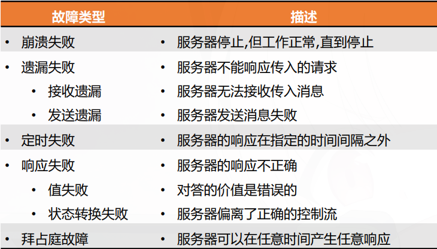

RPC通信模块（或传输）主要基于一组通信原语(IPC): makerpc(.),
getRequest(.),和sendResponse(.) 其失败模型和容错机制也围绕着这些原语展开。

常见故障类型

总结下来就是“执行了没、执行了几次、结果在哪”。

## RPC 容错的三大核心机制

三个可以独立或组合使用的容错措施：

### 1. 重传请求（客户端侧）

思想：控制是否重新传输请求服务，直到收到应答或假定服务器失败为止

问题：请求或回复消息可能丢失（网络丢包、服务器过载）。

方法：makerpc(.) 使用超时+重传机制。

- 发送请求后启动定时器

- 超时未收到回复，则重传请求

- 可以重复多次，直到收到回复或认定服务器失败

挑战：如何选择超时值？

- 太短：误判（服务器慢但未崩溃）

- 太长：响应慢
- 通常基于经验或统计（如 RTT 均值 + 偏差）

### 2. 重复过滤（服务器侧）

思想：控制何时使用重传,以及是否在服务器上过滤掉重复的请求

问题：重传可能导致同一请求被执行多次（服务器处理完但回复丢失，客户端重传，服务器再次执行）。

危险：并非所有操作都是幂等的。多次执行结果相同的操作叫做幂等操作（如读取数据、设置键值）。多次执行结果不同的操作叫做非幂等操作（如扣款、转账）。

方法：服务器应识别来自同一客户端的重复请求。

- 对请求使用单调递增序号（每个客户端的请求有自己的序号）

- 收到已处理过的序号，则：

  - 选项 A：若操作幂等，直接重新执行并回复（简单但有风险）

  - 选项 B：保留之前的结果历史（在非易失存储中），直接重传上次的回复，不重新执行

### 3. 保留结果（服务器侧）

思想：控制是否保留结果消息的历史记录,以便使丢失的回复能够重新传输,而无需在服务器上重新执行操作

问题：即使过滤掉重复执行，如果回复消息丢失，客户端重传，服务器还是得重新生成回复（要么重执行，要么从历史取）。

方法：服务器将已处理请求的回复消息保留在历史日志中（非易失存储）。

- 收到重复请求时，直接重传历史回复，无需重新执行

适用于非幂等操作，也是实现最多一次语义的基础

代价：需要存储空间和持久化写入开销。

## RPC的调用语义

| 重传请求 | 重复过滤 | 保留结果/重传回复 | 调用语义                                            |
| -------- | -------- | ----------------- | --------------------------------------------------- |
| 否       | N/A      | N/A               | Maybe（可能执行 0 或 1 次？实际可能因丢包而不执行） |
| 是       | 否       | 重新执行程序      | 至少一次（At Least Once）                           | 是 | 最多一次（At Most Once） |
| 是       | 是       | 是                | 最多一次（At Most Once）                            |

Maybe 语义

- 不做任何容错，客户端发一次请求，不重传

- 结果：可能执行 0 次（丢包）或 1 次（成功）

- 适用：容忍丢包的场景，如实时传感器数据

At Least Once 语义

- 客户端重传，服务器不过滤重复

- 结果：请求至少被执行一次，可能多次

- 适用：幂等操作（如读、更新计数器但允许重复加）

- 风险：非幂等操作会导致数据错误

At Most Once 语义

- 客户端重传 + 服务器重复过滤 + 服务器保留历史回复

- 结果：请求最多被执行一次，可能 0 次（如果服务器崩溃或消息永远丢失）

- 适用：大多数业务操作（如转账、扣款）

- 实现复杂：需要持久化存储请求序号和回复

## 受底层传输协议影响的调用语义

UDP 需要 RPC 自己做重传；TCP 提供了可靠传输但仍需应用层端到端检查。

端到端论证：不能完全依赖底层可靠性，应用层需要自己的容错逻辑。
